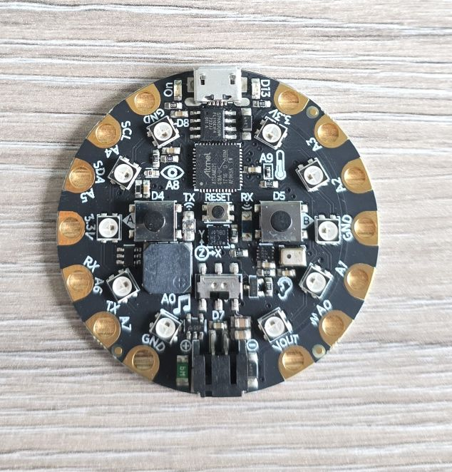

## Overview

The Adafruit Circuit Playground Express is an all-in-one educational microcontroller board designed to make electronics
and programming accessible to beginners while providing enough capability for advanced projects. It features numerous
built-in sensors, LEDs, buttons, and a speaker, all on a single round PCB that's perfect for wearables and interactive projects.

## Hardware Features

- **Microcontroller:** ATSAMD21 ARM Cortex M0+ Processor
- **Clock Speed:** 48 MHz
- **Operating Voltage:** 3.3V
- **Flash Memory:** 2 MB SPI Flash storage
- **Built-in Components:**
  - **10 × RGB NeoPixel LEDs** - Individually addressable, full color
  - **1 × Motion Sensor** - LIS3DH triple-axis accelerometer with tap/free-fall detection
  - **1 × Temperature Sensor** - Thermistor
  - **1 × Light Sensor** - Phototransistor (can detect color and pulse)
  - **1 × Sound Sensor** - MEMS microphone
  - **1 × Mini Speaker** - 7.5mm magnetic speaker/buzzer with Class D amplifier
  - **2 × Push Buttons** - Labeled A and B
  - **1 × Slide Switch** - On/off switch
  - **Infrared TX/RX** - Receiver and transmitter for remote control and proximity sensing
  - **Green "ON" LED** - Power indicator
  - **Red "#13" LED** - Standard blinky LED
  - **Reset Button**
- **I/O Pins:**
  - **8 × Alligator-clip friendly pads**
  - I2C support
  - UART support
  - 8 pins with analog input capability
  - Multiple PWM outputs
  - 7 pads with capacitive touch input
  - 1 true analog output pad
- **USB:** Micro-USB port for programming and debugging
  - Can emulate serial port, keyboard, mouse, joystick, or MIDI device
- **Power:** USB or 3 × AAA battery pack (sold separately)
- **Form Factor:** Round PCB, 2" (50mm) diameter
- **Mounting:** 4 mounting holes for securing

The Circuit Playground Express uses the **ATSAMD21** (ARM Cortex-M0+) microcontroller, which is **not supported** by ESPHome.

## Built-in Sensors and Components

- NeoPixel LEDs (10×)
- Accelerometer (LIS3DH)
  - I2C address: 0x19
- Temperature Sensor
- Light Sensor
  - Ambient light detection
  - Can also function as:
    - Color sensor (with NeoPixels)
    - Pulse sensor (heart rate monitoring)
- Sound Sensor (MEMS Microphone)
  - Not for voice recording
- Speaker
  - 7.5mm magnetic speaker
  - Plays tones and simple melodies
  - Class D amplifier
  - Volume control in software
- Infrared TX/RX
  - Send and receive IR signals
  - Compatible with TV remotes
  - Proximity sensing capability
- Buttons and Switch
  - 2x Programmable input buttons
  - 1x Slide Switch
  - 1x Reset Button

## Pin Layout

The Circuit Playground Express has **8 main pads** around the edge, all alligator-clip friendly:

| Pad | Functions | Notes |
| ----- | ----------- | ------- |
| **A0** | Analog In, PWM, Capacitive Touch | Audio output capable |
| **A1** | Analog In, PWM, Capacitive Touch | |
| **A2** | Analog In, PWM, Capacitive Touch | |
| **A3** | Analog In, PWM, Capacitive Touch | |
| **A4** | Analog In, PWM, Capacitive Touch, I2C SDA | |
| **A5** | Analog In, PWM, Capacitive Touch, I2C SCL | |
| **A6** | Analog In, PWM, Capacitive Touch, TX | UART TX |
| **A7** | Analog In, PWM, Capacitive Touch, RX | UART RX |

### Additional Pads

- **GND** (3 pads) - Ground connections
- **3.3V** - 3.3V power output
- **VOUT** - Battery voltage output

## Capacitive Touch

7 of the 8 pads (A1-A7) support **capacitive touch sensing**:

- Touch with finger to trigger
- No button press needed
- Can sense through thin materials
- Great for interactive projects
- Works with conductive materials (fruit, water, foil)

## Power Options

### USB Power

- 5V from Micro-USB port
- Most common for development
- Can power all features

### Battery Power

- LiPo battery or 3 × AAA battery pack
- Connects to JST connector on back
- Portable operation
- Battery voltage available on VOUT pad
- Slide switch controls power

### Power Considerations

- **Current draw with all NeoPixels on:** ~200mA
- **Typical usage:** 20-50mA
- **Sleep mode:** Available but varies by programming method

## Other Photos

Back of the board:

