## Overview

The Adafruit MiniPiTFT is a 1.3" (diagonal) TFT display with 240x240 pixel resolution, featuring the ST7789 display
driver and two tactile buttons. Originally designed for Raspberry Pi, it works with ESP32 and other microcontrollers.

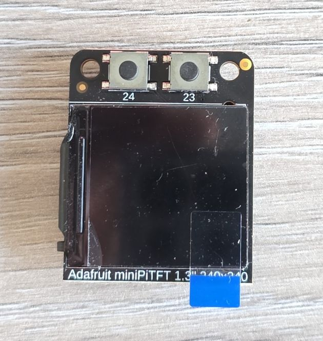

The module features:

- 1.3" square TFT display (240x240 pixels)
- ST7789 display driver
- 4-wire SPI interface
- Full color display (RGB 18-bit, 262K colors)
- 2x tactile buttons (on model #4393)
- Bright backlight

## Testing Status

- ✅ [Basic Config](#basic-configuration) - Wiring up & Test Card in Color
- ✅ [Backlight](#adding-backlight-support--buttons)
- ✅ [Buttons](#adding-backlight-support--buttons)
- ✅ [Simple Graphics and Text](#simple-graphics-and-text-example)
- ✅ [Multipage Icons and Text](#icons-text-pretty) 🌈🦾

## Configuration Notes

The mini PiTFT connects to the 'top' 2x12 headers on the Pi's 2x20 header connection. It uses the following pins:

- 5.0V - Connected to the display backlight - **NOTE ⚠️**: this is incorrectly stated at the pinout page.
the schematic shows that the backlight is connected to 3.3V
- 3.3V - Connected to the display power and also the STEMMA QT / Qwiic connector
- GND - Ground for everything
- SDA & SCL - I2C data for the STEMMA QT / Qwiic connector. Not used by buttons or display - we won't use it
since this is only relevant for Raspberry Pi connection. We could connect I2C to these pins and expose I2C
through that STEMMA QT / Qwiic connector if needed
- GPIO22 (BL) - Used to turn the backlight on and off. If you never want to turn the backlight off,
cut the small jumper on the bottom of the PiTFT to free up GPIO22. This advice is if you're using Raspberry Pi
- GPIO23 & GPIO24 - Connected to the two front buttons. These pins have 10K pullups to 3.3V so
when the button is pressed, you will read a LOW voltage on these pins. So they need to be configured as inverted
- SCK, MOSI, CE0 & GPIO25 (DC) - These are the display control pins. Note that MISO is not connected even though
it is a SPI pin because you cannot read back from the display.

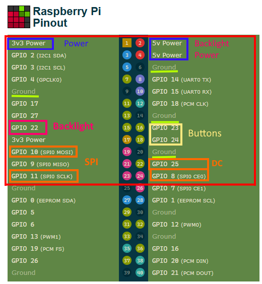

ST7789 display driver supported through [MIPI SPI](https://esphome.io/components/display/mipi_spi/).
[ST7789V component](https://esphome.io/components/display/st7789v/) is still available but will be removed in future.

**NOTE:** On the panel's datasheet it actually says ST7789V.

### Wiring

Example here is for [esp32-devkit-v1](./esp32-devkit-v1)
Adjust substitutions based on your board. For the examples below I used the following wiring:

| 1.3" LCD | esp32-devkit-v1 | Notes |
| :---- | :---- | :---- |
| GPIO 22 | GPIO25 | BLK |
| GPIO 8 (SPI0 CE0) | GPIO05 | CS |
| GPIO 25 | GPIO04 | DC |
| GPIO 10 (SPI0 MOSI) | GPIO23 | MOSI |
| GPIO 11 (SPI0 SCLK) | GPIO18 | SCK |
| GPIO 23 | GPIO26 | Button 1 |
| GPIO 24 | GPIO27 | Button 2 |
| VCC | 3V3 | |
| GND | GND | |

**WARNING 🤦‍♂️**: I spent a good bit of time figuring out why the display did not work. The diagram above is the top
view (looking from above). And, there's a marking on the back of the display that I took to be pin number 1 - that's
incorrect. I marked here which is the pin number 1:

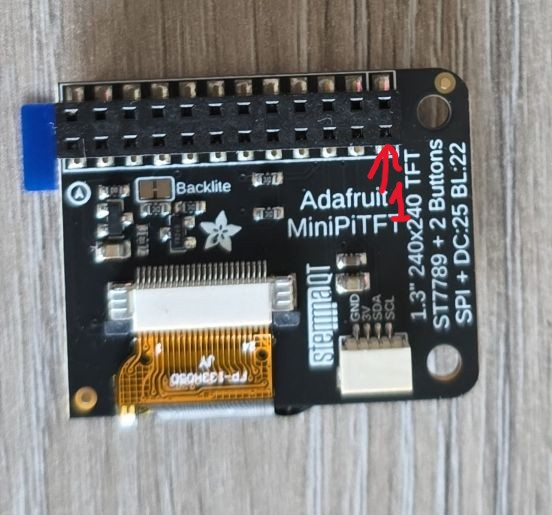

### Basic Configuration

Show test card - ensures everything is correctly configured and wired up. Note that the display is square
so rotation is not really necessary. I just wanted buttons to be under the display, so had to rotate it 90 degrees.

Also note that ST7735V supports 320x240 resolution, width and height have to specified. Offsets are not needed since
they are 0 (great job 👍) but I thought to include them for completeness. Some other displays do need it like
[the small RGB LCDE](./st7789v-color-display.md) from Pimoroni.

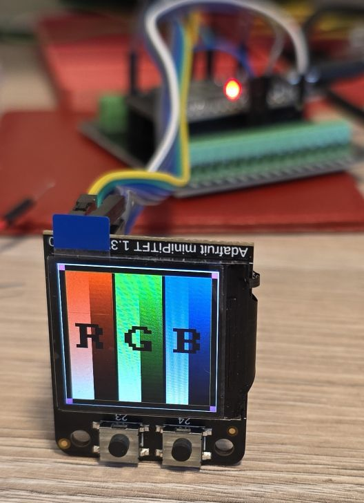

```yaml
esphome:
  name: my-display-test

esp32:
  variant: esp32
  framework:
    type: esp-idf
    advanced:
      minimum_chip_revision: "3.1"

logger:

substitutions:
  clk_pin: GPIO18
  mosi_pin: GPIO23
  disp_cs_pin: GPIO05
  disp_dc_pin: GPIO04
  backlight_pin: GPIO25
  btn_1_pin: GPIO26
  btn_2_pin: GPIO27

spi:
  clk_pin: ${clk_pin}
  mosi_pin: ${mosi_pin}

display:
  - platform: mipi_spi
    id: my_display
    model: ST7789V
    cs_pin: ${disp_cs_pin}
    dc_pin: ${disp_dc_pin}
    show_test_card: true
    data_rate: 40MHz
    rotation: 90
    invert_colors: true
    dimensions:
      width: 240
      height: 240
      offset_height: 0
      offset_width: 0
```

### Adding Backlight Support & Buttons

The following code wires up backlight and uses two buttons to increase and decrease brightness by 25%.

```yaml
globals:
  - id: backlight_level
    type: int
    restore_value: no
    initial_value: '5'

binary_sensor:
  - platform: gpio
    id: button1
    pin:
      number: ${btn_1_pin}
      inverted: true
    on_click:
      then:
        - if:
            condition:
              - lambda: return id(backlight_level) > 1;
            then:
              - globals.set:
                  id: backlight_level
                  value: !lambda return id(backlight_level) - 1;
              - light.turn_on: backlight
              - light.control:
                  id: backlight
                  brightness: !lambda return id(backlight_level) * 0.2;
            else:
              - globals.set:
                  id: backlight_level
                  value: '0'
              - light.turn_off: backlight
  - platform: gpio
    id: button2
    pin:
      number: ${btn_2_pin}
      inverted: true
    on_click:
      then:
        - if:
            condition:
              - lambda: return id(backlight_level) < 4;
            then:
              - globals.set:
                  id: backlight_level
                  value: !lambda return id(backlight_level) + 1;
            else:
              - globals.set:
                  id: backlight_level
                  value: '5'
        - light.turn_on: backlight
        - light.control:
            id: backlight
            brightness: !lambda return id(backlight_level) * 0.2;

output:
  - platform: ledc
    pin: ${backlight_pin}
    id: backlight_pwm

light:
  - platform: monochromatic
    output: backlight_pwm
    name: "Display Backlight"
    id: backlight

display:
  - platform: mipi_spi
    id: my_display
    model: ST7789V
    cs_pin: ${disp_cs_pin}
    dc_pin: ${disp_dc_pin}
    show_test_card: true
    data_rate: 40MHz
    rotation: 90
    invert_colors: true
    dimensions:
      width: 240
      height: 240
      offset_height: 0
      offset_width: 0
```

### Simple Graphics and Text Example

To add text and graphics, add the lambda section and define fonts to the [basic config](#basic-configuration):

In the real life, the circle is full red, camera doesn't do it justice
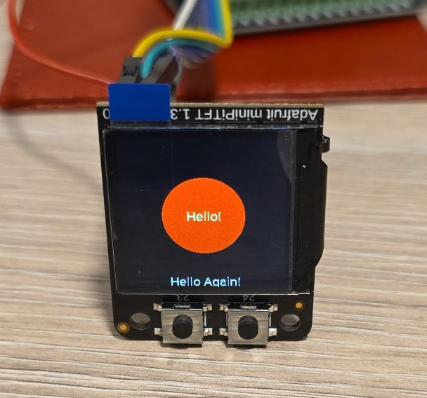

```yaml
font:
  - file: "gfonts://Roboto"
    id: roboto
    size: 20

display:
  - platform: mipi_spi
    id: my_display
    model: ST7789V
    cs_pin: ${disp_cs_pin}
    dc_pin: ${disp_dc_pin}
    data_rate: 40MHz
    rotation: 90
    invert_colors: true
    dimensions:
      width: 240
      height: 240
      offset_height: 0
      offset_width: 0
    lambda: |-
      it.filled_circle(it.get_width()/2, it.get_height()/2, 60, Color(0xFF0000));
      it.print(it.get_width()/2, it.get_height()/2, id(roboto), Color(0x00FF78), TextAlign::CENTER, "Hello!");
      it.print(it.get_width()/2, it.get_height()-10, id(roboto), Color(0xFFFFFF), TextAlign::CENTER, "Hello Again!");
```

### Icons, Text, Pretty

This example has 4 different pages and changes them on button click. The display is set not to update itself
because updates are only done on button click. You might want to change `update_interval: never` to some
other value (default is 1s = 1 second) unless you're using LVGL which handles display itself.

Both buttons, backlight and display are configured.

**WARNING ⚠️**: Set `restore_mode: ALWAYS_ON` for backlight otherwise you won't see anything on the screen unless
you connect it to Home Assistant and can turn it on from there.

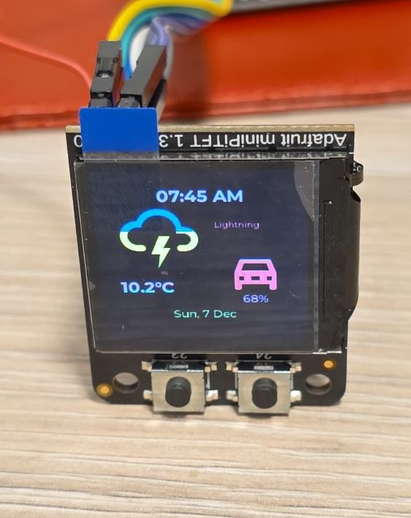

```yaml
binary_sensor:
  - platform: gpio
    id: button1
    pin:
      number: ${btn_1_pin}
      inverted: true
    on_click:
      then:
        - display.page.show_previous: my_display
        - component.update: my_display
  - platform: gpio
    id: button2
    pin:
      number: ${btn_2_pin}
      inverted: true
    on_click:
      then:
        - display.page.show_next: my_display
        - component.update: my_display

output:
  - platform: ledc
    pin: ${backlight_pin}
    id: backlight_pwm

light:
  - platform: monochromatic
    output: backlight_pwm
    name: "Display Backlight"
    id: backlight
    restore_mode: ALWAYS_ON

font:
  #color screen, so good for anti-aliasing
  - id: value_med
    file:
      type: gfonts
      family: Montserrat
    size: 14
    bpp: 4
  - id: value_small
    file:
      type: gfonts
      family: Montserrat
    size: 10
    bpp: 2
  - id: value_large
    file:
      type: gfonts
      family: Montserrat
      weight: bold
    size: 20
    bpp: 4
  - id: mdi_small
    file: assets/materialdesignicons-webfont.ttf
    size: 24
    bpp: 4
    glyphs: [
      "\U000F1A71", # snowflake-thermometer 
      "\U000F032A", # leaf
      "\U000F04B9", # sofa
      "\U000F14DE", # rocket-launch
      "\U000F0C52", # checkbox-outline
      "\U000F0158", # close-box-outline
      "\U000F0704", # plus-box-outline
      "\U000F06F2", # minus-box-outline
    ]
  - id: mdi_med
    file: assets/materialdesignicons-webfont.ttf
    size: 64
    bpp: 4
    glyphs: [
      "\U000F1807", # mdi-fire-circle
      "\U000F0E1B", # mdi-car-back
    ]
  - id: mdi_large
    file: assets/materialdesignicons-webfont.ttf
    size: 96
    bpp: 4
    glyphs: [
      "\U000F0593", # lightning
      "\U000F1A71", # snowflake-thermometer 
      "\U000F032A", # leaf
      "\U000F04B9", # sofa
      "\U000F14DE", # rocket-launch
    ]

display:
  - platform: mipi_spi
    id: my_display
    model: ST7789V
    cs_pin: ${disp_cs_pin}
    dc_pin: ${disp_dc_pin}
    show_test_card: true
    data_rate: 40MHz
    rotation: 90
    invert_colors: true
    dimensions:
      width: 240
      height: 240
      offset_height: 0
      offset_width: 0
    # only update on button click for this demo
    update_interval: never
    pages: 
      - id: page_info
        lambda: |-
          //print time and date
          it.print(it.get_width()/2, 32, id(value_large), Color::random_color(), TextAlign::CENTER, "07:45 AM");
          it.print(it.get_width()/2, 194, id(value_med), Color::random_color(), TextAlign::CENTER, "Sun, 7 Dec");

          it.print(24, 42, id(mdi_large), Color::random_color(), "\U000F0593");
          it.print(160, 64, id(value_small), Color::random_color(), TextAlign::TOP_CENTER, "Lightning");
          it.print(24, 144, id(value_large), Color::random_color(), "10.2°C");

          it.print(180, 104, id(mdi_med), Color::random_color(), TextAlign::TOP_CENTER, "\U000F0E1B");
          it.print(180, 164, id(value_med), Color::random_color(), TextAlign::TOP_CENTER, "68%");
      
      - id: page_heating
        lambda: |-

          const std::string presets[] = {
            "frost", "eco", "comfort", "boost"
          };

          const std::string icons[] = {
            "\U000F1A71", "\U000F032A", "\U000F04B9", "\U000F14DE"
          };
            
          it.print(it.get_width() - 24, 42, id(value_med), Color(0x87CEEB), TextAlign::TOP_RIGHT, "07:45 AM");
          it.print(24, 42, id(mdi_med), Color(0x228B22), "\U000F1807");

          it.print(32, 102, id(value_large), Color(0xDC143C), "18.4°C");
          it.print(32, 132, id(value_med), Color(0xDAA520), "52%");

          it.print(it.get_width() - 48, 102, id(value_med), Color(0xBA55D3), TextAlign::CENTER, "18.0°C");
          it.print(it.get_width() - 48, 76, id(mdi_small), Color(0x008080), TextAlign::CENTER, "\U000F04B9");

          //show icons
          const int icon_size = 24;
          auto y = it.get_height() - 2*icon_size;

          for(auto i = 0; i<4; i++){
            auto is_selected = "comfort" == presets[i];
            auto x = 48 + icon_size*i + 9*i; auto invert_icon = false;

            if(is_selected){
              invert_icon = true;
              it.filled_rectangle(x, y-1, icon_size+1, icon_size+1);
            }
            it.print(x, y, id(mdi_small), invert_icon ? COLOR_OFF :  Color(0xF4A460), icons[i].c_str());
          }
      - id: page_change_preset
        lambda: |-
            it.print(it.get_width()/2, it.get_height()/2, id(mdi_large), Color(0xF4A460), TextAlign::BOTTOM_CENTER, "\U000F1A71");
              
            it.print(it.get_width()/2, it.get_height()-68, id(value_med), Color(0x000080),
            TextAlign::TOP_CENTER, "Set the mode to:");
            it.print(it.get_width()/2, it.get_height()-44, id(value_med), Color(0xF08080),
            TextAlign::TOP_CENTER, "Frost ?");

            //apply
            it.print(48, it.get_height() - 48, id(mdi_small), Color(0x00FF00), TextAlign::TOP_LEFT, "\U000F0158");
            //cancel
            it.print(it.get_width()-48, it.get_height() - 48, id(mdi_small), Color(0xFF0000), TextAlign::TOP_RIGHT, "\U000F0C52");
            
      - id: page_change_temp
        lambda: |-
            it.print(it.get_width()/2, it.get_height()/2, id(mdi_large), COLOR_ON, TextAlign::BOTTOM_CENTER, "\U000F14DE");
            it.print(it.get_width()/2, it.get_height()-96, id(value_large), COLOR_ON, TextAlign::TOP_CENTER, "12.5");
            //apply
            it.print(48, it.get_height() - 48, id(mdi_small), COLOR_ON, TextAlign::TOP_LEFT, "\U000F0158");
            //cancel
            it.print(it.get_width()-48, it.get_height() - 48, id(mdi_small), COLOR_ON, TextAlign::TOP_RIGHT, "\U000F0C52");
            //minus
            it.print(96, it.get_height() - 48, id(mdi_small), COLOR_ON, TextAlign::TOP_LEFT, "\U000F06F2");
            //plus
            it.print(it.get_width() - 96, it.get_height() - 48, id(mdi_small), COLOR_ON, TextAlign::TOP_RIGHT, "\U000F0704");
```

## Other Images

Back of the LCD Display:
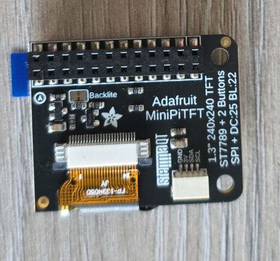

- Page 1 - Info Screen (configured for random colors so another shot)
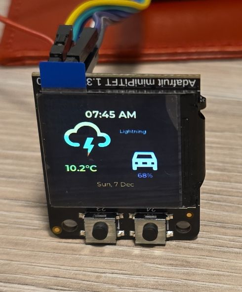
- Page 2 - Heating Screen
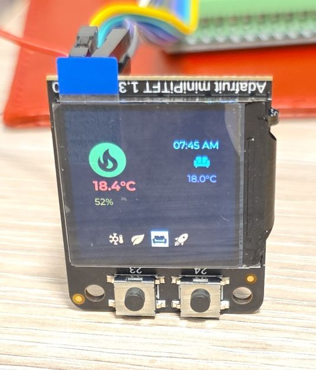
- Page 3 - Set Heating Preset
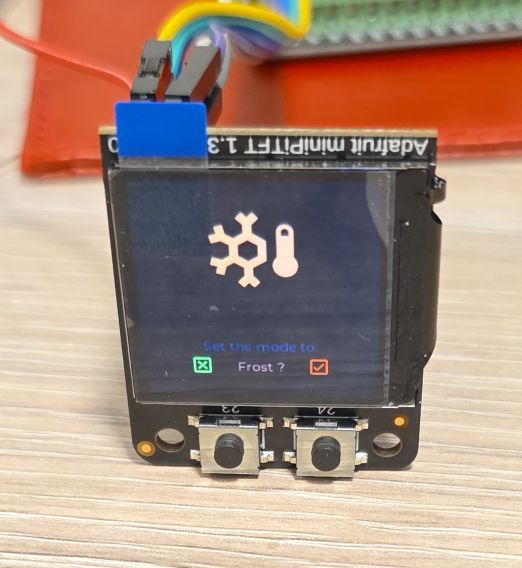
- Page 4 - Set Boost Temperature
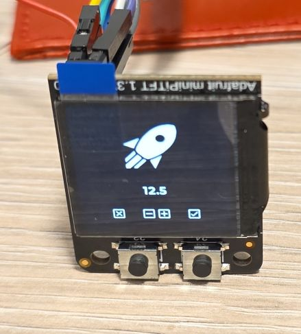
