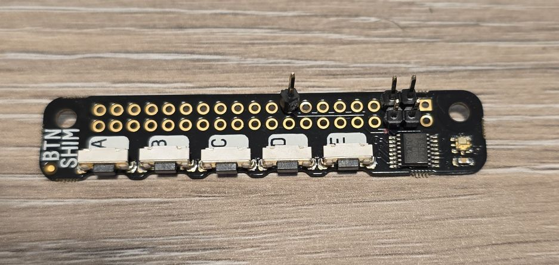
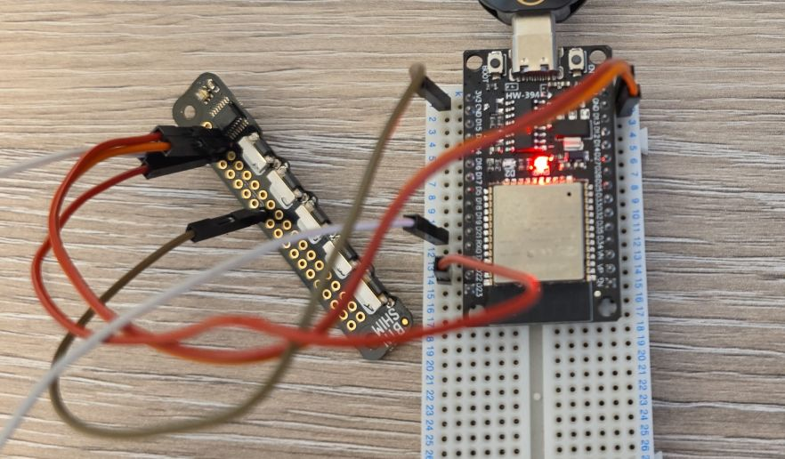
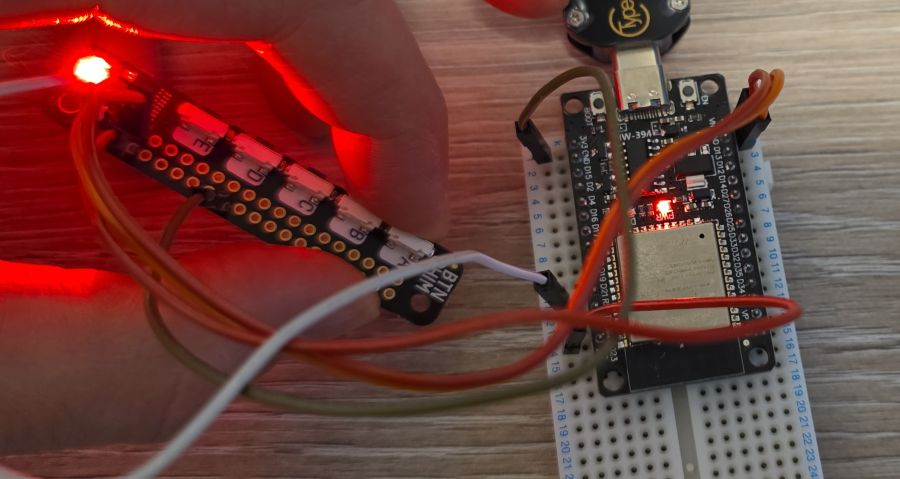
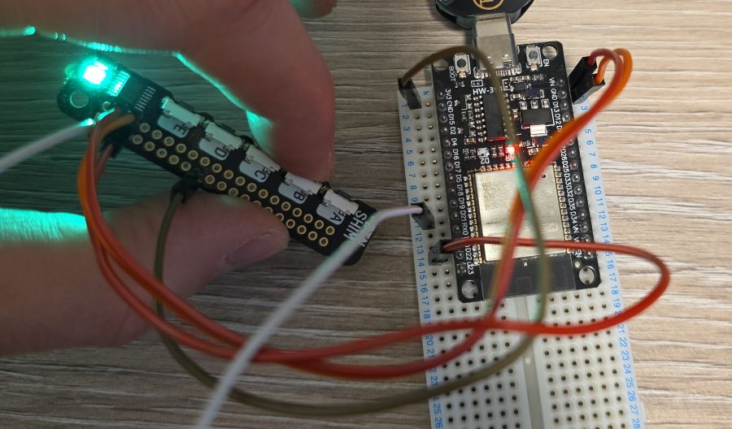
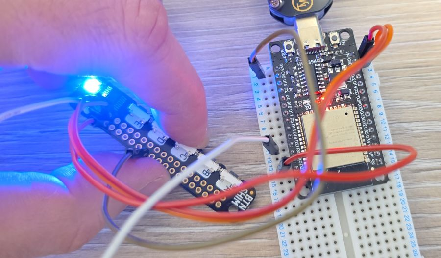
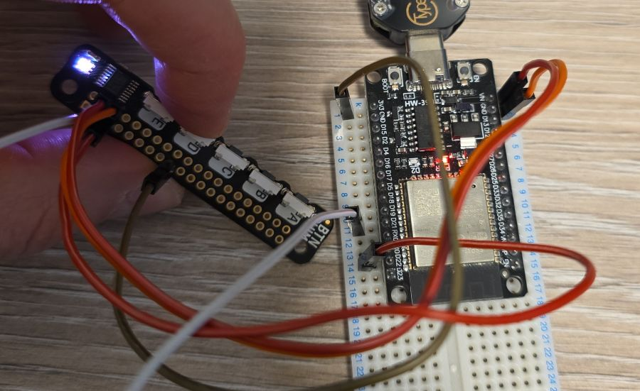
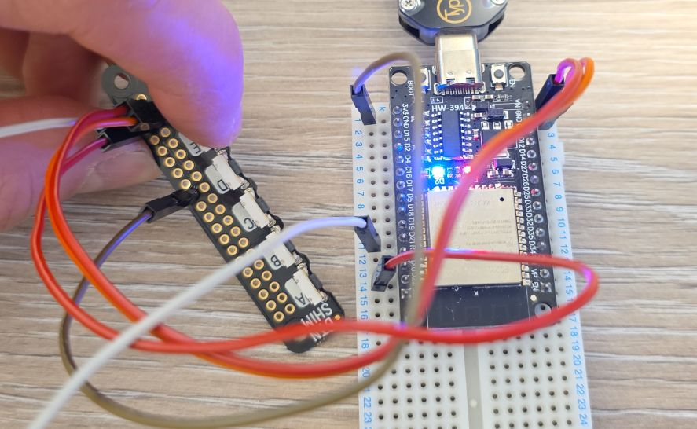
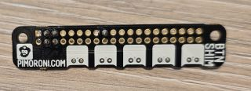

## Overview

The Button SHIM is a compact board featuring 5 tactile buttons and a single RGB LED, designed to sit on top
of a Raspberry Pi GPIO header but also works with other boards.



The board features:

- 5x tactile, right-angle push buttons (A, B, C, D, E)
- Single RGB LED (APA102)
- TCA9554A I/O expander for button inputs
- I2C interface (address 0x3F)
- 3.3V or 5V compatible

## Test Status

Testing done and full example available.

- ✅ [Basic Config](#basic-configuration) - well, full configuration 🙂

## Configuration Notes

⚠️ **Note**: While ESPHome has [TCA9555](https://esphome.io/components/tca9555/) support, TCA9554 and
TCA9554A are not supported because the I2C register addresses are different (TCA9555 has 2x registers of
TCA9554). ✅ External component available (by me 🙂)

⚠️ **Note**: Check out [PCA9554](https://esphome.io/components/pca9554/) support. Check if external
component is necessary because I2C supported addresses and registers are the same as TCA9554/TCA9554A.
Actually PCA9554 and TCA9554 should be software compatibile, however software SPI does not work when
I tested it. My buttons worked with the component, but not the LED on the shim.

The APA102 LED is supported via [SPI LED strip](https://esphome.io/components/light/spi_led_strip/)
platform, however, needs to use "software" SPI because it has to use TCA9554 outputs.

## Basic Configuration

### Wiring

Note that pinout for Button Shim is following Raspberry Pi 40 pin connector.

| Button Shim | ESP32 DevKit | Notes |
| ----------- | ------------ | ----- |
| 5V (pin 4) | 5V | Power for built in LED - can use 3V3 if needed |
| 3V3 (pin 17) | 3V3 | Power for the TCA9554 controller |
| GND (pin 6) | GND | |
| GPIO2 (pin 3) | GPIO21 | I2C1 SDA |
| GPIO3 (pin 5) | GPIO22 | I2C1 SCL |



### Example

It's a longer example, but it covers all buttons and the built in LED. See [further description below](#example-description).



For more photos see [other images section.](#other-images)

```yaml
esphome:
  name: my-btn-shim

esp32:
  board: esp32dev
  framework:
    type: esp-idf

logger:

external_components:
    - source: github://barbarachbc/esphomecomponents
      components: [ tca9554 ]
      refresh: 5min

substitutions:
  builtin_led_pin: GPIO02
  i2c_sda_pin: GPIO21
  i2c_scl_pin: GPIO22

output:
  - platform: gpio
    pin: ${builtin_led_pin}
    id: builtin_led

light:
  - platform: binary
    name: "Built in LED"
    output: builtin_led
  - platform: spi_led_strip
    num_leds: 1
    id: expander_led
    spi_id: expander_led_spi
    data_rate: 1kHz

binary_sensor:
  - platform: gpio
    pin: 
      tca9554: btn_shim
      number: 0
      inverted: true
    id: btn_a
    on_press:
      then:
        - light.addressable_set:
            id: expander_led
            range_from: 0
            range_to: 0
            red: 100%
            green: 22%
            blue: 12%
    on_release:
      then:
        - light.addressable_set:
            id: expander_led
            range_from: 0
            range_to: 0
            red: 0%
            green: 0%
            blue: 0%
  - platform: gpio
    pin: 
      tca9554: btn_shim
      number: 1
      inverted: true
    id: btn_b
    on_press:
      then:
        - light.addressable_set:
            id: expander_led
            range_from: 0
            range_to: 0
            red: 22%
            green: 100%
            blue: 12%
    on_release:
      then:
        - light.addressable_set:
            id: expander_led
            range_from: 0
            range_to: 0
            red: 0%
            green: 0%
            blue: 0%
  - platform: gpio
    pin: 
      tca9554: btn_shim
      number: 2
      inverted: true
    id: btn_c
    on_press:
      then:
        - light.addressable_set:
            id: expander_led
            range_from: 0
            range_to: 0
            red: 22%
            green: 10%
            blue: 100%
    on_release:
      then:
        - light.addressable_set:
            id: expander_led
            range_from: 0
            range_to: 0
            red: 0%
            green: 0%
            blue: 0%
  - platform: gpio
    pin: 
      tca9554: btn_shim
      number: 3
      inverted: true
    id: btn_d
    on_press:
      then:
        - light.addressable_set:
            id: expander_led
            range_from: 0
            range_to: 0
            red: 22%
            green: 22%
            blue: 22%
    on_release:
      then:
        - light.addressable_set:
            id: expander_led
            range_from: 0
            range_to: 0
            red: 0%
            green: 0%
            blue: 0%
  - platform: gpio
    pin: 
      tca9554: btn_shim
      number: 4
      inverted: true
    id: btn_e
    on_press:
      then:
        - output.turn_on: builtin_led
    on_release:
      then:
        - output.turn_off: builtin_led

i2c:
  sda: ${i2c_sda_pin}
  scl: ${i2c_scl_pin}

tca9554:
  - id: btn_shim
    address: 0x3f

spi:
  - id: expander_led_spi
    clk_pin:
      tca9554: btn_shim
      number: 6
    mosi_pin:
      tca9554: btn_shim
      number: 7
    interface: software

```

#### Example Description

- Uses [ESP32 DevKit](./esp32-devkit-v1.md)
- I2C uses `GPIO21` and `GPIO22`, see substitutions if you need to use a different board
- I2C is required, and `external_component` is used for TCA9554
- tca9554 "hub" is setup at 0x3f address
- All 5 buttons are wired up to turn-on while pressed and turn-off LEDs when released:
  - Button A: sets button shim's LED to Red-ish colour
  - Button B: sets button shim's LED to Green-ish colour
  - Button C: sets button shim's LED to Blue-ish colour
  - Button D: sets button shim's LED to some lower brightness
  - Button E: turns on/off board's built in LED
- Software SPI is used for the shim's built in LED, the LED is wired to 6th and 7th pin of the TCA9554
- [SPI LED Strip Light](https://esphome.io/components/light/spi_led_strip/) component is used for the LED,
I used the slowest data rate of 1kHz for it.

## Other Images

Button B:


Button C:


Button D:


Button E:


Back of the board:

