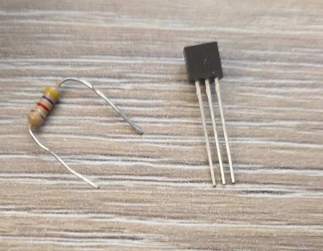
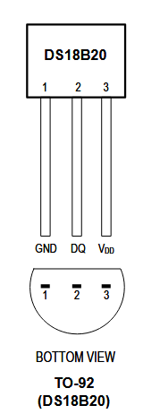
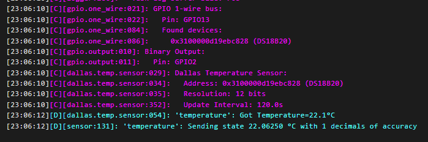
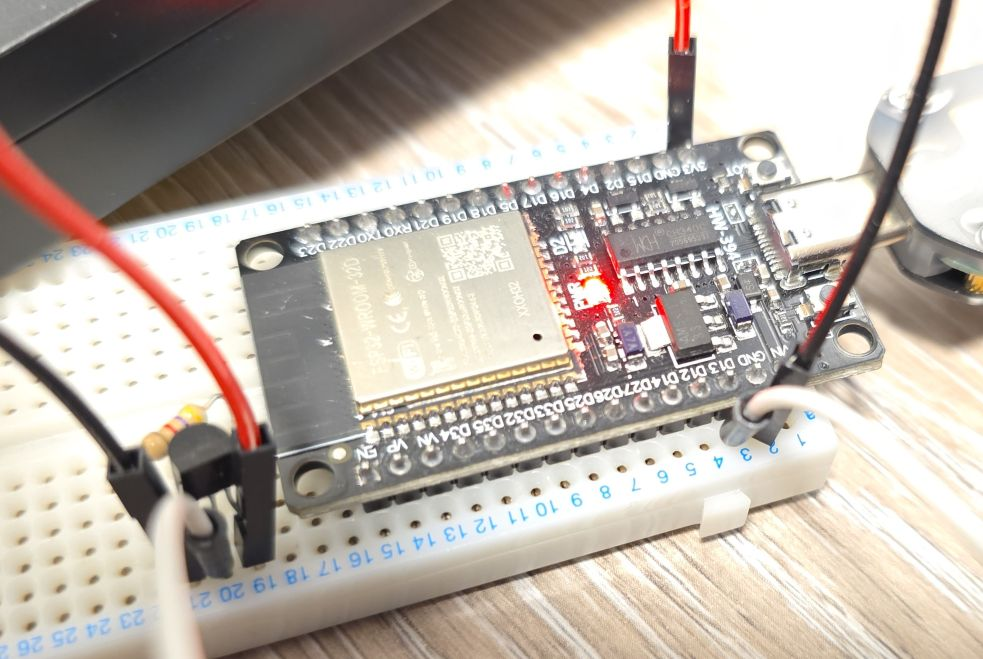
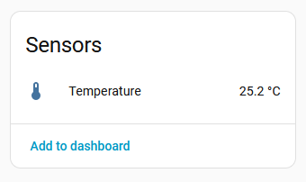

## Overview

The DS18B20 is a popular digital temperature sensor that communicates over a 1-Wire bus that has a very good
accuracy (±0.5°C). I got this as a 3 pin THT component, so not a module.



Features:

- ±0.5°C Accuracy from -10°C to +85°C
- Programmable Resolution from 9 Bits to 12 Bits
- No External Components Required (well, a resistor is required for 1-Wire Bus)
- 1-Wire interface
- Unique 64-bit serial code
- 3.3V or 5V compatible

## Test Status

- ✅ [Basic Configuration](#basic-configuration)

## Wire-up

| DS18B20 | ESP32 DEVKIT | Notes |
| ------- | ------------ | ----- |
| GND (#1) | GND | |
| Vdd (#3) | 3.3V | |
| DQ (#2) | Any GPIO | Has to have 4.7K pullup resistor connected to 3.3V |

- Component Pinout

- Wiring Up With MCU


### Basic Configuration

This is the basic configuration. Pretty simple, I'm using GPIO13 as my 1-wire pin. Just make sure
it has 4.7K pull-up resistor connected to 3.3V on it. If connected to Home Assistant this will
show temperature there, and the temperature is updated every 2 minutes. Have a look in the log for
the temperature.



```yaml
esphome:
  name: my-ds18b20-sensor

esp32:
  board: esp32dev
  framework:
    type: esp-idf

logger:

substitutions:
  one_wire_pin: GPIO13

one_wire:
  - platform: gpio
    pin: ${one_wire_pin}

sensor:
  - platform: dallas_temp
    name: temperature
    device_class: temperature
    state_class: measurement
    icon: mdi:thermometer
    unit_of_measurement: °C
    update_interval: 120s
```



It is good idea to use correct/meaningful icon, unit of measurement, device and state class as in the
example above. This ensures data is displayed nicely in Home Assistant:


