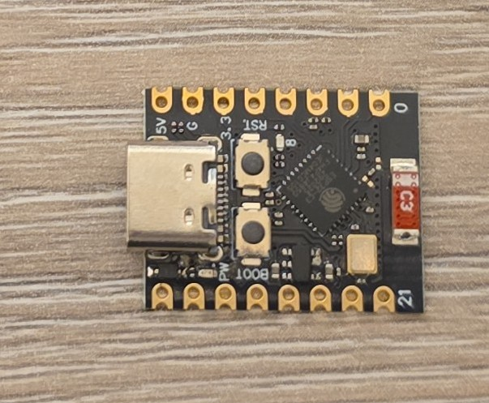
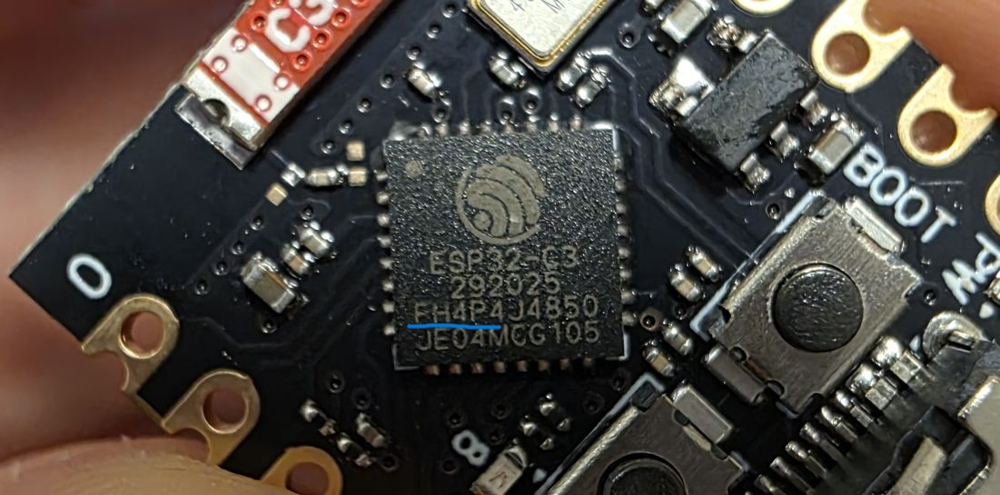
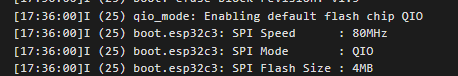
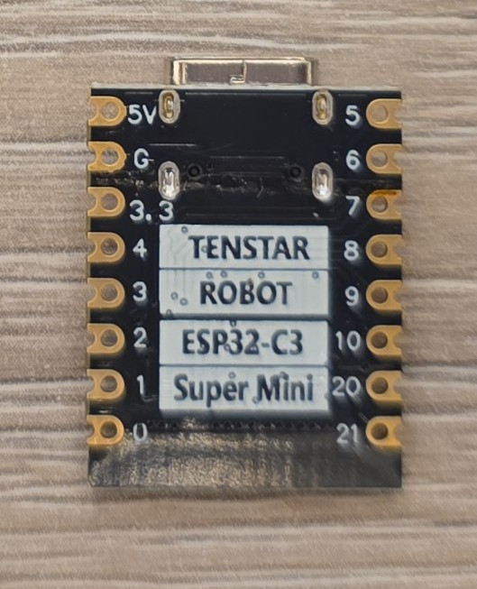

## Overview

The ESP32-C3 Super Mini is a compact development board based on the ESP32-C3 chip, featuring WiFi 2.4GHz and
Bluetooth 5.0 connectivity in a small form factor.



## Test Status

- ✅ [Basic Config](#basic-configuration) + Internal LED & Boot Button

## Additonal Hardware features

- LED (blue) GPIO08
- Boot Button GPIO09
- Reset Button

## Features

- **Compact Design**: Ultra-small size perfect for space-constrained projects
- **MCU:** ESP32-C3FH4 (NOTE: the listing has it as ESP32-C3FN4 which is end-of-life, so this must be updated version)
- **CPU:** 32-bit RISC-V single-core processor, up to 160 MHz
- **RAM:** 400KB
- **Flash:** 4MB In-Package Flash
- **Operating Voltage:** 3.3V
- **Input Voltage:** 5V (USB-C)
- **Connectivity:** WiFi 802.11 b/g/n, Bluetooth LE 5.0
- **USB-C Interface**: Easy programming and power via USB Type-C
- **Debugging**: JTAG & Serial Debugging over USB
- **Peripherals**:
  - Digital I/O x22 (nominally, ESP32 C3 has 22 GPIOs, however 6 are used for internal flash - Quad SPI interface,
  1 is used for backup powerline for the internal flash, 2 are used for USB connection, so that's 13 available.
  The board exposes all 13 of those)
  - LED PWM 6 Channel
  - SPI x1 (nominally it has 3, but 2 of them are used for the internal flash). Supports Single, Dula nd Quad SPI
  - UART x2
  - I2C x1
  - I2S x1
  - IR Transceiver: transmit channel x2, receive channel x2
  - 2 × 12-bit SAR ADC, 6 Channels
  - DMA Controller: transmit channel x3, receive channel x3
  - Temperature Sensor

## Warning ⚠️

Looks like there are some boards out there from less reputable manufacturers/suppliers that have MCUs that do
not have internal FLASH. Not sure how to check it before ordering. In the listing of the item I bought it says
that the chip is ESP32-C3FN4. That _FN4_ at the end indicates: F - internal flash, N - normal temperature, 4 -
flash size (MB) (look it up in te datasheet under _1.1 Nomenclature_). Actually, on the board I got, the MCU is
marked as ESP32-C3FH4 so ... YMMV.

Parts from ESP32-C3 family - ESP32-C3FN4, ESP32-C3FH4, ESP32-C3FH8 (H stands for "high" temperature) have internal
flash. ESP32-C3 without this FN/FH marking requires external flash, so if you get that one,
you won't be able to flash it. Here's the chip marking on the board I have:



Here's the [chip silk marking information](https://docs.espressif.com/projects/esp-packaging/en/latest/esp32c3/01-marking/index_chip.html).

## Pin Reference

The board provides access to various GPIO pins. Refer to the board's pinout diagram for specific pin assignments.
GPIO numbers are printed out at the back of the board. 0 stands for GPIO00, 1 stands for GPIO01, ... 21 stands for
GPIO21.

### Common Pin Mappings

- **I2C**: GPIO08 (SDA), GPIO09 (SCL) **NOTE ⚠️:** GPIO08 shared with status LED though
  - This is marked on the pinout for the board but based on the Datasheet those are priority 3 pins
  - Priority 2 pins are GPIO00 and GPIO01
- **SPI**: GPIO06 (MOSI), GPIO05 (MISO), GPIO04 (SCK)
  - Priority 1 pins for SPI2 are: GPIO02, GPIO04, GPIO05, GPIO06, GPIO07 and GPIO10
- **UART**: GPIO20 (RX), GPIO21 (TX)

**RANDOM RANT 📢:** I don't know how companies are deciding which functions of pins to show on their pin
diagrams. This does not make sense to me. _UART_ is fine, that's priority 1 option for UART0, but _I2C_ and
_SPI_ make no sense to me the way they are shown on the board diagram. FSPIHD is directly routed to GPIO04
for example. That's _HOLD_ signal for Quad SPI. FSPICLK is direclty routed to GPIO07, so, to me, GPIO07 would
be more reasonable choice for SCK. I don't know 🤷‍♂️.

## Configuration Notes

### Reboot Needed 🚨

Like for [xmini c3 board](./xmini-c3.md) it looks like the board does not reboot automatically after uploading
new image (at least through the web interface). I still haven't figured it out, so if you're using
[web interface](https://web.esphome.io/) make sure to go to _Log_ and then _RESET DEVICE_.

### Quad SPI for Flash ℹ️

By default, DIO (Dual I/O SPI mode) is used. This will work for flash that's wired up for Quad mode too, so it's a
reasonable default. However, for integrated flash, Quad I/O mode (QIO) is
[nearly twice as fast](https://docs.espressif.com/projects/esptool/en/latest/esp32/advanced-topics/spi-flash-modes.html).

I finally figured out how to use Quad SPI mode for the integrated flash:


```yaml
esp32:
  variant: esp32c3
  framework:
    type: esp-idf
    sdkconfig_options:
      CONFIG_ESPTOOLPY_FLASHMODE_QIO: y
```

`CONFIG_ESPTOOLPY_FLASHMODE_QIO` needs to be turned on, and **be careful ⚠️** to use lower letter _y_, capital _Y_
does not work.

### Arduino by Default

If you do not specify the framework, esp32c3 will use _arduino_ by default.

## Basic Configuration

Basic configuration with built in button and LED.

```yaml
esphome:
  name: my-esp32c3-supermini

esp32:
  variant: esp32c3
  framework:
    type: esp-idf
    sdkconfig_options:
      CONFIG_ESPTOOLPY_FLASHMODE_QIO: y

logger:

output:
  - platform: gpio
    pin: GPIO08
    id: builtin_led

light:
  - platform: binary
    name: "Built in LED"
    output: builtin_led

binary_sensor:
  - platform: gpio
    pin: 
      number: GPIO09
      inverted: true
    id: boot_btn
    on_press:
      then:
        - output.turn_on: builtin_led
    on_release:
      then:
        - output.turn_off: builtin_led
```

## Other Images

ESP32-C3 Super Mini back:

