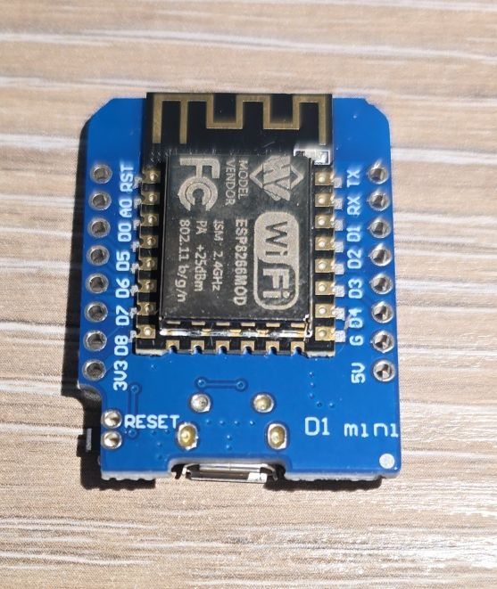
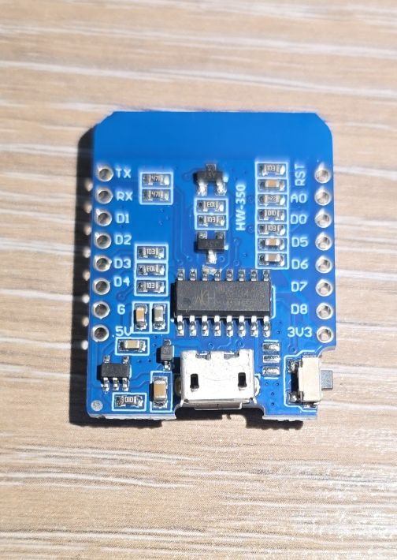

## Overview

The DiyMore NodeMCU (similar to Wemos D1 Mini) is a compact ESP8266-based development board with
built-in WiFi capabilities. It features the ESP8266MOD (ESP-12F) module.



## Test Status

- ✅ [Basic Config](#basic-configuration) + Internal LED
- [ ] GPIO
- [ ] UART
- [ ] SPI
- [ ] I2C
- [ ] I2S
- [ ] PWM
- [ ] IR
- [ ] ADC
- [ ] Deep Sleep

## Hardware Features

- **Module:** ESP8266MOD (ESP-12F)
- **CPU:** ESP8266EX single-core, 80MHz
- **RAM:** 80KB
- **Flash:** 4MB
  - W25Q32FV 32Mbit Serial Nor Flash (not recommended for new designs)
- **USB-to-UART:** CH340G
- **GPIO Pins:** 17 available on the module, not on the board
- **WiFi:** 802.11 b/g/n
- **ADC:** 10-bit (1 channel)
- **PWM:** Multiple channels
- **SPI:** Hardware SPI
- **I2C:** Software-implemented
- **I2S:** Interfaces with DMA
- **UART:** 1 interface
- **Operating Voltage:** 3.3V
- **Input Voltage:** 5V (via USB or VIN)
- **USB Connecor**: Mini USB

## Additional Hardware Features

- Reset button (cannot be used for anything else)
- Built-in LED on GPIO02 (active low/inverted)

## Board Pinout

The D1 Mini has a compact pinout with the following main pins:

### Power Pins

- **3.3V** - 3.3V output
- **5V** - 5V from USB or for input power
- **G** - Ground pins
- **RST** - Reset - active low

### GPIO Pins

- **D0** - GPIO16 (wake from deep sleep)
- **D1** - GPIO5 (I2C SCL)
- **D2** - GPIO4 (I2C SDA)
- **D3** - GPIO0 (Flash/Boot mode)
- **D4** - GPIO2 (Built-in LED, boot mode pin)
- **D5** - GPIO14 (SPI CLK)
- **D6** - GPIO12 (SPI MISO)
- **D7** - GPIO13 (SPI MOSI)
- **D8** - GPIO15 (SPI CS, boot mode pin)
- **RX** - GPIO3 (UART RX)
- **TX** - GPIO1 (UART TX)
- **A0** - ADC0 (Analog input, 0-3.3V)

**NOTE**: When `board: d1_mini` is specified you can use D8 or GPIO15 interchangeably.

## Basic Configuration

Basic configuration with built-in LED control.

```yaml
esphome:
  name: my-d1-mini

esp8266:
  board: d1_mini

output:
  - platform: gpio
    pin: GPIO02
    id: builtin_led
    inverted: true

#if connected to home assistant will be visible in UI
light:
  - platform: binary
    name: "Built in LED"
    output: builtin_led

#since there is no button toggle LED every 5 seconds to make sure it is working
interval:
  - interval: 5s
    then:
       - light.toggle: builtin_led
```

## Important Notes

⚠️ **Boot Mode Pins:** GPIO0, GPIO2, and GPIO15 affect boot mode. Be careful when connecting peripherals to these pins.

⚠️ **I2C:** I2C is implemented in software, so any GPIO can be used, but D1 (GPIO5) and D2 (GPIO4) are the default pins.

⚠️ **Current Limitations:** The 3.3V pin can supply limited current. For power-hungry peripherals, use external power.

### Waking up from Deep Sleep

GPIO16 (D0) on ESP8266 is used for waking up from deep sleep. In order to be used that way it has to be
connected to RST. Now, if it is connected to RST it can't be used for anything else. ESP8266 has a timer for
waking up from deep sleep that can be configured, and once it elapses it will drive GPIO16 low. This will
drive RST low if connected for this and will "wake-up" the MCU by resetting it.

## Troubleshooting

**Board won't flash:**

- Try holding the reset button while connecting USB
- Check CH340 drivers are installed
- Try a different USB cable (must support data)

**Random resets:**

- Check power supply (needs stable 5V, 500mA+)
- The ESP8266 can draw significant current spikes during WiFi transmission

## Other Images

D1 Mini Back:

