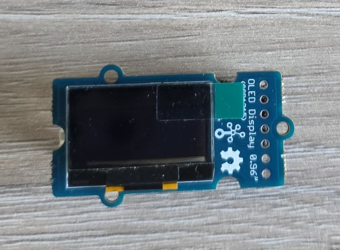
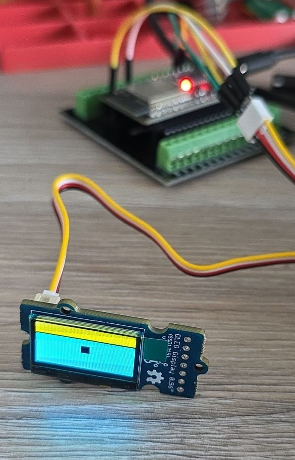
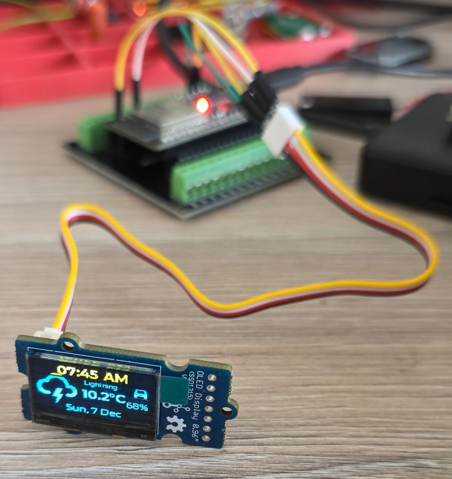
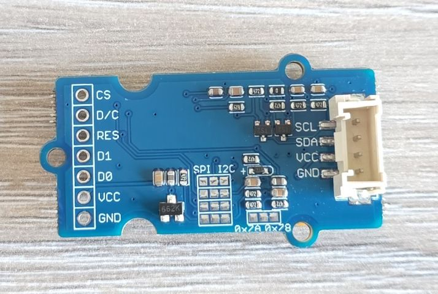
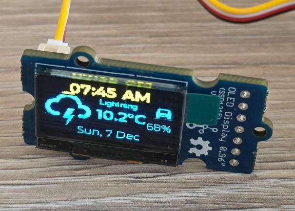
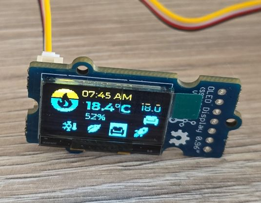
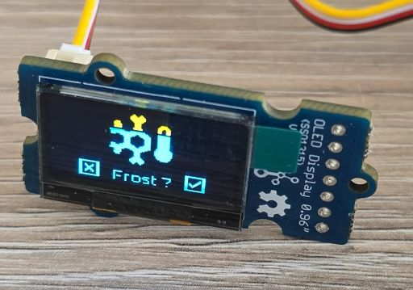
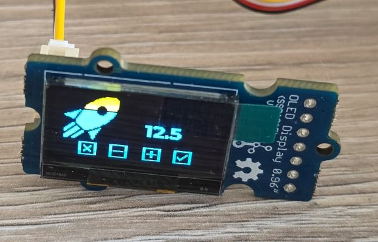

## Overview

Grove - OLED Yellow&Blue Display 0.96 (SSD1315) is a blue and yellow two-color display with 128x64 resolution.
Compared with LCDs, OLED has many advantages like self-emission, high contrast ration, slim/thin outline, wide viewing
angle and low power consumption. This display works on 3.3V or 5V supply voltage.
You can control it through I2C interface on your microcontroller, to display words, images, or any information you want.



- 0.96" OLED display (128x64 pixels)
- Yellow and blue color zones (top 16 rows yellow, bottom 48 rows blue)
- Uses the SSD1315 driver chip
- Grove I2C interface
- I2C address: Unclear at the moment (There are SMD jumpers for I2C address 0x7A or 0x78)
- SPI - can use either through smd jumpers
- Operating voltage: 3.3V-5V
- Wide viewing angle
- Low power consumption

## Testing Status

- ✅ [Basic Config](#basic-configuration) - Wiring up & basic graphics
- ✅ [Multipage Icons and Text](#example-with-icons-and-multiple-pages)

## Remarks

Examples on the product page indicate that [SSD1306 128x64](https://esphome.io/components/display/ssd1306/) should work.
Using SSD1306 configuration works.

It looks like that it is configured for I2C by default. I2C address: Unclear at the moment. There are SMD jumpers for
I2C address 0x7A or 0x78. D/C# acts as SA0 for slave address selection (0x7A when 1, 0x78 when 0). Need to check if
this is by default set.

0x7A/0x78 are 8-bit addresses. This should be configured as 0x3C or 0x3D because esphome uses 7-bit address

There is an option to wire it up to use SPI by soldering jumpers.

The display looks very similar to [XMini C3's display](./xmini-c3.md) - well, yellow & blue.

## Basic Configuration

Very basic test - fill the whole screen and add a small square in the middle:


In reality you don't see the scanning lines. You do see the black line between yellow and blue.

```yaml
esphome:
  name: my-display-test

esp32:
  variant: esp32
  framework:
    type: esp-idf
    advanced:
      minimum_chip_revision: "3.1"

logger:

substitutions:
  i2c_sda_pin: GPIO21
  i2c_scl_pin: GPIO22

i2c:
  sda: ${i2c_sda_pin}
  scl: ${i2c_scl_pin}

display:
  - platform: ssd1306_i2c
    model: "SSD1306 128x64"
    address: 0x3C
    lambda: |-
      it.filled_rectangle(0, 0, it.get_width(), it.get_height());
      it.filled_rectangle(it.get_width()/2 - 6, it.get_height()/2 - 6, 12, 12, COLOR_OFF);
```

## Example with Icons and Multiple Pages

Every 5 seconds the pages cycle through:

- info page with date/time, weather forecast, EV battery level
- heating info page: current indoor temperature, current preset and temperature set for the preset
and an indicator icon whether the heating is ON
- preset selection page
- preset temperature change page



This example is copied from [SH1106 oled display](./sh1106-oled.md), just changed *SH1106* to *SSD1306*

```yaml
esphome:
  name: my-display-test

esp32:
  variant: esp32
  framework:
    type: esp-idf
    advanced:
      minimum_chip_revision: "3.1"

logger:

substitutions:
  i2c_sda_pin: GPIO21
  i2c_scl_pin: GPIO22

i2c:
  sda: ${i2c_sda_pin}
  scl: ${i2c_scl_pin}

interval:
  - interval: 5s
    then:
      - display.page.show_next: my_display
      - component.update: my_display

font:
  #mono screen, so no anti aliasing
  - id: value_med
    file:
      type: gfonts
      family: Montserrat
    size: 12
    bpp: 1
  - id: value_small
    file:
      type: gfonts
      family: Montserrat
    size: 8
    bpp: 1
  - id: value_large
    file:
      type: gfonts
      family: Montserrat
      weight: bold
    size: 16
    bpp: 1
  - id: mdi_small
    file: assets/materialdesignicons-webfont.ttf
    size: 18
    bpp: 1
    glyphs: [
      "\U000F1A71", # snowflake-thermometer 
      "\U000F032A", # leaf
      "\U000F04B9", # sofa
      "\U000F14DE", # rocket-launch
      "\U000F0C52", # checkbox-outline
      "\U000F0158", # close-box-outline
      "\U000F0704", # plus-box-outline
      "\U000F06F2", # minus-box-outline
      "\U000F0E1B", # mdi-car-back
    ]
  - id: mdi_med
    file: assets/materialdesignicons-webfont.ttf
    size: 36
    bpp: 1
    glyphs: [
      "\U000F1807", # mdi-fire-circle
      "\U000F0E1B", # mdi-car-back
    ]
  - id: mdi_large
    file: assets/materialdesignicons-webfont.ttf
    size: 48
    bpp: 1
    glyphs: [
      "\U000F0593", # lightning
      "\U000F1A71", # snowflake-thermometer 
      "\U000F032A", # leaf
      "\U000F04B9", # sofa
      "\U000F14DE", # rocket-launch
    ]

display:
  - platform: ssd1306_i2c
    id: my_display
    model: "SSD1306 128x64"
    address: 0x3C
    update_interval: 1s
    pages:
      - id: page_info
        lambda: |-
          //print time and date
          it.print(it.get_width()/2, 8, id(value_large), COLOR_ON, TextAlign::CENTER, "07:45 AM");
          it.print(it.get_width()/2, it.get_height()-8, id(value_med), COLOR_ON, TextAlign::CENTER,
          "Sun, 7 Dec");

          it.print(0, 10, id(mdi_large), COLOR_ON, "\U000F0593");
          it.print(72, 14, id(value_small), COLOR_ON, TextAlign::TOP_CENTER, "Lightning");
          it.print(52, 24, id(value_large), COLOR_ON, "10.2°C");

          it.print(it.get_width()-2, 14, id(mdi_small), COLOR_ON, TextAlign::TOP_RIGHT, "\U000F0E1B");
          it.print(it.get_width()-2, 34, id(value_med), COLOR_ON, TextAlign::TOP_RIGHT, "68%");
      
      - id: page_heating
        lambda: |-

          const std::string presets[] = {
            "frost", "eco", "comfort", "boost"
          };

          const std::string icons[] = {
            "\U000F1A71", "\U000F032A", "\U000F04B9", "\U000F14DE"
          };
            
          it.print(it.get_width()/2, 7, id(value_med), COLOR_ON, TextAlign::CENTER, "07:45 AM");
          it.print(0, 0, id(mdi_med), COLOR_ON, "\U000F1807");

          it.print(42, 12, id(value_large), COLOR_ON, "18.4°C");
          it.print(42, 30, id(value_med), COLOR_ON, "52%");

          it.print(it.get_width() - 2, 26, id(value_med), COLOR_ON, TextAlign::BOTTOM_RIGHT, "18.0");
          it.print(it.get_width() - 2, 44, id(mdi_small), COLOR_ON, TextAlign::BOTTOM_RIGHT, "\U000F04B9");

          //show icons
          const int icon_size = 18;
          auto y = it.get_height() - icon_size;

          for(auto i = 0; i<4; i++){
            auto is_selected = "comfort" == presets[i];
            auto x = 18 + icon_size*i + 9*i; auto invert_icon = false;

            if(is_selected){
              invert_icon = true;
              it.filled_rectangle(x, y-1, icon_size+1, icon_size+1);
            }
            it.print(x, y, id(mdi_small), invert_icon ? COLOR_OFF :  COLOR_ON, icons[i].c_str());
          }
      - id: page_change_preset
        lambda: |-
            it.print(it.get_width()/2, 48, id(mdi_large), COLOR_ON, TextAlign::BOTTOM_CENTER, "\U000F1A71");
              
            //it.print(it.get_width()/2, 64, id(value_med), COLOR_ON,
            //TextAlign::TOP_CENTER, "Set the mode to:");
            it.print(it.get_width()/2, 48, id(value_med), COLOR_ON,
            TextAlign::TOP_CENTER, "Frost ?");

            //apply
            it.print(18, it.get_height() - 20, id(mdi_small), COLOR_ON, TextAlign::TOP_LEFT, "\U000F0158");
            //cancel
            it.print(it.get_width()-18, it.get_height() - 20, id(mdi_small), COLOR_ON, TextAlign::TOP_RIGHT, "\U000F0C52");
            
      - id: page_change_temp
        lambda: |-
            it.print(28, 48, id(mdi_large), COLOR_ON, TextAlign::BOTTOM_CENTER, "\U000F14DE");
            it.print(it.get_width()/2 + 20, 20, id(value_large), COLOR_ON, TextAlign::TOP_CENTER, "12.5");
            //apply
            it.print(18, it.get_height() - 20, id(mdi_small), COLOR_ON, TextAlign::TOP_LEFT, "\U000F0158");
            //cancel
            it.print(it.get_width()-18, it.get_height() - 20, id(mdi_small), COLOR_ON, TextAlign::TOP_RIGHT, "\U000F0C52");
            //minus
            it.print(42, it.get_height() - 20, id(mdi_small), COLOR_ON, TextAlign::TOP_LEFT, "\U000F06F2");
            //plus
            it.print(it.get_width() - 42, it.get_height() - 20, id(mdi_small), COLOR_ON, TextAlign::TOP_RIGHT, "\U000F0704");
```

## Other Images

Back of the LCD Display:


- Page 1 - Info Screen

- Page 2 - Heating Screen

- Page 3 - Set Heating Preset

- Page 4 - Set Boost Temperature

