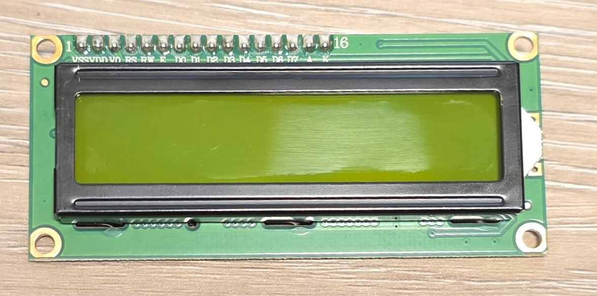
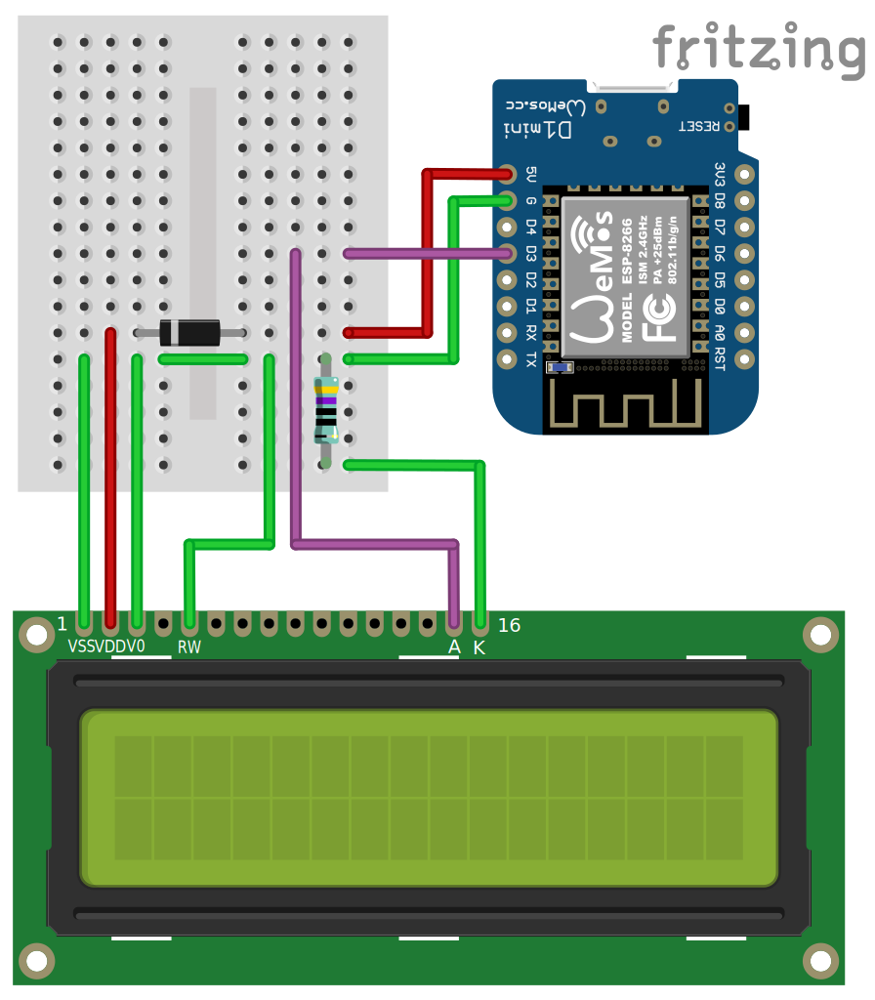
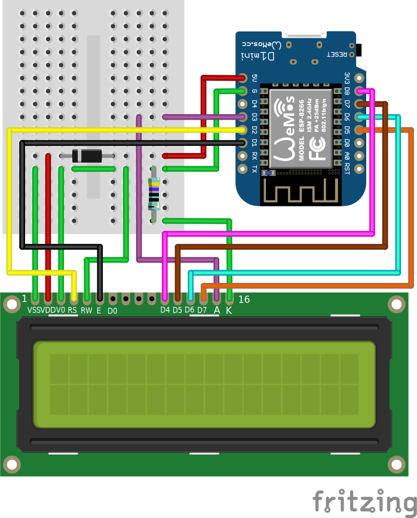
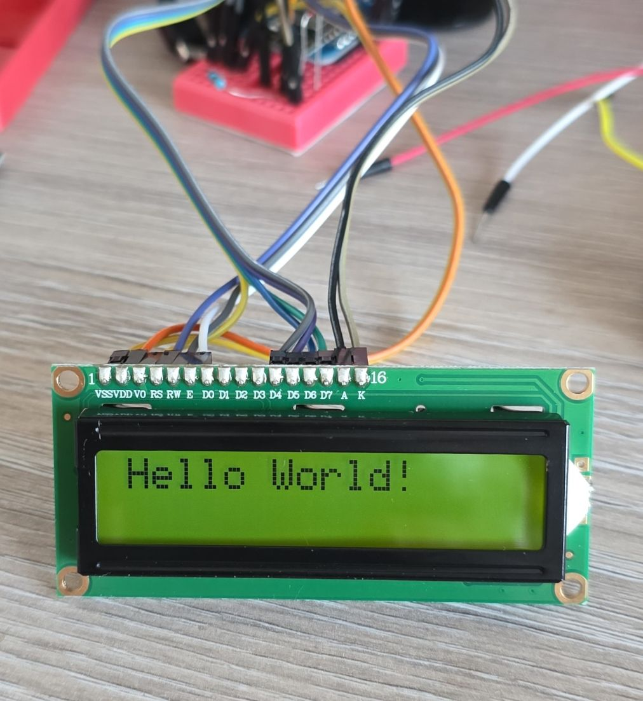
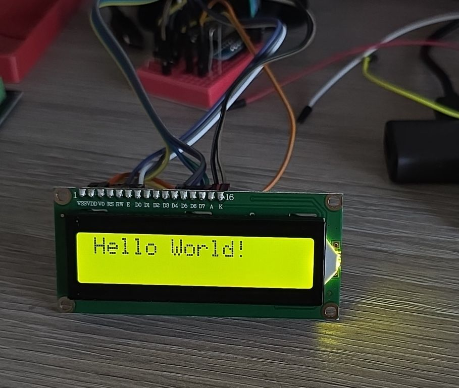
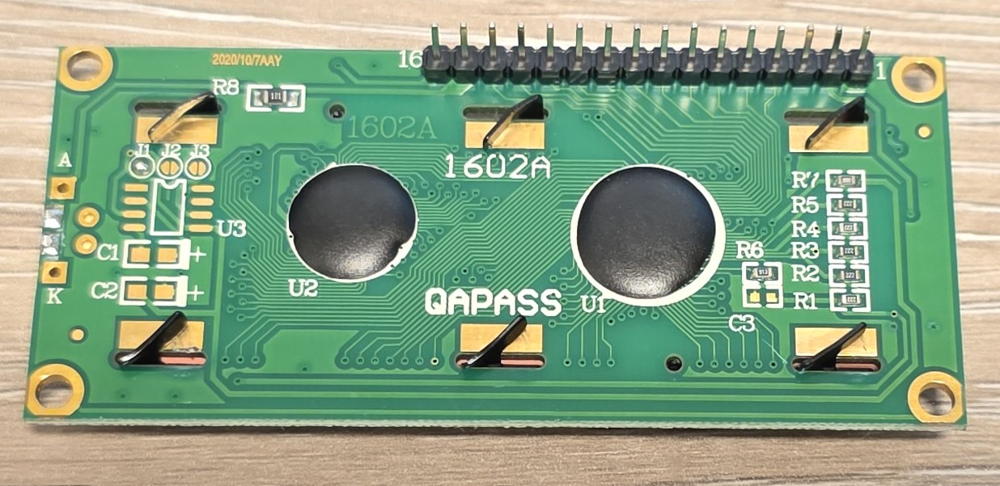

## Overview

The HD44780 is a character-based LCD display controller that has become the de facto standard for simple text
displays. These displays show individual characters in a fixed grid pattern (not pixel-addressable) and are
commonly available in various sizes such as 16x2, 20x4, and 8x2 configurations.

> Not sure how accurate it is that it's de facto standard in 2025, but it has been for decades.
>
> Probably more accurate name for my LCD is 1602A, HD44780 is just a generic name for the controller chip
that's compatible with HD44780 I suppose



My display is salvaged from an old device.

Display features:

- Character-based display (not pixel-addressable)
- Common sizes: **16x2** (mine 1602A), 20x4, 8x2, 20x2, 40x2
- HD44780 or compatible controller chip
- Multiple character sets available
  - HD44780UA00 English-Japanese is my version
  - `it.print("\xAF");` prints `ツ` katakana character
- 8 user-definable custom characters
- Built-in backlight (usually blue or **green** (mine))
- Operating voltage: 5V _but it's complicated_
- Adjustable contrast via potentiometer _but it's complicated_

## Configuration Notes

There are two flavours of connecting the LCD display:
[lcd_gpio](https://esphome.io/components/display/lcd_display/#lcd_gpio-component) which is
for parallel connection,and [lcd_pcf8574](https://esphome.io/components/display/lcd_display/#lcd_pcf8574-component)
which is using PCF8574 I2C expander.

**⚠️NOTE**: If you are going to use backlight make sure you add current limiting resistor.

### Using 5V Supply

**☠️⚠️ DANGER**: LCD needs 5V for VCC. Our ESP MCUs are not 5V tolerant so if you try to read from the LCD
while connected to 5V you'll fry your board! **ALWAYS** connect R/W to the ground!

The display is 3.3V compatible ... but this is for logic. Unfortunately it requires to somehow craft at least
4V between VCC and V0 for it to be able to display anything. So, options are:

- use 5V for power and use a level shifter
  - the reason for this is that minimum level for high signal is 70% of VCC which is 3.5V and that's
  outside of our 3.3V output level.
- use 3.3V for power and somehow get extra -1V or so 👀
  - this can be done with a charge pump, and there is even a placeholder for it on the back side
- _hack_ something yourself ... careful with this ... see my notes below

For this I did "hack" something myself. I added a diode (1N4001 or 1N4148 will work) between 5V and VDD of
the display. This gives me nearly no control of the contrast but it drops VCC enough that 0.7*VCC is
around 3V.

I connected back light led to 5V and a resistor to limit current, that does not go through the diode.

**NOTE**: Since LCD consumes <10mA it should be safe to use even a signal diode like 1N4148 which
can sustain 300mA continuous current.

#### Contrast

Contrast control can be achieved by adding a potentiometer between V0 and ground. I'm connecting it to
the GND since I don't have much headroom with my setup.

#### Backlight

Options:

- Connect A to 5V and K to 470ohm resistor to GND. This way I find it quite bright and no brightness control.
You could use potentiometer, or
- It is possible to control brightness using [ESP32 LEDC output](https://esphome.io/components/output/ledc/)
or [8266 PWM output](https://esphome.io/components/output/esp8266_pwm/) components
and [monochromatic light](https://esphome.io/components/light/monochromatic/).
I used D3 to control it, see the [power wiring](#wiring-5v-power)

#### Wiring 5V Power

Here is how I ended up wiring just the power part, and pins that require to be grounded (RW).
D3 controls the brightness of the backlight, resistor is for current limit - it is 470ohm
(you can choose different value - probably anything from 100 to 1K ohm will work just fine).
I'm powering the display through 1N4148 diode which will give me enough voltage drop so
3.3V logic level will work just fine.



### Pinout and Wiring

For GPIO Examples, I'll be using 4-bit mode.

| Pin | Name | Description | D1 Mini | Notes |
| --- | --- | ----------- | --- | ----- |
| 01 | VSS | Ground | G | GND |
| 02 | VCC | +5V Power Supply | 5V -> | With a diode. See [**NOTE**](#using-5v-supply) above |
| 03 | V0 | Contrast Adjustment | G | GND |
| 04 | RS | Register Select | D2 | Data/Command selection |
| 05 | R/W | Read/Write | G | GND (**🚨 Always Write only mode**) |
| 06 | E | Enable | D1 | "Clock" signal |
| 07 | D0 | Data Bit 0 | | NC |
| 08 | D1 | Data Bit 1 | | NC |
| 09 | D2 | Data Bit 2 | | NC |
| 10 | D3 | Data Bit 3 | | NC |
| 11 | D4 | Data Bit 4 | D8 | GPIO |
| 12 | D5 | Data Bit 5 | D7 | GPIO |
| 13 | D6 | Data Bit 6 | D6 | GPIO |
| 14 | D7 | Data Bit 7 | D5 | GPIO |
| 15 | A | Backlight Anode | D3 | Positive connection: 5V |
| 16 | K | Backlight Kathode | G -> | Negative connection: resistor to GND |

**NOTE**: The documentation says either lower 4 or upper 4 bits can be used, but for me, it only worked
connecting to upper 4 bits (4-7)

### LCD GPIO

This one can be configured to use 4 pins (4-bit mode) of the data bus or all 8 pins (8-bit mode). For all GPIO
examples I'll use 4 bits.

For the examples I'll be using [D1 Mini](./esp8266-d1-mini), and will wire it up like this:

```yaml
esphome:
  name: my-char-lcd

esp8266:
  board: d1_mini

logger:

substitutions:
  pin_enable: D1
  pin_rs: D2
  pin_data0: D8
  pin_data1: D7
  pin_data2: D6
  pin_data3: D5
```

**NOTE**: In the configuration above I used GPIO numbers as per D1 Mini board. If you specify the board for
your platform, you should usually be able to use pin names from the board instead of MCUs GPIO numbers.

### Full Wiring Diagram

Full wiring diagram for D1 Mini and 1602 LCD with backlight control.



## Basic Configuration

Basic configuration without backlight control (I actually had backlight disconnected for this picture).



```yaml
# Example configuration entry
display:
  - platform: lcd_gpio
    dimensions: 16x2
    data_pins:
      - ${pin_data0}
      - ${pin_data1}
      - ${pin_data2}
      - ${pin_data3}
    enable_pin: ${pin_enable}
    rs_pin: ${pin_rs}
    #optional but don't use it
    #rw_pin: ...
    lambda: |-
      it.print("Hello World!");
```

## With Backlight Control

Basic configuration with backlight control.



```yaml
esphome:
  name: my-text-lcd

esp8266:
  board: d1_mini

api:
  encryption:
    key: !secret my_text_lcd_api

ota:
  - platform: esphome
    password: !secret my_text_lcd_ota

wifi:
  ssid: !secret wifi_ssid
  password: !secret wifi_password


logger:

substitutions:
  pin_enable: D1
  pin_rs: D2
  pin_data4: D8
  pin_data5: D7
  pin_data6: D6
  pin_data7: D5

# Example configuration entry
display:
  - platform: lcd_gpio
    dimensions: 16x2
    data_pins:
      - ${pin_data4}
      - ${pin_data5}
      - ${pin_data6}
      - ${pin_data7}
    enable_pin: ${pin_enable}
    rs_pin: ${pin_rs}
    #optional
    #rw_pin: ${pin_rw}
    lambda: |-
      it.print("Hello World!");

output:
  - platform: esp8266_pwm
    pin: D3
    frequency: 1000 Hz
    id: pwm_output

light:
  - platform: monochromatic
    output: pwm_output
    #it will appear in home assistant
    name: "Backlight"

```

## Using ESP32

When using EPS32 use [LEDC component](/components/output-ledc):

```yaml
output:
  - platform: ledc
    pin: ${bl_pin}
    frequency: 1220 Hz
    id: pwm_output
```

**TIP 💡:** I used 1220 Hz for frequency - as per
[recommended frequencies](https://esphome.io/components/output/ledc/#recommended-frequencies).
When I used 1000Hz I was getting flickering.

## Other Images

1602a back:

