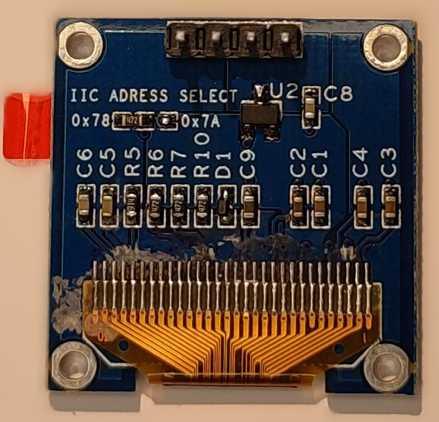

## Overview

The KY34-BY OLED Display by Kuman is a monochrome blue OLED display module.

OLED displays are self-illuminating (no backlight needed), have excellent contrast, wide viewing angles,
and consume very little power. This module uses the SSD1306 driver chip.


- 0.96" blue OLED display (128x64 pixels)
- Uses the SSD1306 driver chip
- I2C interface
- I2C address: 0x78 (or 0x7A - jumper) This should be configured as 0x3C or 0x3D because esphome uses 7-bit address
- Operating voltage: 3.3V-5V

## Testing Status

- ✅ [Basic Config](#basic-configuration) - Wiring up & Test Card in Color
- ✅ [Simple Graphics and Text](#simple-graphics-and-text-example)

## Configuration Notes

Uses [SSD1306](https://esphome.io/components/display/ssd1306/) I2C (SSD1306 128x64).

- The same as the display on [Xmini C3](./xmini-c3.md)
- Similar to [grove-oled-ssd1315](./grove-oled-ssd1315), has the same addresses indicated

### Wiring

Example here is for [esp32-devkit-v1](./esp32-devkit-v1)
Adjust substitutions based on your board. For the examples below I used the following wiring:

| LCD | esp32-devkit-v1 | Notes |
| :---- | :---- | :---- |
| SCL | GPIO22 | I2C Clock |
| SDA | GPIO21 | I2C Data |
| VCC | 3V3 | |
| GND | GND | |

## Basic Configuration

Very basic test - just two squares:
<!---->

```yaml
esphome:
  name: my-display-test

esp32:
  variant: esp32
  framework:
    type: esp-idf
    advanced:
      minimum_chip_revision: "3.1"

logger:

substitutions:
  i2c_sda_pin: GPIO21
  i2c_scl_pin: GPIO22

i2c:
  sda: ${i2c_sda_pin}
  scl: ${i2c_scl_pin}

display:
  - platform: ssd1306_i2c
    model: "SSD1306 128x64"
    address: 0x3C
    lambda: |-
      it.filled_rectangle(0, 0, it.get_width(), it.get_height());
      it.filled_rectangle(it.get_width()/2 - 6, it.get_height()/2 - 6, 12, 12, COLOR_OFF);
```

## Simple Graphics and Text Example

To add text and graphics, add the lambda section and define fonts to the [basic config](#basic-configuration):

<!---->

```yaml
font:
  - file: "gfonts://Roboto"
    id: roboto
    size: 20

display:
  - platform: ssd1306_i2c
    model: "SSD1306 128x64"
    address: 0x3C
    lambda: |-
      it.filled_rectangle(0, 0, it.get_width(), it.get_height(), COLOR_OFF);
      it.filled_circle(it.get_width()/2, 40, 24, COLOR_ON);
      it.print(it.get_width()/2, 10, id(roboto), COLOR_ON, TextAlign::CENTER, "Hello!");
```

## Other Images

Back of the display:

