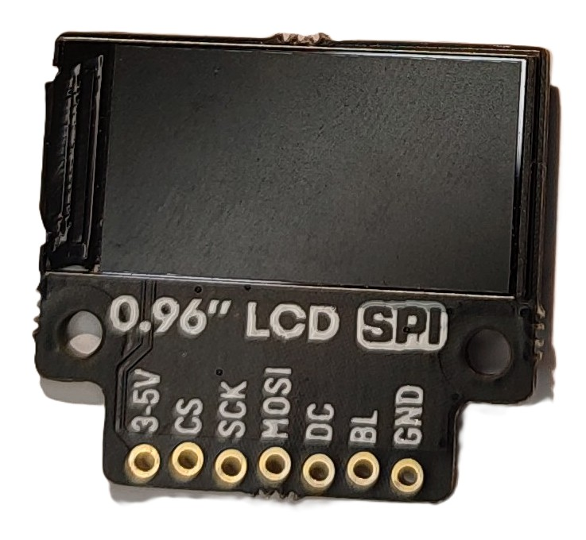
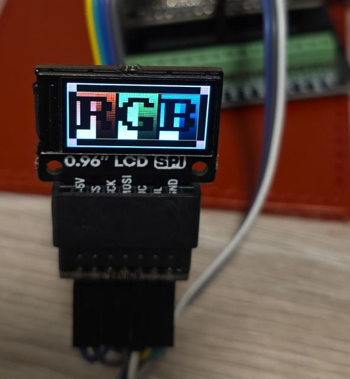
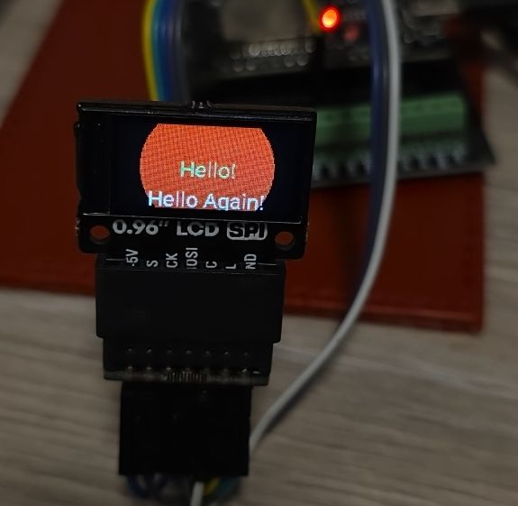
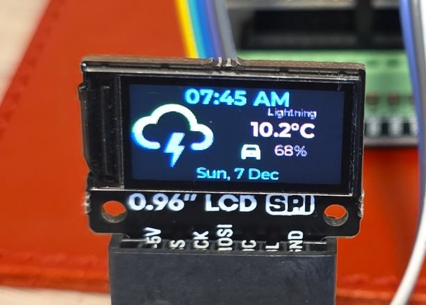
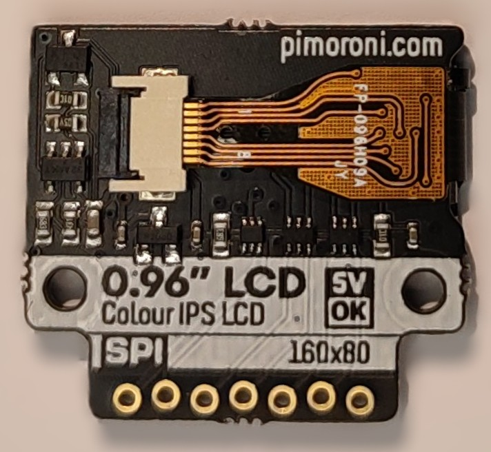
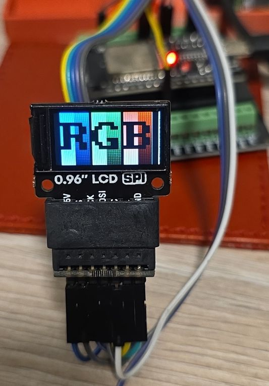
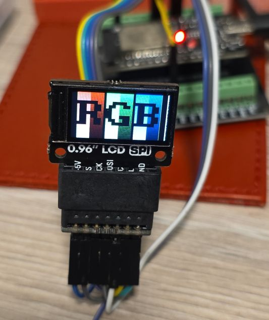
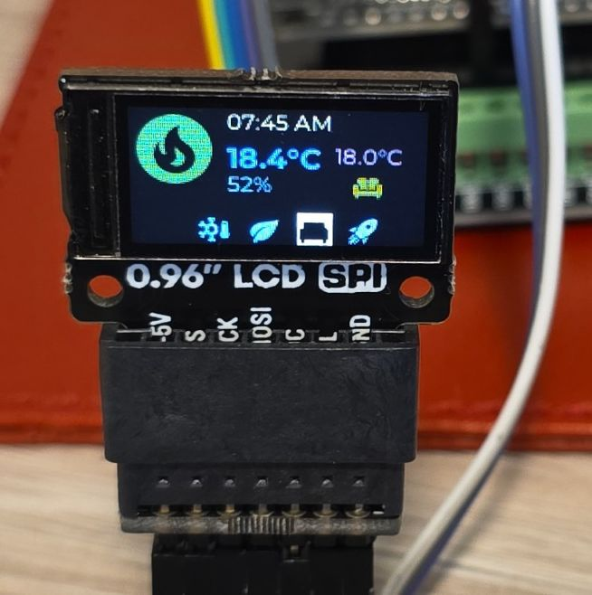
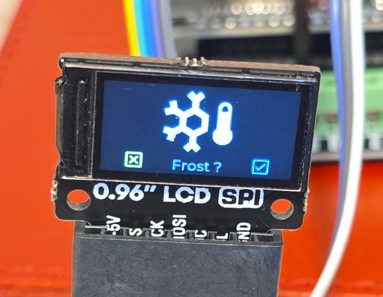
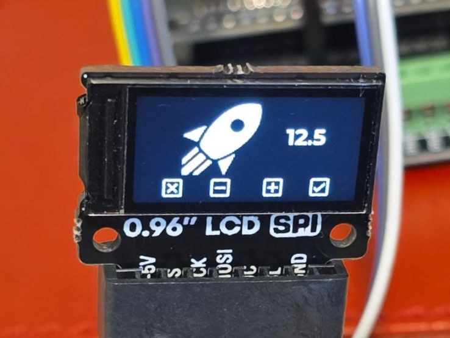

## Overview

The 0.96" SPI Colour LCD is a compact, high-quality color display from Pimoroni. Its small form factor makes it
ideal for embedded projects, wearables, and space-constrained applications.



Display specifications:

- 160x80 pixels (~190 PPI)
- 10.8x21.7mm active area
- 400cd/m2 luminance
- 800:1 contrast ratio
- 160° viewing angle (horizontal and vertical)
- ST7735S driver chip
- 4-wire SPI interface
- Full color display (RGB)
- 3.3V compatible, can use 5V power supply

## Testing Status

- ✅ [Basic Config](#basic-configuration) - Wiring up & Test Card in Color
- ✅ [Backlight](#adding-backlight-support)
- ✅ [Simple Graphics and Text](#simple-graphics-and-text-example)
- ✅ [Multipage Icons and Text](#icons-text-pretty) 🌈🦾

## Configuration Notes

- Requires **SPI**, spi_id is optional, but spi component is required.
- Platform: **st7735**
  - The chip supports 128x160 dimensions so we need to use correct dimensions
  - Since the width is 160, we'll use 90 degree rotation
  - Height is 80, so we have 48 less rows
  - After a few tries I got `offset_width: 1` and `offset_height: 26`. I started without any offset, then based on
  what I got on the screen went with 1 and 24, and finally got to 1 and 26.
- cs_pin and dc_pin are required - can be any available GPIO
- **Backlight control** is optional but recommended for power management
- `color_order` is by default RGB, but the correct order is BGR

### Wiring

Example here is for [esp32-devkit-v1](./esp32-devkit-v1)
Adjust substitutions based on your board. For the examples below I used the following wiring:

| 0.96" LCD | esp32-devkit-v1 | Notes |
| :---- | :---- | :---- |
| BLK | GPIO25 | |
| CS | GPIO05 | |
| DC | GPIO04 | |
| SDA (SPI MOSI) | GPIO23 | |
| SCL (SPI CLK) | GPIO18 | |
| VCC | 3V3 | It can use 5V supply |
| GND | GND | |

Note: The breakout does not have MISO (SPI input) as the display is write-only.

### Basic Configuration

Show test card - ensures everything is correctly configured and wired up.



```yaml
esphome:
  name: my-display-test

esp32:
  variant: esp32
  framework:
    type: esp-idf
    advanced:
      minimum_chip_revision: "3.1"

# Enable logging - always enable, for testing keep it at DEBUG level (default)
logger:

substitutions:
  clk_pin: GPIO18
  mosi_pin: GPIO23
  disp_cs_pin: GPIO05
  disp_dc_pin: GPIO04
  backlight_pin: GPIO25

spi:
  clk_pin: ${clk_pin}
  mosi_pin: ${mosi_pin}

display:
  - platform: mipi_spi
    id: my_display
    model: ST7735
    cs_pin: ${disp_cs_pin}
    dc_pin: ${disp_dc_pin}
    show_test_card: true
    data_rate: 40MHz
    rotation: 90
    invert_colors: true
    color_order: BGR
    dimensions:
      width: 160
      height: 80
      offset_height: 26
      offset_width: 1
```

### Adding Backlight Support

The following example increases backlight brightness from 10%-100% by 10% every 5 seconds.
**NOTE**: Doesn't work if the backlight is not turned on 🙂

```yaml
interval:
  - interval: 5s
    then:
      - light.turn_on: backlight
      - light.control:
          id: backlight
          brightness: !lambda |-
            static int num_executions = 0;
            num_executions = (num_executions % 10) + 1;
            //go from 10%-100%
            return num_executions * 0.1;

output:
  - platform: ledc
    pin: ${backlight_pin}
    id: backlight_pwm

light:
  - platform: monochromatic
    output: backlight_pwm
    name: "Display Backlight"
    id: backlight

display:
  - platform: mipi_spi
    id: my_display
    model: ST7735
    cs_pin: ${disp_cs_pin}
    dc_pin: ${disp_dc_pin}
    show_test_card: true
    data_rate: 40MHz
    rotation: 90
    invert_colors: true
    color_order: BGR
    dimensions:
      width: 160
      height: 80
      offset_height: 26
      offset_width: 1
```

### Simple Graphics and Text Example

To add text and graphics, add the lambda section and define fonts to the [basic config](#basic-configuration):

In the real life, the circle is full red, camera doesn't do it justice


```yaml
font:
  - file: "gfonts://Roboto"
    id: roboto
    size: 20

display:
  - platform: mipi_spi
    id: my_display
    model: ST7735
    cs_pin: ${disp_cs_pin}
    dc_pin: ${disp_dc_pin}
    data_rate: 40MHz
    rotation: 90
    invert_colors: true
    color_order: BGR
    dimensions:
      width: 160
      height: 80
      offset_height: 26
      offset_width: 1
    lambda: |-
      it.filled_circle(it.get_width()/2, it.get_height()/2, 60, Color(0xFF0000));
      it.print(it.get_width()/2, it.get_height()/2, id(roboto), Color(0x00FF78), TextAlign::CENTER, "Hello!");
      it.print(it.get_width()/2, it.get_height()-10, id(roboto), Color(0xFFFFFF), TextAlign::CENTER, "Hello Again!");
```

### Icons, Text, Pretty

This example has 4 different pages and changes them every 5 seconds. The display is set not to update itself
because updates are only done on timer. You might want to change `update_interval: never` to some
other value (default is 1s = 1 second) unless you're using LVGL which handles display itself.



```yaml
interval:
  - interval: 5s
    then:
      - display.page.show_next: my_display
      - component.update: my_display

font:
  #color screen, so good for anti-aliasing
  - id: value_med
    file:
      type: gfonts
      family: Montserrat
    size: 12
    bpp: 4
  - id: value_small
    file:
      type: gfonts
      family: Montserrat
    size: 8
    bpp: 2
  - id: value_large
    file:
      type: gfonts
      family: Montserrat
      weight: bold
    size: 16
    bpp: 4
  - id: mdi_small
    file: assets/materialdesignicons-webfont.ttf
    size: 18
    bpp: 4
    glyphs: [
      "\U000F1A71", # snowflake-thermometer 
      "\U000F032A", # leaf
      "\U000F04B9", # sofa
      "\U000F14DE", # rocket-launch
      "\U000F0C52", # checkbox-outline
      "\U000F0158", # close-box-outline
      "\U000F0704", # plus-box-outline
      "\U000F06F2", # minus-box-outline
      "\U000F0E1B", # mdi-car-back
    ]
  - id: mdi_med
    file: assets/materialdesignicons-webfont.ttf
    size: 48
    bpp: 4
    glyphs: [
      "\U000F1807", # mdi-fire-circle
      "\U000F0E1B", # mdi-car-back
    ]
  - id: mdi_large
    file: assets/materialdesignicons-webfont.ttf
    size: 64
    bpp: 4
    glyphs: [
      "\U000F0593", # lightning
      "\U000F1A71", # snowflake-thermometer 
      "\U000F032A", # leaf
      "\U000F04B9", # sofa
      "\U000F14DE", # rocket-launch
    ]

display:
  - platform: mipi_spi
    id: my_display
    model: ST7735
    cs_pin: ${disp_cs_pin}
    dc_pin: ${disp_dc_pin}
    data_rate: 40MHz
    rotation: 90
    invert_colors: true
    dimensions:
      width: 160
      height: 80
      offset_height: 26
      offset_width: 1
    # only update on timer for this demo
    update_interval: never
    pages: 
      - id: page_info
        lambda: |-
          //print time and date
          it.print(it.get_width()/2, 8, id(value_large), Color::random_color(), TextAlign::CENTER, "07:45 AM");
          it.print(it.get_width()/2, it.get_height()-8, id(value_med), Color::random_color(), TextAlign::CENTER,
          "Sun, 7 Dec");

          it.print(0, 10, id(mdi_large), Color::random_color(), "\U000F0593");
          it.print(120, 14, id(value_small), Color::random_color(), TextAlign::TOP_CENTER, "Lightning");
          it.print(90, 24, id(value_large), Color::random_color(), "10.2°C");

          it.print(90, 44, id(mdi_small), Color::random_color(), TextAlign::TOP_CENTER, "\U000F0E1B");
          it.print(120, 44, id(value_med), Color::random_color(), TextAlign::TOP_CENTER, "68%");
      
      - id: page_heating
        lambda: |-

          const std::string presets[] = {
            "frost", "eco", "comfort", "boost"
          };

          const std::string icons[] = {
            "\U000F1A71", "\U000F032A", "\U000F04B9", "\U000F14DE"
          };
            
          it.print(it.get_width()/2, 7, id(value_med), Color(0x87CEEB), TextAlign::CENTER, "07:45 AM");
          it.print(0, 0, id(mdi_med), Color(0x228B22), "\U000F1807");

          it.print(52, 18, id(value_large), Color(0xDC143C), "18.4°C");
          it.print(52, 36, id(value_med), Color(0xDAA520), "52%");

          it.print(it.get_width() - 32, 26, id(value_med), Color(0xBA55D3), TextAlign::CENTER, "18.0°C");
          it.print(it.get_width() - 32, 44, id(mdi_small), Color(0x008080), TextAlign::CENTER, "\U000F04B9");

          //show icons
          const int icon_size = 18;
          auto y = it.get_height() - icon_size;

          for(auto i = 0; i<4; i++){
            auto is_selected = "comfort" == presets[i];
            auto x = 36 + icon_size*i + 9*i; auto invert_icon = false;

            if(is_selected){
              invert_icon = true;
              it.filled_rectangle(x, y-1, icon_size+1, icon_size+1);
            }
            it.print(x, y, id(mdi_small), invert_icon ? COLOR_OFF :  Color(0xF4A460), icons[i].c_str());
          }
      - id: page_change_preset
        lambda: |-
            it.print(it.get_width()/2, 64, id(mdi_large), Color(0xF4A460), TextAlign::BOTTOM_CENTER, "\U000F1A71");
              
            //it.print(it.get_width()/2, 64, id(value_med), Color(0x0000FF),
            //TextAlign::TOP_CENTER, "Set the mode to:");
            it.print(it.get_width()/2, 64, id(value_med), Color(0xF08080),
            TextAlign::TOP_CENTER, "Frost ?");

            //apply
            it.print(18, it.get_height() - 20, id(mdi_small), Color(0x00FF00), TextAlign::TOP_LEFT, "\U000F0158");
            //cancel
            it.print(it.get_width()-18, it.get_height() - 20, id(mdi_small), Color(0xFF0000), TextAlign::TOP_RIGHT, "\U000F0C52");
            
      - id: page_change_temp
        lambda: |-
            it.print(it.get_width()/2 - 20, 64, id(mdi_large), COLOR_ON, TextAlign::BOTTOM_CENTER, "\U000F14DE");
            it.print(it.get_width()/2 + 40, 20, id(value_large), COLOR_ON, TextAlign::TOP_CENTER, "12.5");
            //apply
            it.print(18, it.get_height() - 20, id(mdi_small), COLOR_ON, TextAlign::TOP_LEFT, "\U000F0158");
            //cancel
            it.print(it.get_width()-18, it.get_height() - 20, id(mdi_small), COLOR_ON, TextAlign::TOP_RIGHT, "\U000F0C52");
            //minus
            it.print(52, it.get_height() - 20, id(mdi_small), COLOR_ON, TextAlign::TOP_LEFT, "\U000F06F2");
            //plus
            it.print(it.get_width() - 52, it.get_height() - 20, id(mdi_small), COLOR_ON, TextAlign::TOP_RIGHT, "\U000F0704");

```

## Other Images

Back of the LCD Display:


- Troubleshooting - Incorrect color order (by default for this driver, it is RGB, but should be BGR):


- Troubleshooting - Incorrect offset:


- Page 2 - Heating Screen

- Page 3 - Set Heating Preset

- Page 4 - Set Boost Temperature

