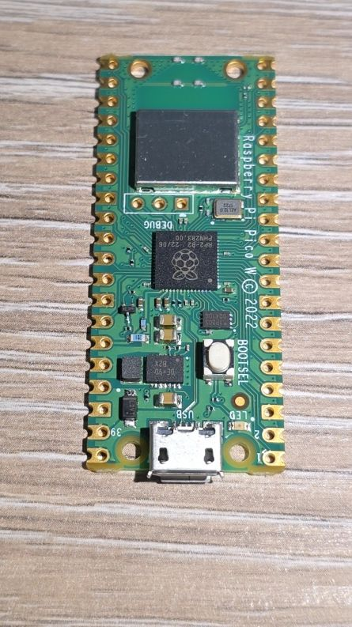
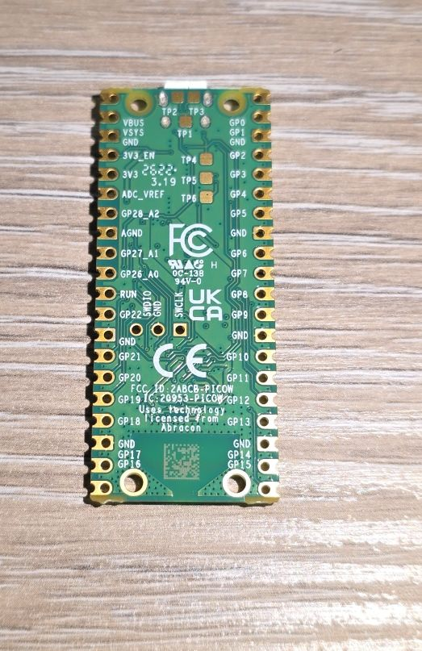

## Overview

The Raspberry Pi Pico W is a low-cost, high-performance microcontroller board with wireless connectivity.
It adds WiFi and Bluetooth to the original Raspberry Pi Pico, making it ideal for IoT and connected projects.
The board is based on the custom RP2040 microcontroller chip designed by Raspberry Pi.



## Test Status

- [ ] Basic Config
- [ ] GPIO
- [ ] UART
- [ ] SPI
- [ ] I2C
- [ ] I2S
- [ ] (LED) PWM
- [ ] ADC
- [ ] Temperature Sensor
- [ ] PIO
- [ ] Bluetooth
- [ ] USB 1.1 Host

## Hardware Features

- **Microcontroller:** RP2040 (designed by Raspberry Pi)
- **CPU:** Dual-core ARM Cortex-M0+ processor
- **Clock Speed:** Flexible clock up to 133 MHz
- **RAM:** 264KB of SRAM
- **Flash:** 2MB on-board flash memory
- **Wireless:** Infineon CYW43439 chip
  - WiFi: 802.11n, single-band (2.4 GHz)
  - WPA3 security support
  - Soft AP mode (up to 4 clients)
  - Bluetooth 5.2 (LE Central, Peripheral, and Classic)
- **GPIO Pins:** 26 multi-function GPIO pins
- **ADC:** 3 × 12-bit 500ksps Analog-to-Digital Converter channels
- **PWM:** 16 controllable PWM channels
- **Interfaces:**
  - 2 × SPI
  - 2 × I2C
  - 2 × UART
  - 8 × Programmable I/O (PIO) state machines
- **USB:** USB 1.1 with device and host support
- **Power Modes:** Low-power sleep and dormant modes
- **Temperature Sensor:** On-chip temperature sensor
- **Clock & Timers:** Accurate on-chip clock and timer
- **Programming:** Drag-and-drop programming via USB mass storage
- **Debug:** 3-pin Serial Wire Debug (SWD) header
- **Operating Voltage:** 1.8V - 5.5V (input voltage via USB or VSYS)
- **Board Dimensions:** 51mm × 21mm

## Wireless Module Details

The **Infineon CYW43439** provides wireless connectivity:

- Connected to RP2040 via SPI (typically 33MHz)
- On-board antenna (licensed from ABRACON/ProAnt)
- Some pins shared due to pin limitations:
  - CLK shared with VSYS monitor
  - DIN/DOUT and IRQ share one RP2040 pin
- Commercial use license included for CYW43439 driver and BTstack

## ESPHome Support

✅ **Supported Platform:** `rp2040`

The Raspberry Pi Pico W is officially supported by ESPHome with the RP2040 platform.

### Important Notes

⚠️ **Board Compatibility:** Only the **original Raspberry Pi Pico W** with the Infineon CYW43439 chip
is supported. Boards with ESP8285 or similar modules (labeled "RP2040 Pico W-2023") are **NOT** supported.

⚠️ **Development Status:** RP2040 support in ESPHome is still maturing. Some features may have limitations.

## Basic Configuration

```yaml
esphome:
  name: pico-w-device
  friendly_name: "Pico W Device"

rp2040:
  board: rpipicow

```

## Configuration Options

### Watchdog Timer

The RP2040 has a built-in watchdog timer that can automatically reboot the device if it hangs:

```yaml
rp2040:
  board: rpipicow
  watchdog_timeout: 8388ms  # Maximum value (default)
  # Set to 0s to disable watchdog
```

## On-Board LED

⚠️ **Important:** The on-board LED on the Pico W is **NOT** connected to GPIO25 like on the non-wireless Pico.
It's controlled by the CYW43439 wireless chip and requires special handling.

## Temperature Sensor

The RP2040 has a built-in temperature sensor. It is not exposed on any of the pins, so the below is how to use it:

```yaml
sensor:
  - platform: adc
    pin: TEMPERATURE
    name: "Core Temperature"
    unit_of_measurement: "°C"
    filters:
      - lambda: return 27 - (x - 0.706f) / 0.001721f;
```

## Other Images

Pico W Back:

