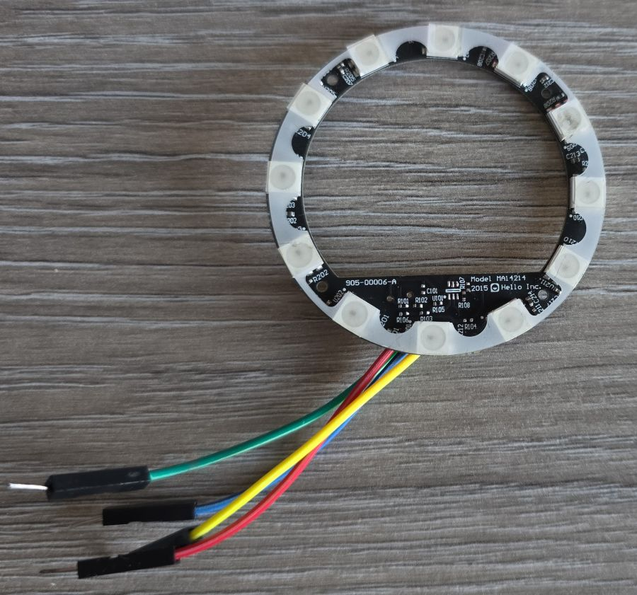
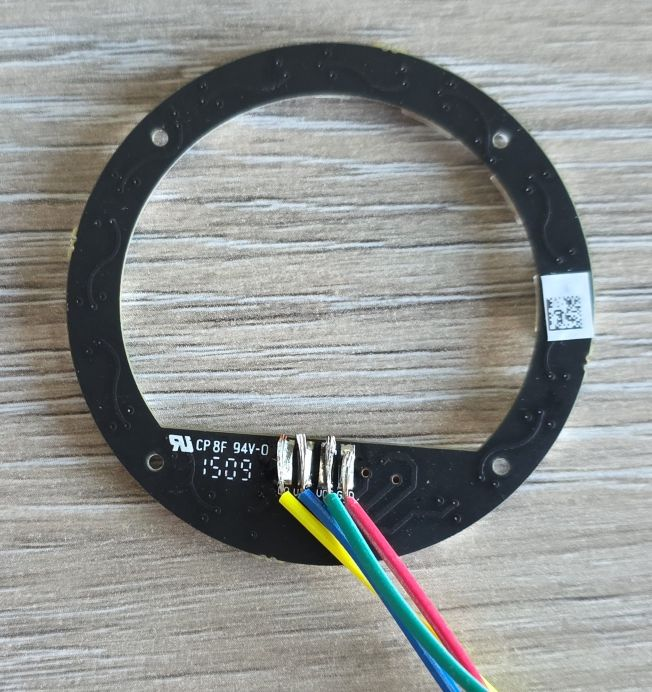

## Overview

Salvaged LED ring with 12 individually addressable RGB LEDs (SK6812 compatible)

The board features:

- 12 RGB LEDs
- SK6812 individually addressable LEDs (similar to WS2812B)



## Configuration Notes

Supported via ESPHome's [NeoPixelBus Light component](https://esphome.io/components/light/neopixelbus/). Note that NeoPixelBus
only works with the Arduino framework.

For ESP-IDF use [ESP32 RMT LED Strip](https://esphome.io/components/light/esp32_rmt_led_strip/)

### Basic Configuration

```yaml
#works with esp-idf
light:
  - platform: esp32_rmt_led_strip
    chipset: SK6812
    num_leds: 12
    rgb_order: GRB
    name: "My Hello"
    id: my_ring
    pin: GPIO17
```

## Other Images

Back of the LCD Display:

