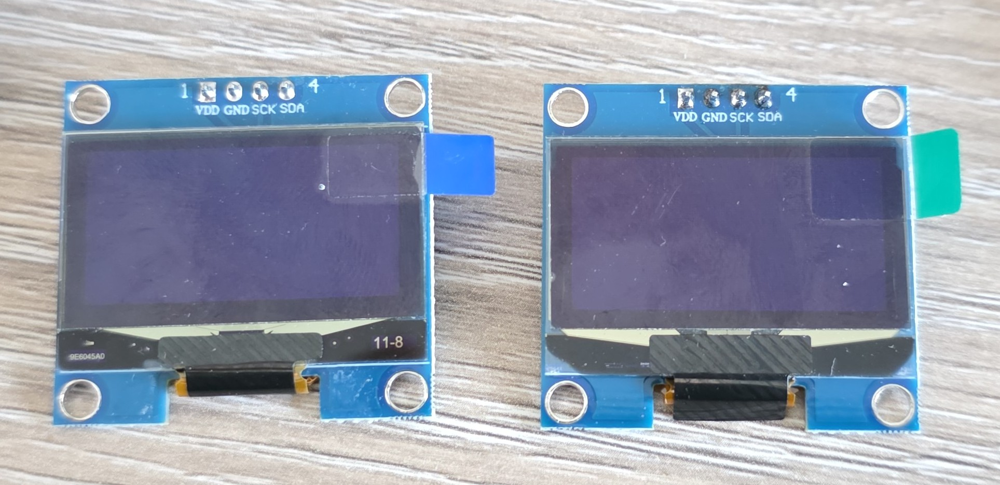
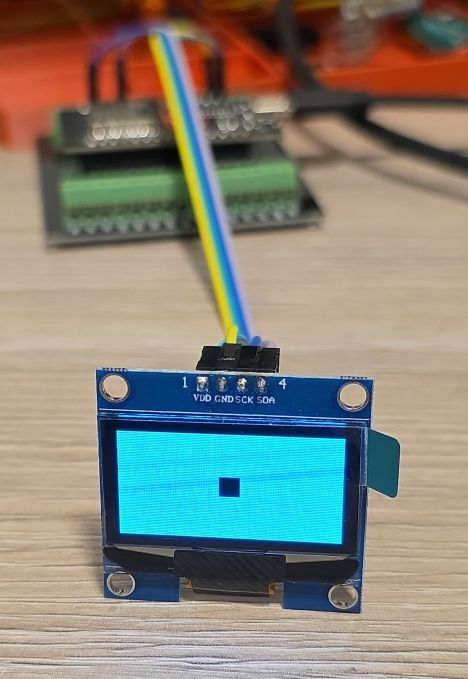
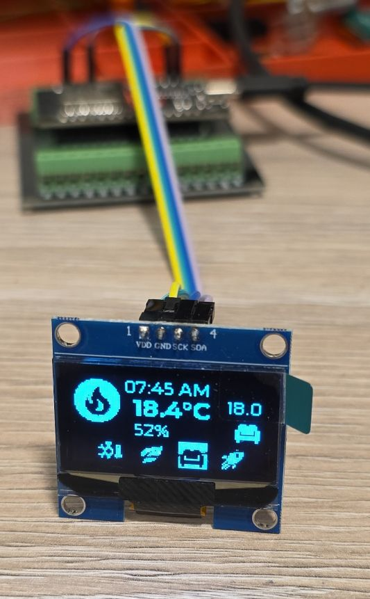
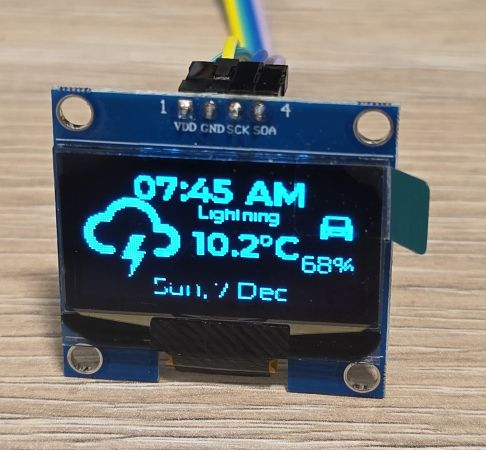
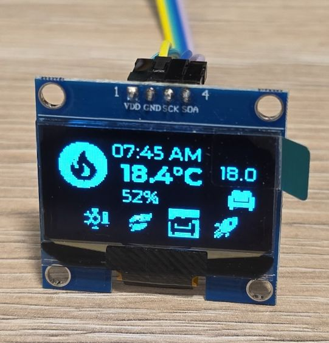
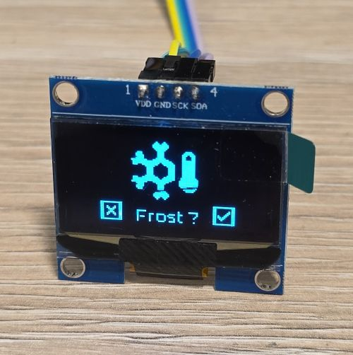
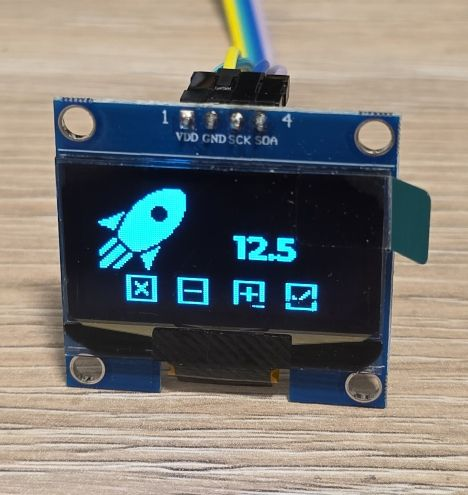

## Overview

The 1.3" OLED Display Module is a monochrome OLED display with white or blue pixels.



OLED displays are self-illuminating (no backlight needed), have excellent contrast, wide viewing angles, and
consume very little power. This module uses the SH1106 driver chip.

- 1.3" OLED display (128x64 pixels)
- White or blue monochrome display
- Uses the SH1106 driver chip
- I2C interface
- I2C address: 0x3C or 0x3D (configurable)
- Operating voltage: 3.3V-5V
- Wide viewing angle (>160°)
- Low power consumption
- High contrast ratio

## Testing Status

- ✅ [Basic Config](#basic-configuration) - Wiring up & basic graphics
- ✅ [Multipage Icons and Text](#example-with-icons-and-multiple-pages)

## Configuration Notes

- Requires **I2C** interface
- Platform: [**ssd1306_i2c**](https://esphome.io/components/display/ssd1306/)
- Model: **SH1106 128x64**
- I2C address: **0x3C** or **0x3D** (check your module)
- ⚠️ **show_test_card** - cannot be used, does not show anything, so careful there

## Basic Configuration

Very basic test - fill the whole screen and add a small square in the middle:



The scanning lines do not show in real life, only on photos.

```yaml
esphome:
  name: my-display-test

esp32:
  variant: esp32
  framework:
    type: esp-idf
    advanced:
      minimum_chip_revision: "3.1"

logger:

substitutions:
  i2c_sda_pin: GPIO21
  i2c_scl_pin: GPIO22

i2c:
  sda: ${i2c_sda_pin}
  scl: ${i2c_scl_pin}

display:
  - platform: ssd1306_i2c
    model: "SH1106 128x64"
    address: 0x3C
    lambda: |-
      it.filled_rectangle(0, 0, it.get_width(), it.get_height());
      it.filled_rectangle(it.get_width()/2 - 6, it.get_height()/2 - 6, 12, 12, COLOR_OFF);
```

## Example with Icons and Multiple Pages

Every 5 seconds the pages cycle through:

- info page with date/time, weather forecast, EV battery level
- heating info page: current indoor temperature, current preset and temperature set for the preset
and an indicator icon whether the heating is ON
- preset selection page
- preset temperature change page



```yaml
esphome:
  name: my-display-test

esp32:
  variant: esp32
  framework:
    type: esp-idf
    advanced:
      minimum_chip_revision: "3.1"

logger:

substitutions:
  i2c_sda_pin: GPIO21
  i2c_scl_pin: GPIO22

i2c:
  sda: ${i2c_sda_pin}
  scl: ${i2c_scl_pin}

interval:
  - interval: 5s
    then:
      - display.page.show_next: my_display
      - component.update: my_display

font:
  #mono screen, so no anti aliasing
  - id: value_med
    file:
      type: gfonts
      family: Montserrat
    size: 12
    bpp: 1
  - id: value_small
    file:
      type: gfonts
      family: Montserrat
    size: 8
    bpp: 1
  - id: value_large
    file:
      type: gfonts
      family: Montserrat
      weight: bold
    size: 16
    bpp: 1
  - id: mdi_small
    file: assets/materialdesignicons-webfont.ttf
    size: 18
    bpp: 1
    glyphs: [
      "\U000F1A71", # snowflake-thermometer 
      "\U000F032A", # leaf
      "\U000F04B9", # sofa
      "\U000F14DE", # rocket-launch
      "\U000F0C52", # checkbox-outline
      "\U000F0158", # close-box-outline
      "\U000F0704", # plus-box-outline
      "\U000F06F2", # minus-box-outline
      "\U000F0E1B", # mdi-car-back
    ]
  - id: mdi_med
    file: assets/materialdesignicons-webfont.ttf
    size: 36
    bpp: 1
    glyphs: [
      "\U000F1807", # mdi-fire-circle
      "\U000F0E1B", # mdi-car-back
    ]
  - id: mdi_large
    file: assets/materialdesignicons-webfont.ttf
    size: 48
    bpp: 1
    glyphs: [
      "\U000F0593", # lightning
      "\U000F1A71", # snowflake-thermometer 
      "\U000F032A", # leaf
      "\U000F04B9", # sofa
      "\U000F14DE", # rocket-launch
    ]

display:
  - platform: ssd1306_i2c
    id: my_display
    model: "SH1106 128x64"
    address: 0x3C
    update_interval: 1s
    pages:
      - id: page_info
        lambda: |-
          //print time and date
          it.print(it.get_width()/2, 8, id(value_large), COLOR_ON, TextAlign::CENTER, "07:45 AM");
          it.print(it.get_width()/2, it.get_height()-8, id(value_med), COLOR_ON, TextAlign::CENTER,
          "Sun, 7 Dec");

          it.print(0, 10, id(mdi_large), COLOR_ON, "\U000F0593");
          it.print(72, 14, id(value_small), COLOR_ON, TextAlign::TOP_CENTER, "Lightning");
          it.print(52, 24, id(value_large), COLOR_ON, "10.2°C");

          it.print(it.get_width()-2, 14, id(mdi_small), COLOR_ON, TextAlign::TOP_RIGHT, "\U000F0E1B");
          it.print(it.get_width()-2, 34, id(value_med), COLOR_ON, TextAlign::TOP_RIGHT, "68%");
      
      - id: page_heating
        lambda: |-

          const std::string presets[] = {
            "frost", "eco", "comfort", "boost"
          };

          const std::string icons[] = {
            "\U000F1A71", "\U000F032A", "\U000F04B9", "\U000F14DE"
          };
            
          it.print(it.get_width()/2, 7, id(value_med), COLOR_ON, TextAlign::CENTER, "07:45 AM");
          it.print(0, 0, id(mdi_med), COLOR_ON, "\U000F1807");

          it.print(42, 12, id(value_large), COLOR_ON, "18.4°C");
          it.print(42, 30, id(value_med), COLOR_ON, "52%");

          it.print(it.get_width() - 2, 26, id(value_med), COLOR_ON, TextAlign::BOTTOM_RIGHT, "18.0");
          it.print(it.get_width() - 2, 44, id(mdi_small), COLOR_ON, TextAlign::BOTTOM_RIGHT, "\U000F04B9");

          //show icons
          const int icon_size = 18;
          auto y = it.get_height() - icon_size;

          for(auto i = 0; i<4; i++){
            auto is_selected = "comfort" == presets[i];
            auto x = 18 + icon_size*i + 9*i; auto invert_icon = false;

            if(is_selected){
              invert_icon = true;
              it.filled_rectangle(x, y-1, icon_size+1, icon_size+1);
            }
            it.print(x, y, id(mdi_small), invert_icon ? COLOR_OFF :  COLOR_ON, icons[i].c_str());
          }
      - id: page_change_preset
        lambda: |-
            it.print(it.get_width()/2, 48, id(mdi_large), COLOR_ON, TextAlign::BOTTOM_CENTER, "\U000F1A71");
              
            //it.print(it.get_width()/2, 64, id(value_med), COLOR_ON,
            //TextAlign::TOP_CENTER, "Set the mode to:");
            it.print(it.get_width()/2, 48, id(value_med), COLOR_ON,
            TextAlign::TOP_CENTER, "Frost ?");

            //apply
            it.print(18, it.get_height() - 20, id(mdi_small), COLOR_ON, TextAlign::TOP_LEFT, "\U000F0158");
            //cancel
            it.print(it.get_width()-18, it.get_height() - 20, id(mdi_small), COLOR_ON, TextAlign::TOP_RIGHT, "\U000F0C52");
            
      - id: page_change_temp
        lambda: |-
            it.print(28, 48, id(mdi_large), COLOR_ON, TextAlign::BOTTOM_CENTER, "\U000F14DE");
            it.print(it.get_width()/2 + 20, 20, id(value_large), COLOR_ON, TextAlign::TOP_CENTER, "12.5");
            //apply
            it.print(18, it.get_height() - 20, id(mdi_small), COLOR_ON, TextAlign::TOP_LEFT, "\U000F0158");
            //cancel
            it.print(it.get_width()-18, it.get_height() - 20, id(mdi_small), COLOR_ON, TextAlign::TOP_RIGHT, "\U000F0C52");
            //minus
            it.print(42, it.get_height() - 20, id(mdi_small), COLOR_ON, TextAlign::TOP_LEFT, "\U000F06F2");
            //plus
            it.print(it.get_width() - 42, it.get_height() - 20, id(mdi_small), COLOR_ON, TextAlign::TOP_RIGHT, "\U000F0704");
```

## Other Images

Back of the OLEDs:


- Page 1 - Info Screen

- Page 2 - Heating Screen

- Page 3 - Set Heating Preset

- Page 4 - Set Boost Temperature

