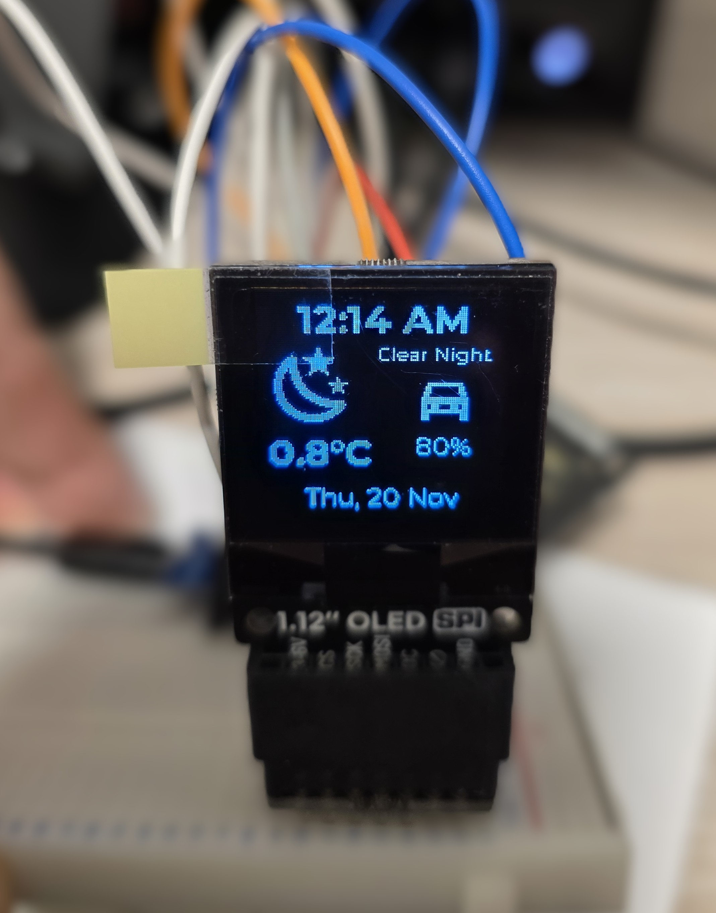
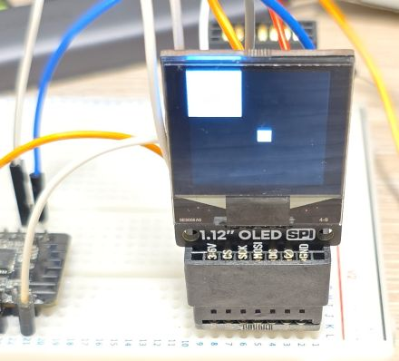
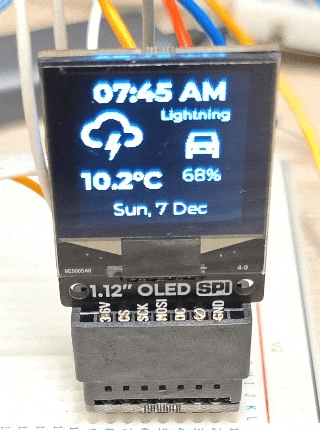
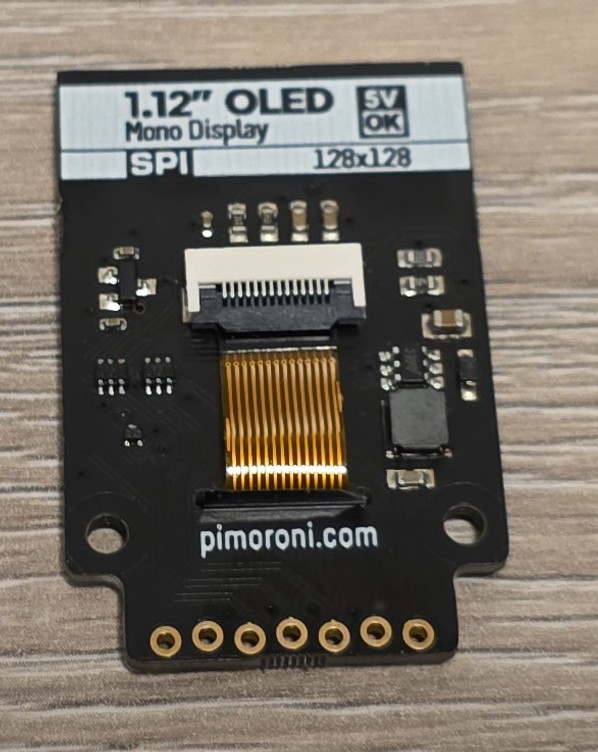
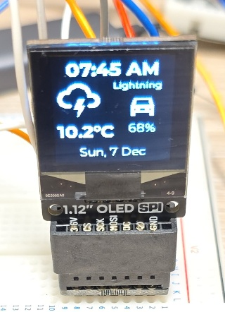
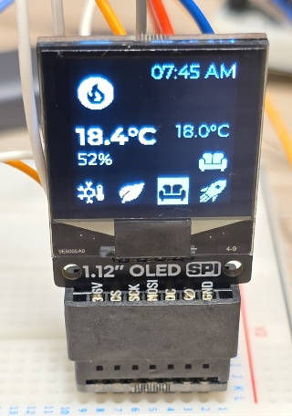
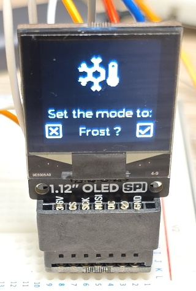
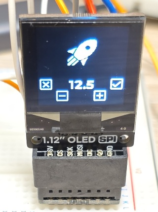

## Overview

This OLED is a beautiful monochrome display.

OLED displays are self-illuminating (no backlight needed), have excellent contrast, wide viewing angles,
and consume very little power.



- 1.12" white/black OLED display (128x128 pixels)
- Uses the SH1107 driver chip
- 20x20mm active area
- SPI or I2C (address 0x3C/0x3D (cut trace)) interface
- This version uses SPI
- 3.3V or 5V compatible

## Testing Status

- ✅ [Basic Config](#basic-configuration) - Wiring up & basic graphics
- ✅ [Multipage Icons and Text](#example-with-icons-and-multiple-pages)
- ✅ Tested with ESP32
- [ ] Tested with ESP8266

## Configuration Notes

- Requires **SPI**, spi_id is optional, but spi component is required.
- ⚠️ **show_test_card** - cannot be used, does not show anything, so careful there
- model: "SH1107 128x128"
- rotation: 180 ... well, depends on how you want to position it I suppose 🙂,
but because of how the board is oriented 180 makes sense
- cs_pin and dc_pin are required - can be any available GPIO
- No backlight or contrast support

### Basic Configuration

Example here is for [esp32-devkit-v1](./esp32-devkit-v1) I use substitutions in the example below.

Very basic test - just two squares:


```yaml
esphome:
  name: my-1-12oled

esp32:
  board: esp32dev
  framework:
    type: esp-idf

substitutions:
  clk_pin: GPIO18
  mosi_pin: GPIO23
  disp_cs_pin: GPIO15
  disp_dc_pin: GPIO04

spi:
  clk_pin: ${clk_pin}
  mosi_pin: ${mosi_pin}

display:
  - platform: ssd1306_spi
    id: pimoroni1_12oled
    model: "SH1107 128x128"
    cs_pin: ${disp_cs_pin}
    dc_pin: ${disp_dc_pin}
    rotation: 180
    lambda: |-
      it.filled_rectangle(0, 0, 48, 48);
      it.filled_rectangle(it.get_width()/2, it.get_height()/2, 12, 12);

```

#### Using a Different Board

For [beetle-esp32-c6](./beetle-esp32-c6) you can use for example:

```yaml
substitutions:
  clk_pin: GPIO23
  mosi_pin: GPIO22
  disp_cs_pin: GPIO05
  disp_dc_pin: GPIO07
```

### Example with Icons and Multiple Pages

In this example I used [beetle-esp32-c6](./beetle-esp32-c6).
Every 5 seconds the pages cycle through:

- info page with date/time, weather forecast, EV battery level
- heating info page: current indoor temperature, current preset and temperature set for the preset
and an indicator icon whether the heating is ON
- preset selection page
- preset temperature change page



```yaml
esphome:
  name: display-test

esp32:
  variant: esp32c6

substitutions:
  clk_pin: GPIO23
  mosi_pin: GPIO22
  disp_cs_pin: GPIO05
  disp_dc_pin: GPIO07

interval:
  - interval: 5s
    then:
      - display.page.show_next: my_display
      - component.update: my_display

font:
  #mono screen, so no anti aliasing
  - id: value_med
    file:
      type: gfonts
      family: Montserrat
    size: 14
    bpp: 1
  - id: value_small
    file:
      type: gfonts
      family: Montserrat
    size: 10
    bpp: 1
  - id: value_large
    file:
      type: gfonts
      family: Montserrat
      weight: bold
    size: 20
    bpp: 1
  - id: mdi_small
    file: assets/materialdesignicons-webfont.ttf
    size: 24
    bpp: 1
    glyphs: [
        "\U000F1A71", # snowflake-thermometer
        "\U000F032A", # leaf
        "\U000F04B9", # sofa
        "\U000F14DE", # rocket-launch
        "\U000F0C52", # checkbox-outline
        "\U000F0158", # close-box-outline
        "\U000F0704", # plus-box-outline
        "\U000F06F2", # minus-box-outline
      ]
  - id: mdi_med
    file: assets/materialdesignicons-webfont.ttf
    size: 32
    bpp: 1
    glyphs: [
        "\U000F1807", # mdi-fire-circle
        "\U000F0E1B", # mdi-car-back
      ]
  - id: mdi_large
    file: assets/materialdesignicons-webfont.ttf
    size: 48
    bpp: 1
    glyphs: [
        "\U000F0593", # lightning
        "\U000F1A71", # snowflake-thermometer
        "\U000F032A", # leaf
        "\U000F04B9", # sofa
        "\U000F14DE", # rocket-launch
      ]

display:
  - platform: ssd1306_spi
    id: my_display
    model: "SH1107 128x128"
    cs_pin: ${disp_cs_pin}
    dc_pin: ${disp_dc_pin}
    rotation: 180
    update_interval: 1s
    pages:
      - id: page_info
        lambda: |-
          //print time and date
          it.printf(it.get_width()/2, 14, id(value_large), COLOR_ON, TextAlign::CENTER, "07:45 AM");
          it.printf(it.get_width()/2, 114, id(value_med), COLOR_ON, TextAlign::CENTER, "Sun, 7 Dec");

          it.printf(4, 27, id(mdi_large), COLOR_ON, "\U000F0593");
          it.printf(90, 27, id(value_small), COLOR_ON, TextAlign::TOP_CENTER, "Lightning");
          it.printf(4, 76, id(value_large), COLOR_ON, "10.2°C");

          it.printf(96, 42, id(mdi_med), COLOR_ON, TextAlign::TOP_CENTER, "\U000F0E1B");
          it.printf(96, 76, id(value_med), COLOR_ON, TextAlign::TOP_CENTER, "68%%");

      - id: page_heating
        lambda: |-
          const std::string presets[] = {
            "frost", "eco", "comfort", "boost"
          };

          const std::string icons[] = {
            "\U000F1A71", "\U000F032A", "\U000F04B9", "\U000F14DE"
          };

          it.printf(it.get_width() - 2, 2, id(value_med), COLOR_ON, TextAlign::TOP_RIGHT, "07:45 AM");
          it.printf(4, 12, id(mdi_med), COLOR_ON, "\U000F1807");

          it.printf(4, 52, id(value_large), COLOR_ON, "18.4°C");
          it.printf(4, 76, id(value_med), COLOR_ON, "52%%");

          it.printf(it.get_width() - 4, 52, id(value_med), COLOR_ON, TextAlign::TOP_RIGHT, "18.0°C");
          it.printf(it.get_width() - 4, 76, id(mdi_small), COLOR_ON, TextAlign::TOP_RIGHT, "\U000F04B9");

          //show icons
          const int icon_size = 24;
          auto y = it.get_height() - icon_size;

          for(auto i = 0; i<4; i++){
            auto is_selected = "comfort" == presets[i];
            auto x = 2 + icon_size*i + 9*i; auto invert_icon = false;

            if(is_selected){
              invert_icon = true;
              it.filled_rectangle(x, y-1, icon_size+1, icon_size+1);
            }
            it.printf(x, y, id(mdi_small), invert_icon ? COLOR_OFF : COLOR_ON, icons[i].c_str());
          }
      - id: page_change_preset
        lambda: |-
          it.printf(it.get_width()/2, it.get_height()/2, id(mdi_large), COLOR_ON, TextAlign::BOTTOM_CENTER, "\U000F1A71");

          it.printf(it.get_width()/2, it.get_height()-48, id(value_med), COLOR_ON, TextAlign::TOP_CENTER,
          "Set the mode to:");
          it.printf(it.get_width()/2, it.get_height()-24, id(value_med), COLOR_ON, TextAlign::TOP_CENTER, "Frost ?");

          //apply
          it.printf(0, it.get_height() - 28, id(mdi_small), COLOR_ON, TextAlign::TOP_LEFT, "\U000F0158");
          //cancel
          it.printf(it.get_width(), it.get_height() - 28, id(mdi_small), COLOR_ON, TextAlign::TOP_RIGHT, "\U000F0C52");

      - id: page_change_temp
        lambda: |-
          it.printf(it.get_width()/2, it.get_height()/2, id(mdi_large), COLOR_ON, TextAlign::BOTTOM_CENTER, "\U000F14DE");
          it.printf(it.get_width()/2, it.get_height()-48, id(value_large), COLOR_ON, TextAlign::TOP_CENTER, "12.5");
          //apply
          it.printf(0, it.get_height() - 48, id(mdi_small), COLOR_ON, TextAlign::TOP_LEFT, "\U000F0158");
          //cancel
          it.printf(it.get_width(), it.get_height() - 48, id(mdi_small), COLOR_ON, TextAlign::TOP_RIGHT, "\U000F0C52");
          //minus
          it.printf(24, it.get_height() - 28, id(mdi_small), COLOR_ON, TextAlign::TOP_LEFT, "\U000F06F2");
          //plus
          it.printf(it.get_width() - 24, it.get_height() - 28, id(mdi_small), COLOR_ON, TextAlign::TOP_RIGHT, "\U000F0704");
```

## Other Images

Pimoroni 1.12" Mono OLED Breakout:


Pimoroni 1.12" Mono OLED Breakout Back:


Shots from the more [complicated example](#example-with-icons-and-multiple-pages):

- Page 1 - Info Screen

- Page 2 - Heating Screen

- Page 3 - Set Heating Preset

- Page 4 - Set Boost Temperature

