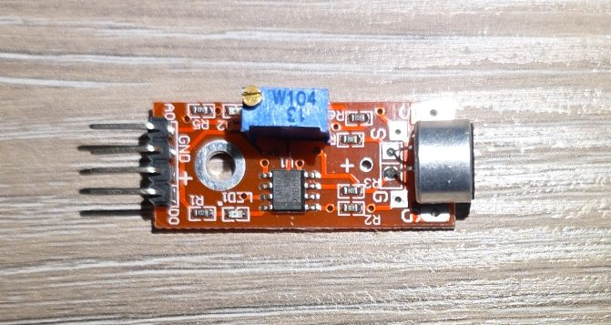
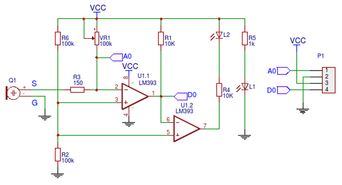
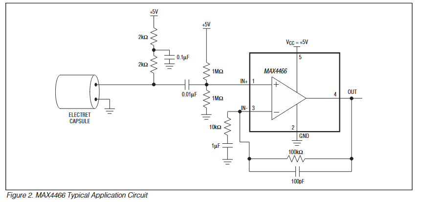
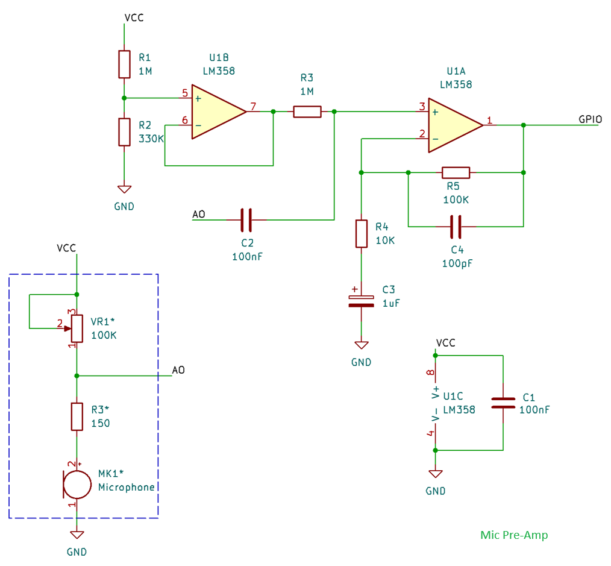
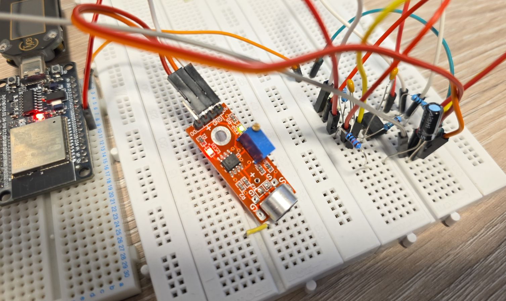
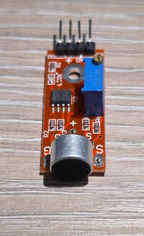
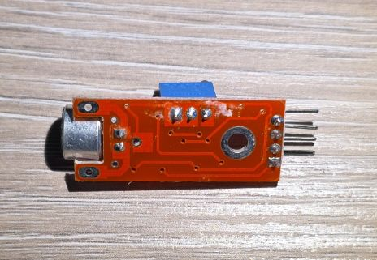

## Overview

The sound sensor module detects sound intensity using an electret microphone with adjustable sensitivity.



The module features:

- Electret microphone capsule (CMA-6542PF)
- Both digital and analog outputs
- Digital output with adjustable threshold
- Analog output for sound level measurement
- Operating voltage: 3.3V-5V
- Adjustable sensitivity via 100K (W104) trimmer potentiometer - ([Bochen 3296](https://www.bochen-guosheng.com/product_detail/170.html))
- Frequency range: 50Hz-10kHz
- Onboard LED indicators
- Uses LM393 comparator for triggering digital output

## Test Status

- ✅ [Basic Config](#basic-configuration) - wiring up the module for digital and analog processing
- ✅ [Better Analog](#better-analog-circuit) - improved circuit for analog processing
- ✅ [Microphone Input](#as-a-microphone)

## Configuration Notes

Supported through:

- Digital: [GPIO Binary Sensor](https://esphome.io/components/binary_sensor/gpio/) component
- Analog through [ADC](https://esphome.io/components/sensor/adc/) component

However, the circuit is pretty poorly designed for analog input 👎:



_Schematic from:_[https://forum.arduino.cc/t/how-to-measure-high-sound-pressure-levels/1128684](https://forum.arduino.cc/t/how-to-measure-high-sound-pressure-levels/1128684)

**NOTE ⚠️**: The microphone output is not amplified and the output is very low for anything useful.
While basic configuration below is correct, it is pretty useless without additional circuit.

**NOTE ⁉️**: Why was potentiometer of 100K selected for this is also beyond me. They probably had
a pile of them when they designed the circuit is my guess. It tooke me 20+ turns to lower
the sensitivity enough for it to pick up any noise.

Power supply: 3.3V just to be on the safe side

For me, the resistance that worked was between 1.6K and 1.7K. Overall, not a great experience.
I'll need to think how to use it.

## Wiring

| KY-037 | ESP32 DevKit | Note |
| ------ | ------------ | ---- |
| + | 3V3 | |
| G | GND | |
| D0 | GPIO18 | Digital output of the sensor module |
| A0 | GPIO33 | Analog output of the sensor module |

## Basic Configuration

Basic example with [ESP32 Devkit V1](./esp32-devkit-v1.md). Can use any GPIO pin for the digital input,
in the example below that is `sensor_dpin: GPIO18`. For analog input: `sensor_apin: GPIO33` - this is ADC1
which uses GPIO32-GPIO39 on ESP32.

```yaml
esphome:
  name: my-sound-sensor

esp32:
  board: esp32dev
  framework:
    type: esp-idf

logger:

substitutions:
  sensor_dpin: GPIO18
  sensor_apin: GPIO33
  builtin_led_pin: GPIO02

binary_sensor:
  - platform: gpio
    id: sound_sensor
    pin: ${sensor_dpin}
    name: "Noise Sensor"
    device_class: sound
    on_press:
      then:
        - output.turn_on: builtin_led
    on_release:
      then:
        - output.turn_off: builtin_led


output:
  - platform: gpio
    pin: ${builtin_led_pin}
    id: builtin_led

light:
  - platform: binary
    name: "Built in LED"
    output: builtin_led

sensor:
  - platform: adc
    pin: ${sensor_apin}
    name: "Sound Sensor"
    update_interval: 100ms
```

## Better Analog Circuit

The module as-is, only really works with digital output, analog output is just not good enough for any use.
I'll try to compe up with a better circuit here. The goal is to reuse this module for some audio processing
if at all possible.

Drawing inspiration from MAX4465-MAX4469 datasheet (see references):


Ideally, a rail-to-rail op-amp would be better with 3.3V but I only had LM358 in my drawer. Since LM358 has
about 0V-1.8V useful range (there's max 1.5V output swing from positive rail and 20mV from negative), my
circuit is going to be slightly different. I came up with this:



Not a great mic "pre-amp" but it will do. For this to work, I only modified basic config with `attenuation`:

```yaml
sensor:
  - platform: adc
    pin: ${sensor_apin}
    name: "Sound Sensor"
    update_interval: 100ms
    attenuation: 6dB
```



The output swing will be 0-1.8V which, and based
[on the documentation](https://esphome.io/components/sensor/adc/#adc-esp32_attenuation)
attenuation should be 6dB. Now, `auto` option might work, but I wanted to make sure I know what's happening.
The above circuit is not great but it gave me a decent room to work with.

Just another note on this, ADC in ESP32 has a range of 0V to about 1.1V, so attenuation is required if
reading is going to be over that value.

### Quick Analog Circuit Explanation

Input to the circuit is the Sound Sensor Module A0 output, and I am just showing relevant bits
of the module.
Essentially, that circuit is powering microphone's internal integrated pre-amp. We're a bit limited here
with how the module is designed but this will still work decently. This part is in dashed line rectangle.

R1 and R2 are setting my reference voltage to around 0.8V - they form voltage divider. LM358 has 2 op-amps,
and I'm using only one. The unused one (U1B) has to be properly connected so it does not interfere with
the used one, so I just used it for setting reference voltage. It has 0.8V on the positive input,
and it's wired as a buffer (gain = 1).

The 2nd op-amp (U1A) is configured as 11x non-inverting amp (A = 1+R5/R4 = 11). I could have used a
potentiometer but I chanced it with 11x gain 🙂.

Capacitors:

- C1 is de-coupling capacitor for our IC (op-amp)
- C2 is coupling capacitor (blocks DC component from the sound sensor module)
- C3 is there so op-amp amplifies only AC component of the input signal (blocks DC)
- C4 is for stability (blocks higher frequencies from amplification)

**NOTE:** If you're using a different op-amp, you might need to change some of the resistors if you want
to get a better output range. As-is, it will work with most of the op-amps anyway, but you might just be
wasting some of the extra gain you could squeeze in. Some op-amps won't even work with this - e.g. TL072
since it requires at least 4V for power supply.

**NOTE:** I could have used 5V to supply my op-amp circuit - however, 1.5V is maximum offset from the
positive rail which would make 3.5V max output voltage which is too close to the max voltage of our
ESP32 GPIO.

## As a Microphone

An example of using the ["better analog circuit"](#better-analog-circuit) is with
[Sound Level Component](https://esphome.io/components/sensor/sound_level/). This example is showing sound
level in the log, but you can show it in Home Assistant.

```yaml
esphome:
  name: my-sound-sensor

esp32:
  board: esp32dev
  framework:
    type: esp-idf

logger:

substitutions:
  sensor_dpin: GPIO18
  sensor_apin: GPIO33
  builtin_led_pin: GPIO02
  dummy_clk_pin: GPIO15

output:
  - platform: gpio
    pin: ${builtin_led_pin}
    id: builtin_led

sensor:
  - platform: sound_level
    microphone: adc_mic
    passive: false
    measurement_duration: 500ms
    peak:
      id: peak_loudness
      name: "Peak Loudness"
      on_value_range:
        - below: -30.0
          then:
            - output.turn_off: builtin_led
        - above: -30.0
          then:
            - output.turn_on: builtin_led
    rms:
      id: average_loudness
      name: "Average Loudness"

i2s_audio:
  i2s_lrclk_pin: ${dummy_clk_pin}
  use_legacy: true

microphone:
  - platform: i2s_audio
    id: adc_mic
    adc_type: internal
    adc_pin: ${sensor_apin}
    correct_dc_offset: true
```

Open up logs in [ESPHome Web](https://web.esphome.io/) and see the sound level sensor showing average and
peak loudness. Turn on some music on your phone and bring it closer to the mic and pull it further away and
see how the levels change.

### Microphone

Microphone above is using [I2S Audio Microphone](https://esphome.io/components/microphone/i2s_audio/)
component. In order to use our microphone attached to ADC we need to use `adc_type: internal` and select
`adc_pin`. Make sure you set `correct_dc_offset: true` since we have DC offset.

**NOTE ⚠️**: This only works with ESP32, it does not work with other platforms like ESP8266 for example.
For this, it requires use of "legacy" drivers.

In order for our microphone to work, [I2S Audio](https://esphome.io/components/i2s_audio/) component needs
to be defined. It requires `i2s_lrclk_pin` to be defined even though it's not used, and `use_legacy` needs
to be _true_.

**INFO ℹ️/Question ❓**: Based on
[Espressif's ADC FAQ](https://docs.espressif.com/projects/esp-faq/en/latest/software-framework/peripherals/adc.html)
this should not work very well with WiFi turned on:
`sampling rate can reach 1000 times per second with Wi-Fi`
which is not great but maybe it's good enough for getting loudness measurements, however I'm not 100% sure
why would this be the case when I2S uses it's own DMA. Anyway, as usual: YMMV 🚗.

### Sensor

I setup [Sound Level Component](https://esphome.io/components/sensor/sound_level/) that supports peak and
average loudness measurement. Let's go through the settings:

- `microphone: adc_mic` is our mic sensor connected to ADC
- `passive: false` turns on measurements, if set to _true_ it will need to be either started manually
or when some other component is using the microphone
- `measurement_duration: 500ms` - measures every half a second
- `peak` and `rms` are sensors, and they supports all [sensor component](https://esphome.io/components/sensor/) settings
- `on_value_range` - [this automation](https://esphome.io/components/sensor/#on_value_range) turns on/off
builtin_led - try clapping and it will turn on/off

## Other Images

Sound sensor:


Sound sensor back:

