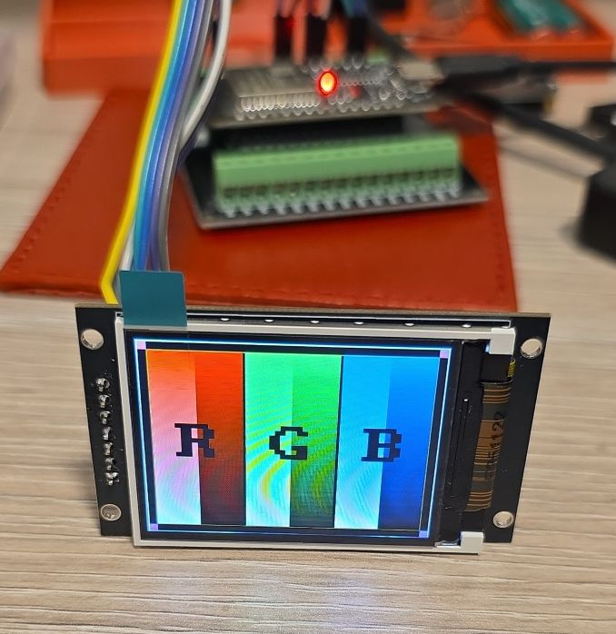
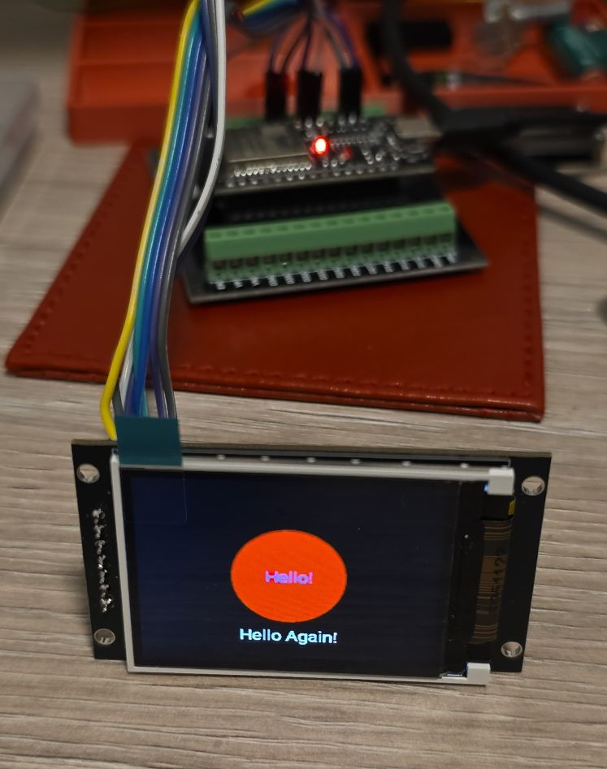
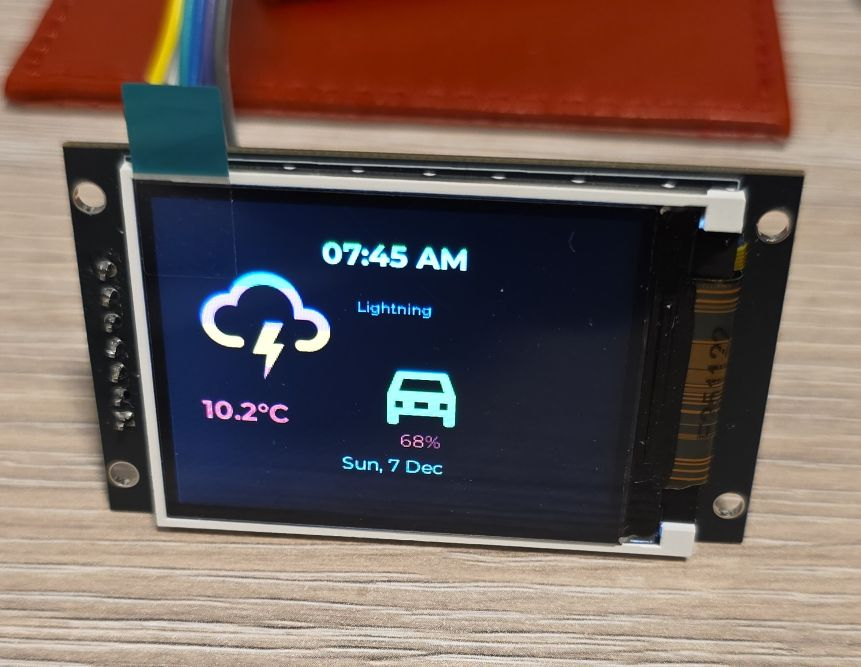
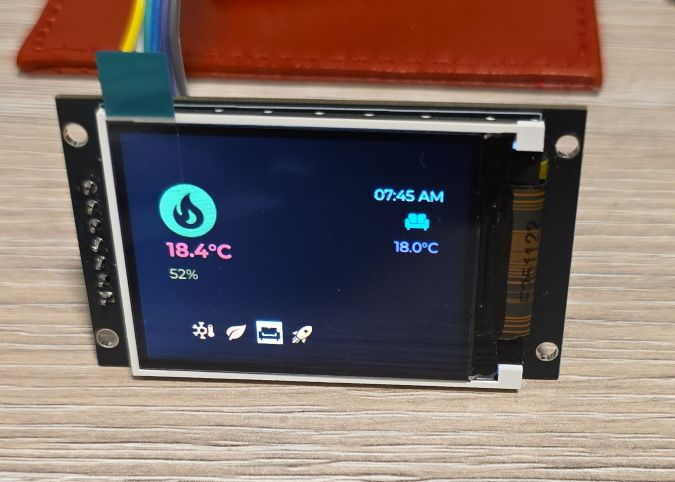
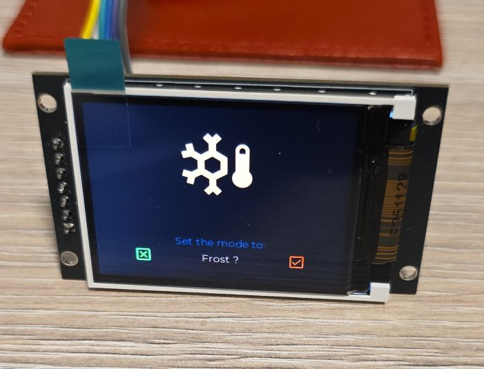
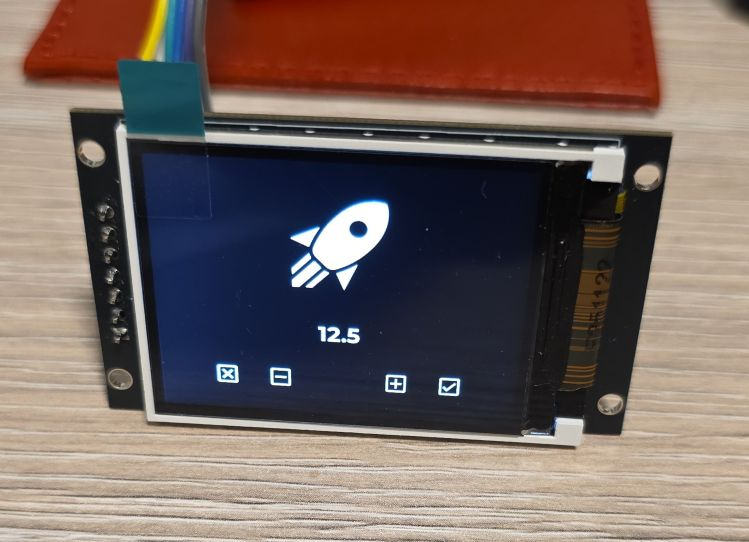

## Overview

The 2" Display Module is a Color TFT LCD display with 240x320 resolution. (The listing says OLED LCD which
makes no sense and checking black - there's definitely backlight). This module uses the ST7789V driver chip.


## Testing Status

- ✅ [Basic Config](#basic-configuration) - Wiring up & Test Card in Color
- ✅ [Simple Graphics and Text](#simple-graphics-and-text-example)
- ✅ [Multipage Icons and Text](#icons-text-pretty) 🌈🦾

## Configuration Notes

- Requires **SPI** interface
- Platform: [**mipi_spi**](https://esphome.io/components/display/mipi_spi/)
- Model: **ST7789V**
- I'm using original ESP32 and I got a warning in log that I could use
[minimum_chip_revision](https://esphome.io/components/esp32/#advanced-configuration). So I did, it should
reduce flash size
- Looks like default buffer size for the display component is 1/8 with 16 bits for pixels, which consumes just about
19KB. 100% buffer would take 320x240x2 bytes - about 150KB ... so that's nearly half of the available RAM on ESP32.
- `color_order` is by default BGR - this might be because of the chip - ST7789V

Board [jc2432w328c](./jc2432w328c.md) has the same driver so it should have the same setup.

### Wiring

Example here is for [esp32-devkit-v1](./esp32-devkit-v1)
Adjust substitutions based on your board. For the examples below I used the following wiring:

| st7789v-oled | esp32-devkit-v1 | |
| :---- | :---- | :---- |
| CS | GPIO05 | |
| DC | GPIO04 | |
| RES | GPIO16 | |
| SDA (SPI MOSI) | GPIO23 | |
| SCL (SPI CLK) | GPIO18 | |
| VCC | 3V3 | |
| GND | GND | |

### Basic Configuration

Show test card - ensures everything is correctly configured and wired up.



```yaml
esphome:
  name: my-display-test

esp32:
  variant: esp32
  framework:
    type: esp-idf
    advanced:
      minimum_chip_revision: "3.1"

# Enable logging - always enable, for testing keep it at DEBUG level (default)
logger:

substitutions:
  clk_pin: GPIO18
  mosi_pin: GPIO23
  disp_cs_pin: GPIO05
  disp_dc_pin: GPIO04
  disp_reset_pin: GPIO16

spi:
  clk_pin: ${clk_pin}
  mosi_pin: ${mosi_pin}

display:
  - platform: mipi_spi
    id: my_display
    model: ST7789V
    cs_pin: ${disp_cs_pin}
    dc_pin: ${disp_dc_pin}
    reset_pin: ${disp_reset_pin}
    show_test_card: true
    data_rate: 40MHz
    rotation: 90
    invert_colors: true
```

### Simple Graphics and Text Example

To add text and graphics, add the lambda section and define fonts to the [basic config](#basic-configuration):

In the real life, the circle is full red, this is weird refreshing that camera caught.


```yaml
font:
  - file: "gfonts://Roboto"
    id: roboto
    size: 20

display:
  - platform: mipi_spi
    id: my_display
    model: ST7789V
    cs_pin: ${disp_cs_pin}
    dc_pin: ${disp_dc_pin}
    reset_pin: ${disp_reset_pin}
    data_rate: 40MHz
    rotation: 90
    invert_colors: true
    lambda: |-
      it.filled_circle(it.get_width()/2, it.get_height()/2, 60, Color(0xFF0000));
      it.print(it.get_width()/2, it.get_height()/2, id(roboto), Color(0x0000FF), TextAlign::CENTER, "Hello!");
      it.print(it.get_width()/2, it.get_height()/2 + 80, id(roboto), Color(0xFFFFFF), TextAlign::CENTER, "Hello Again!");
```

### Icons, Text, Pretty

This example has 4 different pages and changes them every 5 seconds. The display is set not to update itself
because updates are only done on timer. You might want to change `update_interval: never` to some
other value (default is 1s = 1 second) unless you're using LVGL which handles display itself.

I used random colors for page 1. Something weird is going on when you do that, I'm not sure if this is
a bug of some kind, but it does look funky 🌈

For pages 2 and 3 I used colors with corresponding hexcode and then for the last page I just
used COLOR_ON which gives monochromatic display.

<!---->


```yaml
interval:
  - interval: 5s
    then:
      - display.page.show_next: my_display
      - component.update: my_display

font:
  #color screen, so good for anti-aliasing
  - id: value_med
    file:
      type: gfonts
      family: Montserrat
    size: 14
    bpp: 4
  - id: value_small
    file:
      type: gfonts
      family: Montserrat
    size: 10
    bpp: 2
  - id: value_large
    file:
      type: gfonts
      family: Montserrat
      weight: bold
    size: 20
    bpp: 4
  - id: mdi_small
    file: assets/materialdesignicons-webfont.ttf
    size: 24
    bpp: 4
    glyphs: [
      "\U000F1A71", # snowflake-thermometer 
      "\U000F032A", # leaf
      "\U000F04B9", # sofa
      "\U000F14DE", # rocket-launch
      "\U000F0C52", # checkbox-outline
      "\U000F0158", # close-box-outline
      "\U000F0704", # plus-box-outline
      "\U000F06F2", # minus-box-outline
    ]
  - id: mdi_med
    file: assets/materialdesignicons-webfont.ttf
    size: 64
    bpp: 4
    glyphs: [
      "\U000F1807", # mdi-fire-circle
      "\U000F0E1B", # mdi-car-back
    ]
  - id: mdi_large
    file: assets/materialdesignicons-webfont.ttf
    size: 96
    bpp: 4
    glyphs: [
      "\U000F0593", # lightning
      "\U000F1A71", # snowflake-thermometer 
      "\U000F032A", # leaf
      "\U000F04B9", # sofa
      "\U000F14DE", # rocket-launch
    ]

display:
  - platform: mipi_spi
    id: my_display
    model: ST7789V
    cs_pin: ${disp_cs_pin}
    dc_pin: ${disp_dc_pin}
    reset_pin: ${disp_reset_pin}
    data_rate: 40MHz
    rotation: 90
    invert_colors: true
    # only update on timer for this demo
    update_interval: never
    pages: 
      - id: page_info
        lambda: |-
          //print time and date
          it.print(it.get_width()/2, 32, id(value_large), Color::random_color(), TextAlign::CENTER, "07:45 AM");
          it.print(it.get_width()/2, 194, id(value_med), Color::random_color(), TextAlign::CENTER, "Sun, 7 Dec");

          it.print(24, 42, id(mdi_large), Color::random_color(), "\U000F0593");
          it.print(160, 64, id(value_small), Color::random_color(), TextAlign::TOP_CENTER, "Lightning");
          it.print(24, 144, id(value_large), Color::random_color(), "10.2°C");

          it.print(180, 104, id(mdi_med), Color::random_color(), TextAlign::TOP_CENTER, "\U000F0E1B");
          it.print(180, 164, id(value_med), Color::random_color(), TextAlign::TOP_CENTER, "68%");
      
      - id: page_heating
        lambda: |-

          const std::string presets[] = {
            "frost", "eco", "comfort", "boost"
          };

          const std::string icons[] = {
            "\U000F1A71", "\U000F032A", "\U000F04B9", "\U000F14DE"
          };
            
          it.print(it.get_width() - 24, 42, id(value_med), Color(0x87CEEB), TextAlign::TOP_RIGHT, "07:45 AM");
          it.print(24, 42, id(mdi_med), Color(0x228B22), "\U000F1807");

          it.print(32, 102, id(value_large), Color(0xDC143C), "18.4°C");
          it.print(32, 132, id(value_med), Color(0xDAA520), "52%");

          it.print(it.get_width() - 48, 102, id(value_med), Color(0xBA55D3), TextAlign::CENTER, "18.0°C");
          it.print(it.get_width() - 48, 76, id(mdi_small), Color(0x008080), TextAlign::CENTER, "\U000F04B9");

          //show icons
          const int icon_size = 24;
          auto y = it.get_height() - 2*icon_size;

          for(auto i = 0; i<4; i++){
            auto is_selected = "comfort" == presets[i];
            auto x = 48 + icon_size*i + 9*i; auto invert_icon = false;

            if(is_selected){
              invert_icon = true;
              it.filled_rectangle(x, y-1, icon_size+1, icon_size+1);
            }
            it.print(x, y, id(mdi_small), invert_icon ? COLOR_OFF :  Color(0xF4A460), icons[i].c_str());
          }
      - id: page_change_preset
        lambda: |-
            it.print(it.get_width()/2, it.get_height()/2, id(mdi_large), Color(0xF4A460), TextAlign::BOTTOM_CENTER, "\U000F1A71");
              
            it.print(it.get_width()/2, it.get_height()-68, id(value_med), Color(0x000080),
            TextAlign::TOP_CENTER, "Set the mode to:");
            it.print(it.get_width()/2, it.get_height()-44, id(value_med), Color(0xF08080),
            TextAlign::TOP_CENTER, "Frost ?");

            //apply
            it.print(48, it.get_height() - 48, id(mdi_small), Color(0x00FF00), TextAlign::TOP_LEFT, "\U000F0158");
            //cancel
            it.print(it.get_width()-48, it.get_height() - 48, id(mdi_small), Color(0xFF0000), TextAlign::TOP_RIGHT, "\U000F0C52");
            
      - id: page_change_temp
        lambda: |-
            it.print(it.get_width()/2, it.get_height()/2, id(mdi_large), COLOR_ON, TextAlign::BOTTOM_CENTER, "\U000F14DE");
            it.print(it.get_width()/2, it.get_height()-96, id(value_large), COLOR_ON, TextAlign::TOP_CENTER, "12.5");
            //apply
            it.print(48, it.get_height() - 48, id(mdi_small), COLOR_ON, TextAlign::TOP_LEFT, "\U000F0158");
            //cancel
            it.print(it.get_width()-48, it.get_height() - 48, id(mdi_small), COLOR_ON, TextAlign::TOP_RIGHT, "\U000F0C52");
            //minus
            it.print(96, it.get_height() - 48, id(mdi_small), COLOR_ON, TextAlign::TOP_LEFT, "\U000F06F2");
            //plus
            it.print(it.get_width() - 96, it.get_height() - 48, id(mdi_small), COLOR_ON, TextAlign::TOP_RIGHT, "\U000F0704");
```

## Other Images

Back of the display:


- Page 2 - Heating Screen

- Page 3 - Set Heating Preset

- Page 4 - Set Boost Temperature

