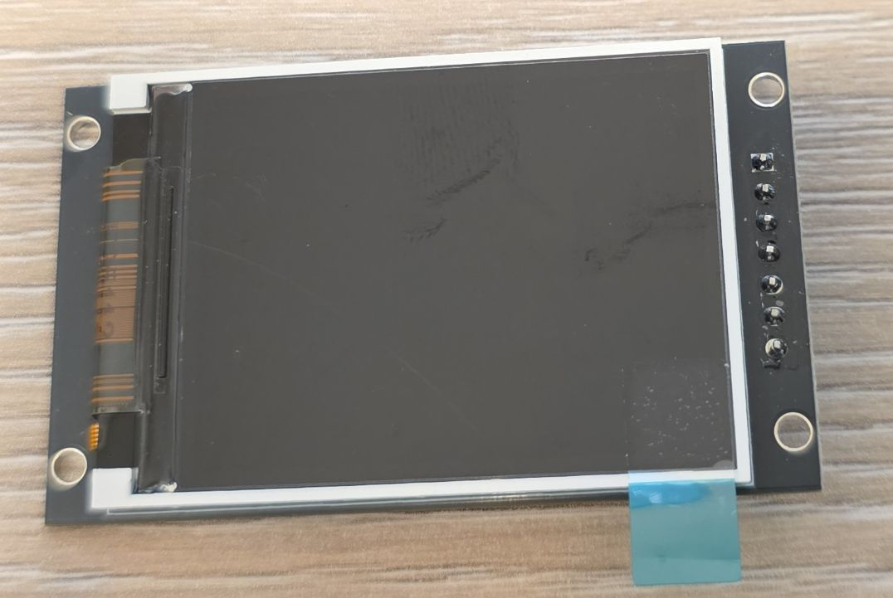
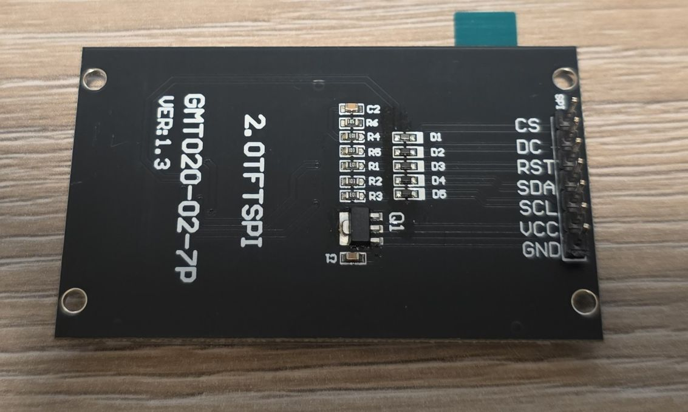

## Overview

The 2" OLED Display Module is a Color OLED? display with 240x320 resolution. (The listing says OLED LCD which
makes no sense)

OLED displays are self-illuminating (no backlight needed), have excellent contrast, wide viewing angles,
and consume very little power. This module uses the ST7789V driver chip.

## Configuration Notes

- Requires **SPI** interface
- Platform: [**mipi_spi**](https://esphome.io/components/display/mipi_spi/)
- Model: **ST7789V**

Board [jc2432w328c](./jc2432w328c.md) has the same driver so it should have the same setup.

## Other Images

Back of the display:

