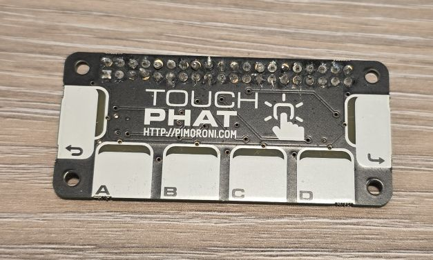

## Overview

Six touch-sensitive buttons with added LEDs. It uses the CAP1166 capacitive touch and LED driver chip.
The LEDs have been under-mounted and shine through exposed sections of the PCB to give
a pleasing yellow-green glow and a completely smooth top surface!



The board features:

- Six capacitive touch buttons
- Six bright white under-mounted LEDs
- Microchip CAP1166 capacitive touch and LED driver chip
- I2C: 0x2c

## Configuration Notes

Not supported by ESPHome. The chip is nearly exactly the same as
[CAP1188](https://esphome.io/components/binary_sensor/cap1188/).
The only difference is that CAP1188 supports 8, and CAP1166 supports 6 touch sensors and LEDs.
Addresses and functionalities are all the same.

**NOTE** The LEDs are not linked to Touch Pads. LEDs are positioned under different pads so they have to be disconnected.

✅ External component [available](github://barbarachbc/esphomecomponents) (by me 🙂)

### Basic Configuration

```yaml
esp32:
  board: esp32dev
  framework:
#    type: arduino
    type: esp-idf

external_components:
    - source: github://barbarachbc/esphomecomponents
      components: [ cap1166 ]
      refresh: 5min
          
cap1166:
  - id: touch_phat
    address: 0x2C
    touch_threshold: 0x40
    allow_multiple_touches: true

i2c:
  id: i2c_bus
  sda: GPIO33
  scl: GPIO32

binary_sensor:
  - platform: cap1166
    id: touch_key0
    channel: 0
    name: "Touch Key 0"
    on_press:
      then:
        - ....
    on_release:
      then:
        - ....
    on_click:
      min_length: 50ms
      max_length: 350ms
      then:
        - lambda: |-
            ESP_LOGI("my_test", "Touched Key 0");
  - platform: cap1166
    id: touch_key1
    channel: 1
    name: "Touch Key 1"
    on_press:
      ....

```

**NEXT:** add notes on all the functionality of the external component

## Other Images

Touch pHat back:

