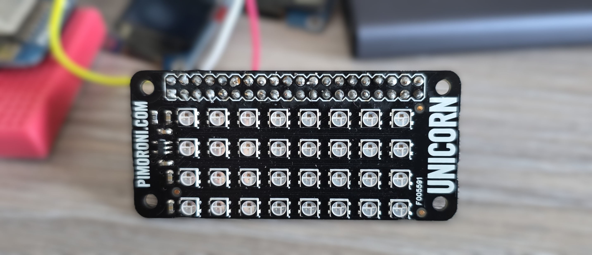
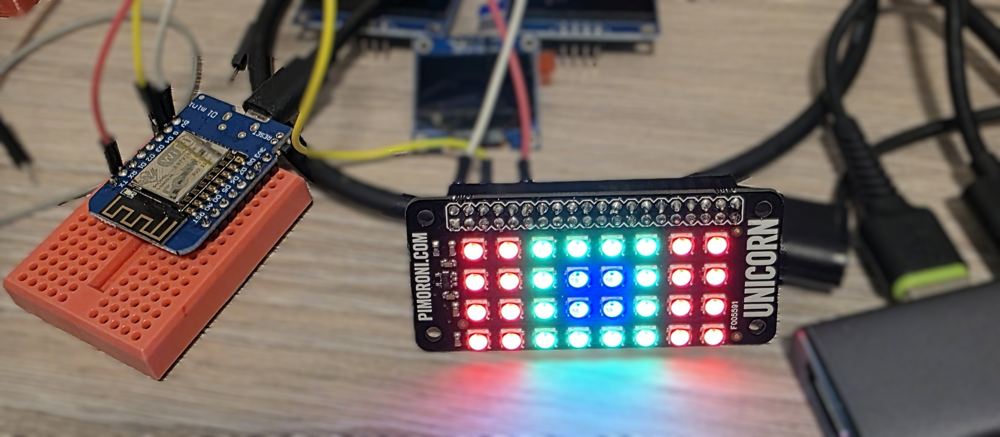
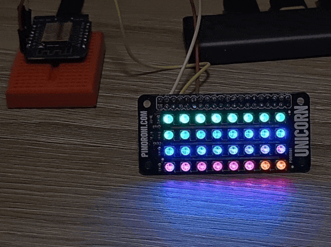
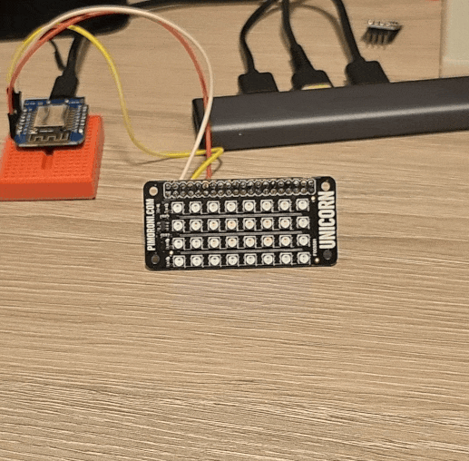
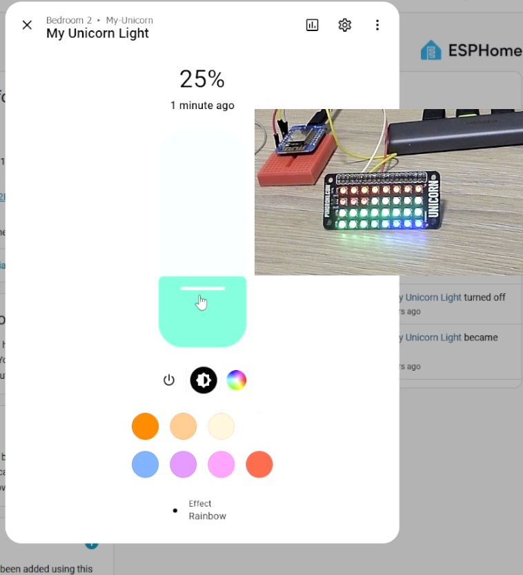
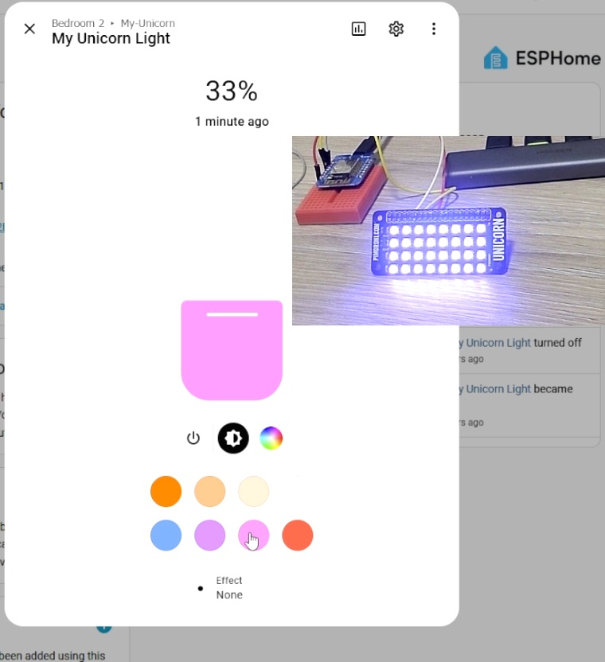

## Overview

The Unicorn pHAT is a compact 8x4 RGB LED matrix designed as a HAT for Raspberry Pi Zero.
It features 32 individually addressable RGB LEDs (SK6812 compatible) in a 3.5mm x 3.5mm package,
providing vibrant color display capabilities in a small form factor.



The board features:

- 8x4 (32 total) RGB LEDs
- SK6812 individually addressable LEDs (similar to WS2812B)
- 3.5mm x 3.5mm LED package
- Raspberry Pi HAT form factor
- Compatible with NeoPixel/WS2812 protocols

## Configuration Notes

Requires only single GPIO. Other connection is 5V and GND.
5V is expected so LEDs can show the full spectrum of light, but 3.3V will do just fine.

Supported via ESPHome's [NeoPixelBus Light component](https://esphome.io/components/light/neopixelbus/).
Note that NeoPixelBus only works with the Arduino framework.

For ESP-IDF use [ESP32 RMT LED Strip](https://esphome.io/components/light/esp32_rmt_led_strip/)

**ℹ️ ESP8266**: When using ESP8266 based board you'll need to use neopixelbus and it is recommended to use GPIO03

**🚨 NOTE**: When using RGB lights, brightness will affect how they appear, especially when using effects.
Some effects depend on brightness of each color so some effects might not be in full display
if brightness is not at 100%. On the other hand, you might go blind(ed) at 100%, so 🤷🏻.

### Basic Configuration

```yaml
#works with arduino only
light:
  - platform: neopixelbus
    variant: 800KBPS
    num_leds: 32
    type: GRB
    name: "My Unicorn Light"
    id: my_unicorn_phat
    pin: GPIO17
```

```yaml
#works with esp-idf
light:
  - platform: esp32_rmt_led_strip
    chipset: ws2812
    num_leds: 32
    rgb_order: GRB
    name: "My Light"
    internal: true
    id: my_strip
    pin: GPIO17
```

### Using With Addressable Light Display

This example uses an example from [addressable light](https://esphome.io/components/display/addressable_light/) and
draws bulls-eye pattern on 8x4 display (original example on 8x8 ... well, it's kind of bulls-eye pattern).



Example uses 8266 based [D1 mini](./esp8266-d1-mini).

```yaml
esphome:
  name: my-unicorn

esp8266:
  board: d1_mini

logger:

light:
  - platform: neopixelbus
    variant: 800KBPS
    num_leds: 32
    type: GRB
    name: "My Unicorn Light"
    id: my_unicorn_phat
    #note: using ESP8266 so I chose GPIO03
    pin: GPIO03

display:
  - platform: addressable_light
    id: led_matrix_light
    addressable_light_id: my_unicorn_phat
    width: 8
    height: 4
    update_interval: 16ms
    lambda: |-
      // Draw a bulls-eye pattern
      Color red = Color(0x770000);
      Color green = Color(0x007700);
      Color blue = Color(0x000077);
      it.rectangle(0, 0, 2, 4, red);
      it.rectangle(2, 0, 4, 4, green);
      it.rectangle(3, 1, 2, 2, blue);
      it.rectangle(6, 0, 2, 4, red);

```

### Addressable Effects

In this example we cover [addressable effects](https://esphome.io/components/light/#light-effects).
Every 25 seconds (`interval`), we display a new effect for 20 seconds and then turn off the display.
Setting the effect is by name, so I chose names e1-e7 because of this.
Defining num_executions as static ensures the value is preserved across lambda calls.



Note that 60% is still bright, so if you don't have a diffuser - get one!

Example uses 8266 based [D1 mini](./esp8266-d1-mini).

```yaml
esphome:
  name: my-unicorn

esp8266:
  board: d1_mini

logger:

interval:
  - interval: 25s
    then:
      - light.control:
          id: my_unicorn_phat
          effect: !lambda |-
            static int num_executions = 0;
            num_executions = num_executions % 7 + 1;
            return str_sprintf("e%d", num_executions);
          brightness: 60%
          state: on
      - delay: 20s
      - light.control:
          id: my_unicorn_phat
          state: off

light:
  - platform: neopixelbus
    variant: 800KBPS
    num_leds: 32
    type: GRB
    name: "My Unicorn Light"
    id: my_unicorn_phat
    pin: GPIO03
    effects:
      - addressable_rainbow:
          name: "e1"
      - addressable_color_wipe:
          name: "e2"
      - addressable_scan:
          name: "e3"
      - addressable_twinkle:
          name: "e4"
      - addressable_random_twinkle:
          name: "e5"
      - addressable_fireworks:
          name: "e6"
      - addressable_flicker:
          name: "e7"

```

### Light Effects

Can we use this with ["normal" effects](https://esphome.io/components/light/#light-effects) I hear you asking?
Well, there's 4 and I added addressable rainbow to the end of the list.



I'm not actually sure that "normal" effects follow 60% brightness settings. My eyes hurt 🥹.

Interesting thing though - Random Effect sets random color for all LEDs, so your next effect (Strobe)
uses that color for strobing.

```yaml
esphome:
  name: my-unicorn

esp8266:
  board: d1_mini

logger:

interval:
  - interval: 25s
    then:
      - light.control:
          id: my_unicorn_phat
          effect: !lambda |-
            static int num_executions = 0;
            num_executions = num_executions % 5 + 1;
            return str_sprintf("e%d", num_executions);
          brightness: 60%
          state: on
      - delay: 20s
      - light.control:
          id: my_unicorn_phat
          state: off

light:
  - platform: neopixelbus
    variant: 800KBPS
    num_leds: 32
    type: GRB
    name: "My Unicorn Light"
    id: my_unicorn_phat
    pin: GPIO03
    effects:
      - pulse:
          name: "e1"
      - random:
          name: "e2"
      - strobe:
          name: "e3"
      - flicker:
          name: "e4"
      - addressable_rainbow:
          name: "e5"

```

### Using with Home Assistant

You can use this with home assistant. You'll need wifi and api components. Names of the effects will appear in the UI.



```yaml
esphome:
  name: my-unicorn

esp8266:
  board: d1_mini

api:
  encryption:
    key: !secret my_unicorn_api

ota:
  - platform: esphome
    password: !secret my_unicorn_ota

wifi:
  ssid: !secret wifi_ssid
  password: !secret wifi_password


logger:

light:
  - platform: neopixelbus
    variant: 800KBPS
    num_leds: 32
    type: GRB
    name: "My Unicorn Light"
    id: my_unicorn_phat
    pin: GPIO03
    effects:
      - pulse:
          name: "Pulse"
      - random:
          name: "Random"
      - strobe:
          name: "Strobe"
      - flicker:
          name: "Flicker"
      - addressable_rainbow:
          name: "Rainbow"

```


