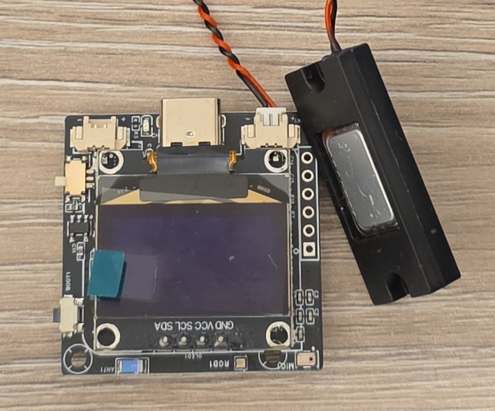
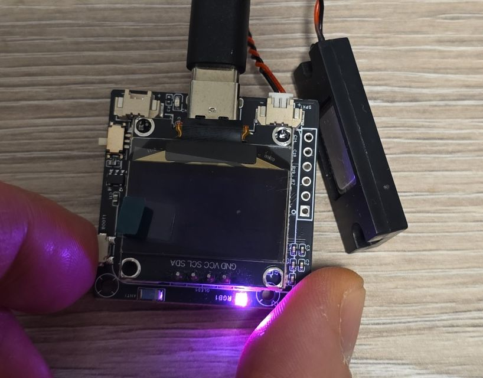
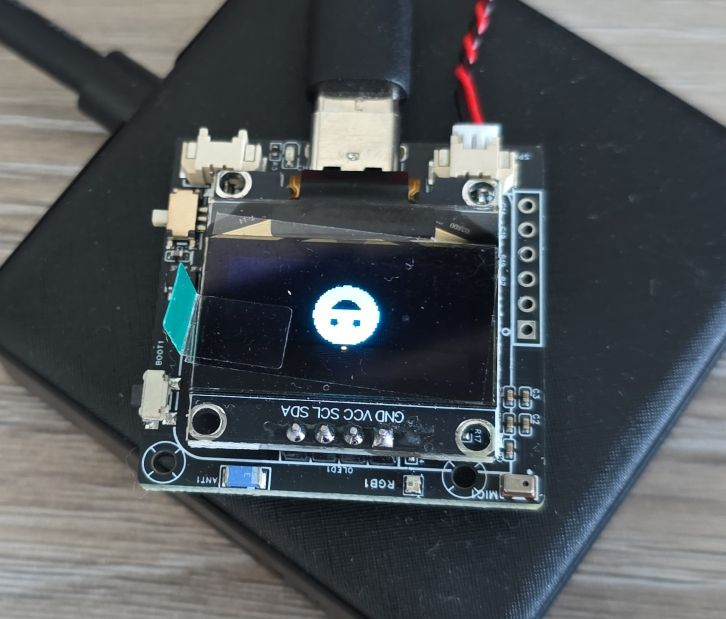
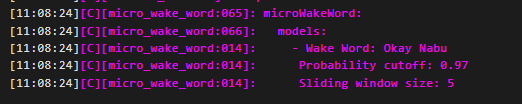
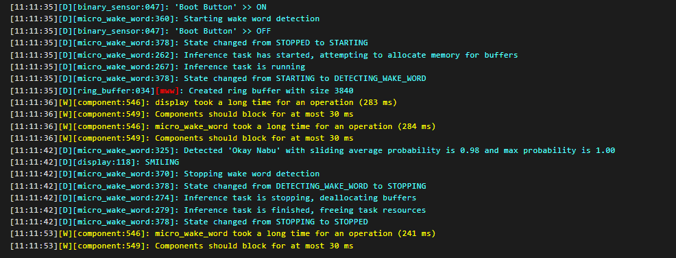
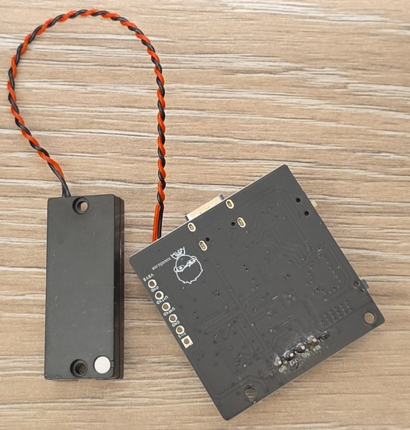

## Overview

The XiaGe Xmini-C3 is a compact AI voice development board designed for the XiaoZhi AI voice assistant project.
It combines an ESP32-C3 microcontroller with audio processing capabilities (ES8311 codec + NS4150B amplifier),
a 0.96-inch OLED display, and battery support in a small form factor.



This board is specifically designed for the **XiaoZhi AI** voice assistant project and includes
hardware optimized for that use case. Of course we'll try to setup voice assistant in Home Assistant and keep
everything local.

## Test Status

- ✅ [Basic Config](#basic-configuration) with boot button and LED indicator
- ✅ [Display (SSD1306)](#display)
- ✅ Boot Button
- ✅ LED Indicator
- ✅ [Audio (ES8311 + NS4150B)](#audio-configuration)
- ✅ [Microphone (ES8311)](#microphone-configuration)

## Hardware Features

- **Display:** 0.96-inch SSD1306 OLED (128x64 monochrome/dual color) (I2C ADDR: 0x3C)
- **Audio Codec:** ES8311 audio decoder (I2S & I2C) I2C Addr: 0x18
- **Amplifier:** NS4150B power amplifier IC (connected to ES8311)
- **Microphone:** Onboard MEMS microphone for voice input (ZTS6216 connected to ES8311)
- **Speaker:** 1.25mm connector for 3W-5W cavity speaker (speaker included)
- **Connectivity:** WiFi 802.11 b/g/n, Bluetooth LE 5.0
- **Power:** 3.7V lithium battery support with LGS4056 charging IC
- **USB:** TYPE-C for programming, serial communication, and 5V charging
- **Buttons:** BOOT button for whatever you want (originally intended for waking up device)
- **Antenna:** Ceramic antenna
- **Expansion:** 6-pin interface (UART RX/TX, VSys, 3V3, GND)
- **LED:** WS2812 RGB LED

### Module Specifications

- **MCU:** ESP32-C3-QFN-32-EP
- **CPU:** 32-bit RISC-V single-core processor, up to 160 MHz
- **RAM:** 400KB
- **Flash:** 16MB NOR FLASH (W25Q128JVSIQ)
- **Operating Voltage:** 3.3V
- **Input Voltage:** 5V (USB-C) or 3.7V (battery)

### Audio Specifications

- **Codec:** ES8311 I2S audio codec
- **Amplifier:** NS4150B (3W-5W output)
- **Speaker Interface:** 1.25mm standard connector
- **Speaker:** Default 3514 ultra-thin cavity speaker (8 Ω 2W)

## Pinout and I/O Connectors

### Buttons

- **Power Mode Switch:** There's a slide-switch on the side for switching between USB & Battery power supply
- **Boot (BOOT):** Originally - wake-up button, also used for dialogue interrupt

### Expansion Interface (6-Pin)

The 6-pin expansion interface provides:

- **UART RX/TX:** Serial communication
- **VSys:** ~4.5V system voltage
- **3V3:** 3.3V regulated output
- **GND:** Ground (2x)

### Battery and Speaker Connectors

- **Battery:** 1.25mm standard connector for 3.7V lithium battery
- **Speaker:** 1.25mm standard connector (3W-5W recommended)

### Pin Distribution

The table below is based on the [schematic](https://oshwhub.com/tenclass01/xmini_c3) and later I found the
[config file with everything 🙂](https://github.com/78/xiaozhi-esp32/blob/main/main/boards/xmini-c3/config.h)

| ESP32C3 | Function | Connected To | Notes |
| --- | -------- | ------------ | ----- |
| GPIO09 | | Boot Button | |
| GPIO03 | I2C_SDA | Display/Audio Codec | |
| GPIO04 (MTTMS) | I2C_SCL | Display/Audio Codec | |
| GPIO02 | WS2812 DIN | NeoPixel | |
| SPICS0 (GPIO14) | SPI_CS0 | Flash | Reserved for Flash - do not use |
| SPICLK (GPIO15) | SPI_CLK | Flash | Reserved for Flash - do not use |
| SPID (GPIO16) | SPI_ID | Flash | Reserved for Flash - do not use |
| SPIQ (GPIO17) | SPI_IQ | Flash | Reserved for Flash - do not use |
| SPIWP (GPIO13) | U1TXD | UART TX | Expansion interface |
| SPIHD (GPIO12) | U1RXD | UART RX | Expansion interface |
| GPIO10 | I2S_MCK | Audio Codec | |
| GPIO08 | I2S_BCK | Audio Codec | |
| MTDO (GPIO07) | I2S_DI | Audio Codec | |
| MTCK (GPIO06) | I2S_WS | Audio Codec | |
| MTDI (GPIO05) | I2S_DO | Audio Codec | |

## Important Notes

**WARNING ⚠️**: The board does not have reset button, and for whatever reason it does not reboot automatically
after using USB to upload firmware. If you're using [ESPHome Web interface](https://web.esphome.io/) you'll need go
to Logs and there is an option to Reset Device. I just could not figure out how to do it automatically, I tried
several *platformio_options* but without success. (Maybe it's my machine, other devices that worked before do not
reboot anymore ... might need to reboot ♻️ my machine).

**WARNING ⚠️**: Make sure to go through [basic configuration](#basic-configuration) and if that is working
you have correctly setup board. Flash is connected in Dual SPI mode. The default configuration is DIO (Dual I/O),
so not specifying it will work, but I prefer to be explicit about it when I know this is how the board is wired-up.

**INFO ℹ️**: There are 2 I2C pheripherals - the display and the audio codec. They use default addresses:
0x3C and 0x18 respectively.
The basic configuration has I2C configured so in the logs you should see something like:

```
[09:01:09][C][i2c.idf:094]:  SDA Pin: GPIO3
[09:01:09][C][i2c.idf:094]:  SCL Pin: GPIO4
[09:01:09][C][i2c.idf:094]:  Frequency: 50000 Hz
[09:01:09][C][i2c.idf:114]: Results from bus scan:
[09:01:09][C][i2c.idf:120]: Found device at address 0x18
[09:01:09][C][i2c.idf:120]: Found device at address 0x3C
```

**LOOK OUT 🔍**: There's a switch on the side for battery operation. Board won't power up when connected over USB if
the switch is in the battery mode. If you can't get the board to work, maybe the switch is in the wrong position.

## Basic Configuration

Basic configuration for Xmini-C3 with ESP32-C3 only covers very basic and minimal configuration.
This does nothing spectacular but gives you an option to make sure that everything is working.
The configuration below will configure the board to build correctly and will correctly configure
the RGB LED indicator, boot button and I2C bus. Things to check after using this configuration:

- Check log, I2C should do address scan and should show that it found devices with 0x18 and 0x3C address
- Press boot button - after a slight delay the LED Indicator will turn purple-ish.
- Release boot button - the LED indicator should turn off



```yaml
esphome:
  name: my-xmini-c3

esp32:
  variant: esp32c3
  framework:
    type: esp-idf
    sdkconfig_options:
      CONFIG_ESPTOOLPY_FLASHMODE_DIO: y
  flash_size: 16MB

logger:

substitutions:
  boot_btn_pin: GPIO09
  i2c_sda_pin: GPIO03
  i2c_scl_pin: GPIO04
  neopixel_pin: GPIO02

i2c:
  sda: ${i2c_sda_pin}
  scl: ${i2c_scl_pin}

light:
  - platform: esp32_rmt_led_strip
    id: my_indicator
    chipset: ws2812
    num_leds: 1
    rgb_order: GRB
    name: "Indicator Light"
    restore_mode: ALWAYS_OFF
    pin: ${neopixel_pin}

# Boot button
binary_sensor:
  - platform: gpio
    pin:
      number: ${boot_btn_pin}
      inverted: true
      mode:
        input: true
        pullup: true
    name: "Boot Button"
    id: boot_btn
    on_press:
      then:
        # making sure that RGB light is wired up
        - light.turn_on: my_indicator
        - light.control:
            id: my_indicator
            brightness: 60%
            red: 100%
            green: 25%
            blue: 75%
    on_release:
      then:
        - light.turn_off: my_indicator
```

## Display

The display should be similar to other displays using [SSD1306 component](https://esphome.io/components/display/ssd1306/).
I added some display test code to the basic configuration at the very bottom.
It fills the whole display and shows small empty square in the middle.


```yaml
esphome:
  name: my-xmini-c3

esp32:
  variant: esp32c3
  framework:
    type: esp-idf
    sdkconfig_options:
      CONFIG_ESPTOOLPY_FLASHMODE_DIO: y
  flash_size: 16MB

logger:

substitutions:
  boot_btn_pin: GPIO09
  i2c_sda_pin: GPIO03
  i2c_scl_pin: GPIO04
  neopixel_pin: GPIO02

i2c:
  sda: ${i2c_sda_pin}
  scl: ${i2c_scl_pin}

light:
  - platform: esp32_rmt_led_strip
    id: my_indicator
    chipset: ws2812
    num_leds: 1
    rgb_order: GRB
    name: "Indicator Light"
    restore_mode: ALWAYS_OFF
    pin: ${neopixel_pin}

binary_sensor:
  - platform: gpio
    pin:
      number: ${boot_btn_pin}
      inverted: true
      mode:
        input: true
        pullup: true
    name: "Boot Button"
    id: boot_btn
    on_press:
      then:
        - light.turn_on: my_indicator
        - light.control:
            id: my_indicator
            brightness: 60%
            red: 100%
            green: 25%
            blue: 75%
    on_release:
      then:
        - light.turn_off: my_indicator

#https://esphome.io/components/display/ssd1306/
display:
  - platform: ssd1306_i2c
    model: "SSD1306 128x64"
    address: 0x3C
    lambda: |-
      it.filled_rectangle(0, 0, it.get_width(), it.get_height());
      it.filled_rectangle(it.get_width()/2 - 6, it.get_height()/2 - 6, 12, 12, COLOR_OFF);
```

### Display Configuration Notes

That blue and yellow color looks beautiful 🙂. Now, the display is monochrome so you can't control the colors.
That yellow stripe is "COLOR_ON" for that portion of the display ... 1/4 of the display so first 16 rows.

Keep in mind that the yellow and blue portions of the screen are fixed. So depending on where you want your
yellow stripe to appear you have to physically rotate the screen. Using rotation attribute won't change where
the colors show up, it will just rotate the coordinating system.

You can try this out to see where they yellow shows up. It turns on color for different quarter of the screen
every second.

```yaml
display:
  - platform: ssd1306_i2c
    model: "SSD1306 128x64"
    address: 0x3C
    update_interval: 1s
    #rotation: 180
    lambda: |-
      static auto i = 0;
      it.filled_rectangle(0, 0, it.get_width(), it.get_height(), COLOR_OFF);
      it.filled_rectangle(0, i*16, it.get_width(), 16);
      i = (i+1)%4;
```

## Audio Configuration

OK, let's get crazy. In order to do anything with audio there's a number of components that need to be used:

- [es8311 audio dac](https://esphome.io/components/audio_dac/es8311/)
- [i2s audio](https://esphome.io/components/i2s_audio/)
- [i2s speaker](https://esphome.io/components/speaker/i2s_audio/)
- [speaker media player](https://esphome.io/components/media_player/speaker/)
- [i2s microphone](https://esphome.io/components/microphone/i2s_audio/) - not used in this example

To use this, press *boot* button and the device will play G# chord, the LED indicator will light up, and once it
finishes playing the LED will turn off.

I'll go into details below, here's the full configuration:

```yaml
esphome:
  name: my-xmini-c3

esp32:
  variant: esp32c3
  framework:
    type: esp-idf
    sdkconfig_options:
      CONFIG_ESPTOOLPY_FLASHMODE_DIO: y
  flash_size: 16MB

#NOTE: required for media speaker (even if using only local files)
network:

logger:

substitutions:
  boot_btn_pin: GPIO09
  i2c_sda_pin: GPIO03
  i2c_scl_pin: GPIO04
  neopixel_pin: GPIO02
  i2s_ws_pin: GPIO06
  i2s_bck_pin: GPIO08
  i2s_mck_pin: GPIO10
  i2s_do_pin: GPIO05
  i2s_di_pin: GPIO07
  mute_pin: GPIO11

i2c:
  sda: ${i2c_sda_pin}
  scl: ${i2c_scl_pin}

light:
  - platform: esp32_rmt_led_strip
    id: my_indicator
    chipset: ws2812
    num_leds: 1
    rgb_order: GRB
    name: "Indicator Light"
    restore_mode: ALWAYS_OFF
    pin: ${neopixel_pin}


# Boot button
binary_sensor:
  - platform: gpio
    pin:
      number: ${boot_btn_pin}
      inverted: true
      mode:
        input: true
        pullup: true
    name: "Boot Button"
    id: boot_btn
    on_click:
      then:
      - audio_dac.set_volume:
          id: my_dac
          volume: 80%
      - light.turn_on: my_indicator
      - light.control:
          id: my_indicator
          brightness: 40%
          red: 100%
          green: 25%
          blue: 75%
      - output.turn_off: mute_control
      - media_player.speaker.play_on_device_media_file:
          media_file: my_test_notification
          announcement: true
      # Wait until the alarm sound starts playing
      - wait_until:
          media_player.is_announcing:
      # Wait until the alarm sound stops playing
      - wait_until:
          not:
            media_player.is_announcing:
      - output.turn_on: mute_control
      - light.turn_off: my_indicator


output:
  - platform: gpio
    pin: ${mute_pin}
    id: mute_control
    inverted: true
#https://esphome.io/components/audio_dac/es8311/
audio_dac:
  - platform: es8311
    id: my_dac
    use_microphone: false
    bits_per_sample: 16bit
    #sample_rate: 48000
    sample_rate: 16000
    address: 0x18

#https://esphome.io/components/i2s_audio/
i2s_audio:
  - id: i2s_output
    i2s_lrclk_pin: ${i2s_ws_pin}
    i2s_bclk_pin: ${i2s_bck_pin}
    i2s_mclk_pin: ${i2s_mck_pin}

#https://esphome.io/components/speaker/i2s_audio/
speaker:
  - platform: i2s_audio
    id: my_speaker
    dac_type: external
    i2s_dout_pin: ${i2s_do_pin}
    i2s_audio_id: i2s_output
    channel: mono
    #sample_rate: 48000
    sample_rate: 16000
    bits_per_channel: 16bit
    buffer_duration: 500ms


#https://esphome.io/components/microphone/i2s_audio/
microphone:
  - platform: i2s_audio
    id: external_mic
    adc_type: external
    i2s_din_pin: ${i2s_di_pin}
    i2s_audio_id: i2s_output

#testing speaker
#https://esphome.io/components/media_player/speaker/
media_player:
  - platform: speaker
    id: my_media_player
    announcement_pipeline:
      #no transcoding
      format: WAV
      speaker: my_speaker
    #only WAV for testing
    codec_support_enabled: false
    #default value will crash it
    buffer_size: 51200
    #
    files:
      - id: my_test_notification
        #file: assets/g-chord-reverb-48K.wav
        file: assets/g-chord-reverb-16K.wav

#https://esphome.io/components/display/ssd1306/
display:
  - platform: ssd1306_i2c
    model: "SSD1306 128x64"
    address: 0x3C
    lambda: |-
      it.filled_rectangle(0, 0, it.get_width(), it.get_height());
      it.filled_rectangle(it.get_width()/2 - 6, it.get_height()/2 - 6, 12, 12, COLOR_OFF);
```

### Audio Configuration Notes

#### Files

I downloaded G# bariton guitar chord from [Freesounds.org](https://freesound.org/people/TheEndOfACycle/sounds/838383/).
I used Audacity to mix it down from stereo to mono, shortened it, then I expored the file twice:

- [g-chord-reverb-16K.wav](/files/sounds/g-chord-reverb-16K.wav) as mono, 16000 Hz sample rate, Signed 16-bit PCM
- [g-chord-reverb-48K.wav](/files/sounds/g-chord-reverb-48K.wav) as mono, 48000 Hz sample rate, Signed 16-bit PCM

I copied the files to my `/assets` folder so when I build the project they get embedded to the firmware.

#### Media Player

This is just so I have something to test with. I wanted to use local file so I used
[Speaker Media Player](https://esphome.io/components/media_player/speaker/). You could connect to Home Assistant
and play something from there, but I wanted to test simplest possible (not sure if this is simplest though 🙂).

**NOTE:** `network` component is needed by the media player even though we're not connecting to it.

I used announcement pipeline, and that determined which commands I'll be using to play the file. I turned off
most of the features to keep the size of the firmware low. The main things to be careful about are:

- `buffer_size` - if not specified it will crash your board because default is too big for the available memory.
I randomly went for 50KB. I did not play too much with this, just wanted to make it work.
- `files` - the sound file to play. It will be embedded into firmware

Note that `-16K` or `-48k` are for my use so I know which sampling rate file has. The player does not use it, it reads
everything it needs from the file.

```yaml
media_player:
  - platform: speaker
    id: my_media_player
    announcement_pipeline:
      #no transcoding
      format: WAV
      speaker: my_speaker
    #only WAV for testing
    codec_support_enabled: false
    #default value will crash it
    buffer_size: 51200
    #
    files:
      - id: my_test_notification
        #file: assets/g-chord-reverb-48K.wav
        file: assets/g-chord-reverb-16K.wav
```

#### Bits and Sample Rate

You can try different combinations of bits and sampling rates. I tried all possible combinations of using 16KHz
sampling rate for DAC, but using 48KHz file, and different sampling rate for the I2S audio component. All of them
worked. The file I played, and the speaker used are not great to ascertain the difference in audio, but all possible
combinations I tried worked and produced the sound.

Note that 16 bits per sample is the minimum that will work with the media player. I tried using 8bit but the component
was complaining.

#### Audio DAC

```yaml
#https://esphome.io/components/audio_dac/es8311/
audio_dac:
  - platform: es8311
    id: my_dac
    use_microphone: false
    bits_per_sample: 16bit
    #sample_rate: 48000
    sample_rate: 16000
    address: 0x18
```

I suppose this is self explanatory. It uses I2C bus for control.

#### I2S Audio

[I2S Audio Component](https://esphome.io/components/i2s_audio/) allows us to configure I2S bus.

```yaml
i2s_audio:
  - id: i2s_output
    i2s_lrclk_pin: ${i2s_ws_pin}
    i2s_bclk_pin: ${i2s_bck_pin}
    i2s_mclk_pin: ${i2s_mck_pin}
```

#### I2S Audio

[I2S Speaker Component](https://esphome.io/components/speaker/i2s_audio/) allows us to configure the DAC as a speaker.
Another option is to use [I2S Media Player](https://esphome.io/components/media_player/i2s_audio/) and in that case
we would not need the other media player, but I didn't know how to play local file on it.

The main thing is to tell it what's the pin for I2S Data Out (DOUT) signal. There's only one channel so `mono`. Keep
buffer duration small since we only have internal RAM.

```yaml
speaker:
  - platform: i2s_audio
    id: my_speaker
    dac_type: external
    i2s_dout_pin: ${i2s_do_pin}
    i2s_audio_id: i2s_output
    channel: mono
    #sample_rate: 48000
    sample_rate: 16000
    bits_per_channel: 16bit
    buffer_duration: 500ms
```

#### DAC Enable/Mute Control

**IMPORTANT 🚨:**
I called this `mute_control` so I inverted it. The GPIO11 is connected to CTRL pin of the *NS4150B* amp. High on this pin
enables output of the amp - without this you will get no sound!

```yaml
output:
  - platform: gpio
    pin: ${mute_pin}
    id: mute_control
    inverted: true
```

#### Playing Sound

When the *boot* button is clicked the following happens:

- DAC volume is set to 80% - change it to your liking
- LED Indicator is turned ON
- Mute is turned off `output.turn_off: mute_control`
  - **IMPORTANT:** without this step you will not hear any sound!
- Media is played. Note that the announcement pipeline is configured so `announcement: true` is set. There's waiting
for announcement to start, then to complete
- Mute is turned on
- LED Indicator is turned OFF

```yaml
binary_sensor:
  - platform: gpio
    pin:
      number: ${boot_btn_pin}
      inverted: true
      mode:
        input: true
        pullup: true
    name: "Boot Button"
    id: boot_btn
    on_click:
      then:
      - audio_dac.set_volume:
          id: my_dac
          volume: 80%
      - light.turn_on: my_indicator
      - light.control:
          id: my_indicator
          brightness: 40%
          red: 100%
          green: 25%
          blue: 75%
      - output.turn_off: mute_control
      - media_player.speaker.play_on_device_media_file:
          media_file: my_test_notification
          announcement: true
      # Wait until the alarm sound starts playing
      - wait_until:
          media_player.is_announcing:
      # Wait until the alarm sound stops playing
      - wait_until:
          not:
            media_player.is_announcing:
      - output.turn_on: mute_control
      - light.turn_off: my_indicator
```

## Microphone Configuration

OK, lets finish with microphone configuration. For this example we need:

- [i2s microphone](https://esphome.io/components/microphone/i2s_audio/)
- [microWakeWord](https://esphome.io/components/micro_wake_word/)

To use this, click *boot* button and the device will wait for the wake word. Upon wake word detection, it will
show a smiley face and then it will clear the screen after 10 seconds and you need to click *boot* button again.



Here's how it looks like in logs when microWakeWord is configured, and how when it's detected:





I'll go into details below, here's the full configuration:

```yaml
esphome:
  name: my-xmini-c3

esp32:
  variant: esp32c3
  framework:
    type: esp-idf
    sdkconfig_options:
      CONFIG_ESPTOOLPY_FLASHMODE_DIO: y
  flash_size: 16MB

logger:

substitutions:
  boot_btn_pin: GPIO09
  i2c_sda_pin: GPIO03
  i2c_scl_pin: GPIO04
  neopixel_pin: GPIO02
  i2s_ws_pin: GPIO06
  i2s_bck_pin: GPIO08
  i2s_mck_pin: GPIO10
  i2s_do_pin: GPIO05
  i2s_di_pin: GPIO07
  mute_pin: GPIO11

i2c:
  sda: ${i2c_sda_pin}
  scl: ${i2c_scl_pin}

light:
  - platform: esp32_rmt_led_strip
    id: my_indicator
    chipset: ws2812
    num_leds: 1
    rgb_order: GRB
    name: "Indicator Light"
    restore_mode: ALWAYS_OFF
    pin: ${neopixel_pin}


binary_sensor:
  - platform: gpio
    pin:
      number: ${boot_btn_pin}
      inverted: true
      mode:
        input: true
        pullup: true
    name: "Boot Button"
    id: boot_btn
    on_click:
      then:
        - micro_wake_word.start:

output:
  - platform: gpio
    pin: ${mute_pin}
    id: mute_control
    inverted: true
#https://esphome.io/components/audio_dac/es8311/
audio_dac:
  - platform: es8311
    id: my_dac
    use_microphone: false
    bits_per_sample: 16bit
    #sample_rate: 48000
    sample_rate: 16000
    address: 0x18

#https://esphome.io/components/i2s_audio/
i2s_audio:
  - id: i2s_output
    i2s_lrclk_pin: ${i2s_ws_pin}
    i2s_bclk_pin: ${i2s_bck_pin}
    i2s_mclk_pin: ${i2s_mck_pin}

#https://esphome.io/components/speaker/i2s_audio/
speaker:
  - platform: i2s_audio
    id: my_speaker
    dac_type: external
    i2s_dout_pin: ${i2s_do_pin}
    i2s_audio_id: i2s_output
    #to be able to use it on memory restricted device (for testing)
    channel: mono
    #sample_rate: 48000
    sample_rate: 16000
    bits_per_channel: 16bit
    buffer_duration: 500ms


#https://esphome.io/components/microphone/i2s_audio/
microphone:
  - platform: i2s_audio
    id: external_mic
    adc_type: external
    i2s_din_pin: ${i2s_di_pin}
    i2s_audio_id: i2s_output

image:
  - file: mdi:emoticon
    id: smile
    type: binary
    resize: 40x40

#https://esphome.io/components/micro_wake_word/
micro_wake_word:
  microphone: external_mic
  models:
    - model: github://esphome/micro-wake-word-models/models/v2/okay_nabu.json
  on_wake_word_detected:
    then:
      - lambda: |-
          ESP_LOGD("display", "SMILING");
          id(my_display).image(44, 12, id(smile));
      - component.update: my_display
      - delay: 10s
      - lambda: |-
          id(my_display).filled_rectangle(0, 0, 128, 64, COLOR_OFF);
      - component.update: my_display

#https://esphome.io/components/display/ssd1306/
display:
  - platform: ssd1306_i2c
    id: my_display
    model: "SSD1306 128x64"
    address: 0x3C
    # this is just for this demo since all the code is doing showing a smiley face
    # on detecting microWakeWord
    auto_clear_enabled: false
```

### Microphone Configuration Notes

Note that I removed media player for simplicity because it's not used in the example

#### Microphone

In the excerpt below, ADC is configured to use MEMS microphone (ZTS6216) - but that microphone has analog output.
For that reason `use_microphone` has to be set to `false` (which is *default* value anyway).

I2S microphone is configured then with correct input pin and *adc_type* is *external*.

```yaml
#https://esphome.io/components/audio_dac/es8311/
audio_dac:
  - platform: es8311
    id: my_dac
    use_microphone: false
    bits_per_sample: 16bit
    #sample_rate: 48000
    sample_rate: 16000
    address: 0x18

#https://esphome.io/components/microphone/i2s_audio/
microphone:
  - platform: i2s_audio
    id: external_mic
    adc_type: external
    i2s_din_pin: ${i2s_di_pin}
    i2s_audio_id: i2s_output
```

#### Micro Wake Word

In the excerpt below it's a pretty basic microWakeWord setup. It uses *okay nabu* wake word and in case of
detecting the wake word it displays an image, and then clears the screen. Very basic but proves that both microphone
and wake word work on pretty limited device that ESP32-C3 is (single core and limited RAM).

```yaml
#https://esphome.io/components/micro_wake_word/
micro_wake_word:
  microphone: external_mic
  models:
    - model: github://esphome/micro-wake-word-models/models/v2/okay_nabu.json
  on_wake_word_detected:
    then:
      - lambda: |-
          ESP_LOGD("display", "SMILING");
          id(my_display).image(44, 12, id(smile));
      - component.update: my_display
      - delay: 10s
      - lambda: |-
          id(my_display).filled_rectangle(0, 0, 128, 64, COLOR_OFF);
      - component.update: my_display
```

### Other Configuration

On boot button click - `micro_wake_word.start` is executed to start listening for the wake word. Once detected, by
*default* the component will stop listening for the wake word so click again to start listening.

```yaml
binary_sensor:
  - platform: gpio
    pin:
      number: ${boot_btn_pin}
      inverted: true
      mode:
        input: true
        pullup: true
    name: "Boot Button"
    id: boot_btn
    on_click:
      then:
        - micro_wake_word.start:
```

## Troubleshooting

### Cannot Write Firmware using Web Interface

I ran into this issue. If you get an issue with either connecting to the device using web interface,
or the installation won't start try this:

- Close your browser and open it again
- Unplug the device and plug it in again

In the first case something's wrong with the driver and/or the browser connection to the device. I am using Edge
browser and I'm testing different devices with different drivers. Sometimes things get wonky, and I tend to not
reboot my machine for days.

In the second case, and I observed this when I used the power selector switch, the board won't go into
boot loader mode. Disconnecting and connecting again seems to work.

## Other Images


