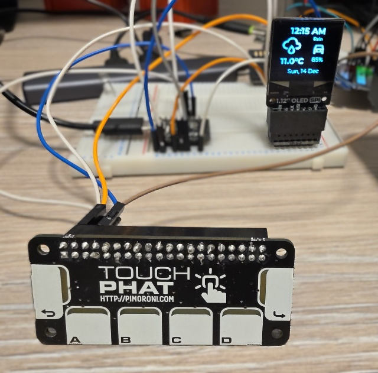
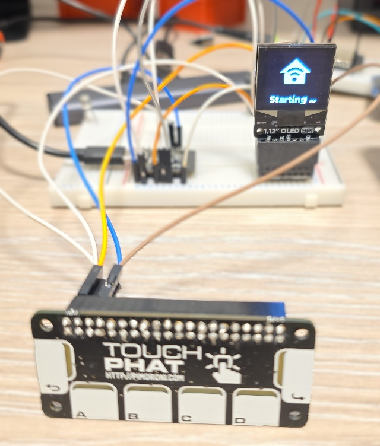
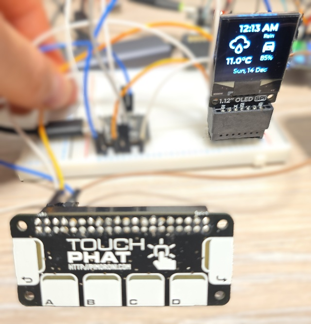
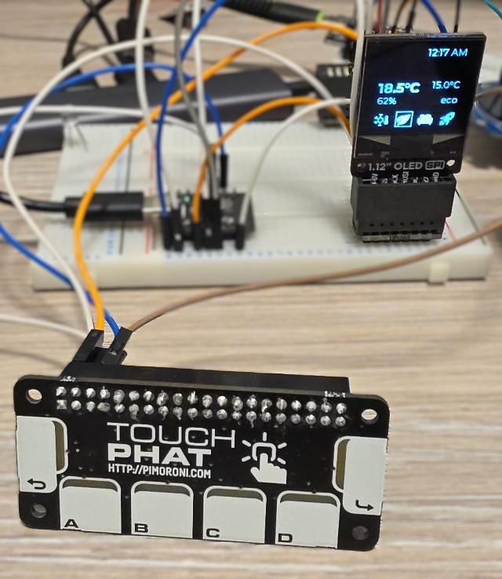
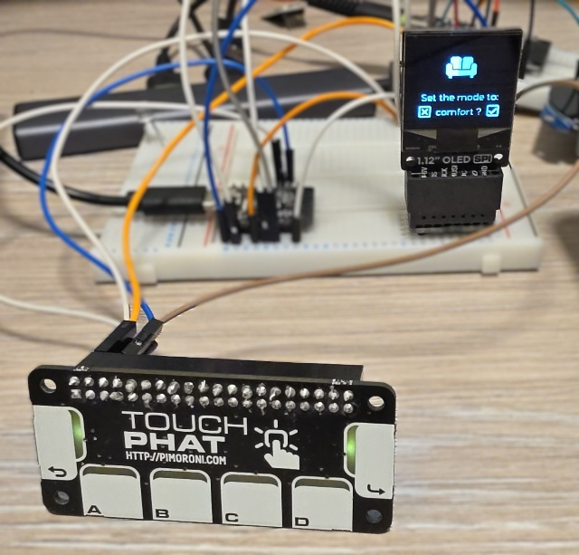
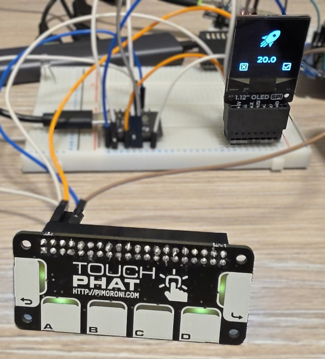

## Project Overview



This advanced project creates a compact bedroom climate controller with a monochrome OLED display and
capacitive touch interface that provides:

- 🕐 Real-time clock display with date
- 🌤️ Weather information (current temperature, forecast icon, and description)
- 🌡️ Indoor climate monitoring (temperature and humidity)
- 🔥 Thermostat control with multiple preset modes (frost, eco, comfort, boost)
- 🎯 Fine-grained temperature adjustment for boost mode
- 🚗 EV battery level monitoring
- 💡 Interactive LED feedback on touch buttons
- 📄 Multi-page interface with heating control page
- 🎨 Context-aware heating status visualization

This project is for a quick overview of important info on one page and then managing heating in the room.
When you get up you can quickly see time/date, outside temperature, forecast and EV battery level
(super important, right?).

On the other page are details of the temperature and humidity in the room and control of heating presets.
One of the presets can also be modified to set a different temperature.

This is working, but it is still a work in progress. All functionality is working, next steps are to
assemble it and get a nice enclosure for it.

## Progress

- ✅ [Main Configuration](#main-configuration-file) - fully functional
- [ ] 3D Enclosure
- [ ] Neopixel
- [ ] Further improvements

### Future improvement ideas

- Neopixel for mood light and notifications
- Use LEDs on the touch screen for quick status
- Adding more pages?
- **NOTE**: I'm running close to the memory limit for additional features

### Reusability Note

Substitutions are put at the top of the config file, so replacing them for your own sensor entity IDs and
climate IDs will get it working for you. Some extra work needed if not all the same component used. Some of
the components are obsolete so a different options might be required.

## What You'll Need

### Hardware

- 1x [DFRobot Beetle ESP32-C6](/devices/beetle-esp32-c6) - Compact ESP32-C6 development board
- 1x [SH1107 OLED Display (128x128, SPI)](/devices/sh1107-spi-oled) - Monochrome display breakout
- 1x [Pimoroni Touch pHAT](/devices/touch-phat) - 6 capacitive touch buttons with RGB LEDs (I2C)
- 1x [Adafruit NeoPixel](/devices/adafruit-neopixel) - RGB LED for ambient/notification
- Jumper wires for connections (for testing it)
- USB-C cable (data capable)
- Power supply (USB charger, 5V/1A minimum)
- This will require soldering if you want it properly assembled
- Optional: 3D printer for custom enclosure (design in progress)

#### Wiring Connections

The OLED display uses SPI bus, Touch breakout uses I2C and Neopixel uses GPIO.

| Component | ESP32-C6 GPIO | Notes |
| --------- | ------------- | ----- |
| **SPI Display (SH1107)** |
| SCK | GPIO23 (SCK) | SPI Clock |
| MOSI | GPIO22 (MOSI) | SPI Master Out |
| CS | GPIO05 | Chip Select |
| DC | GPIO07 | Data/Command |
| **I2C Touch pHAT (CAP1166)** |
| 3 (GPIO 2) | GPIO19 (SDA) | I2C Data |
| 5 (GPIO 3) | GPIO20 (SCL) | I2C Clock |
| **ESP32-C6 Built-in** |
| LED | GPIO15 | Built-in LED - not used |
| BOOT | GPIO09 | Boot button - not used |
| **NeoPixel (Future)** |
| DIN | (TBD) | To be determined |

**Power Notes:**

- All components use 3.3V logic level
- Touch pHAT requires both 3.3V and 5V pins to be connected to power supply. It does not provide power supply
it requires power supply
  - 3.3V power input is for power supply for the CAP1166 controller and logic
  - 5V power input is for powering LEDs. It works with 3.3V and I connected it to 3.3V. Since this is for
  driving LEDs it will not affect overal functionality. LEDs might not be as bright. If you are using some
  other input device, make sure you check documentation for it. Connecting 5V supply to 3.3V device
  might ☠️ kill it.

### Software

- [ESPHome installed](https://esphome.io/guides/getting_started_hassio/)
- Home Assistant with configured [weather integration](https://www.home-assistant.io/integrations/weather/)
  - [Met.no](https://www.home-assistant.io/integrations/met/) used, which is used by 82.4% of all users so
  this should work out of the box.
- Home Assistant entities:
  - Indoor temperature sensor
  - Indoor humidity sensor
  - Climate entity (thermostat/heater)
  - EV Car integration and sensor for battery level
- USB-to-Serial drivers (ESP32-C6 implements USB 2.0 CDC so should work out of the box)

### Required Home Assistant Entities

This project requires the following entities in Home Assistant. You'll need to update the substitutions
with your own entity IDs:

- **Climate Entity**: Thermostat/TRV with preset modes (frost, eco, comfort, boost)
  - Example: `climate.bedroom_heater` (using Versatile Thermostat integration)
  - Must support `preset_mode` attribute and `climate.set_preset_mode` action
- **Temperature Sensor**: Indoor temperature reading
  - Example: `sensor.bedroom_temperature`
- **Humidity Sensor**: Indoor humidity reading
  - Example: `sensor.bedroom_humidity`
- **Weather Integration**: Home Assistant weather entity
  - Example: `weather.forecast_home`
  - Must provide `temperature` and `temperature_unit` attributes
- **EV Battery Sensor** (optional): Electric vehicle battery level
  - Example: `sensor.car_battery_level`
- **Number Entity**: Boost preset temperature setting (if using Versatile Thermostat)
  - Example: `number.bedroom_heater_preset_boost_temp`

### Additional Files

- Material Design Icons font file - see [font component](/components/font#material-design-icons) for more
comprehensive explanation.
- `weather_icon_map.h` header file see
[Info Panel with ESP32 2.8" Display](./info-panel-28.md#weather-icon-map-header-file) project for details.
- CAP1166 custom component is pulled from github repository so no additional files for this are needed

## Project Photos

_Photos of the completed climate controller will be added here once the enclosure is designed._
Meanwhile have a look at some of the .

<!-- TODO: Add wiring diagram -->
_Detailed wiring diagram showing all connections will be added here._

## 3D Printed Enclosure

<!-- TODO: Add 3D model files and assembly instructions -->
_3D printable enclosure design is in progress. STL files and assembly instructions will be provided here._

The enclosure will house:

- ESP32-C6 board
- SH1107 OLED display (front-facing)
- Touch pHAT buttons (front-facing)
- NeoPixel LED (for ambient/notification lighting)
- USB-C access for programming and power

## ESPHome Configuration

### Prerequisites

Before using this configuration, ensure you have:

1. **Home Assistant** with the following configured:
   - Weather integration (provides `weather.forecast_home` entity)
   - Climate entity with preset mode support
   - Indoor temperature and humidity sensors (Zigbee or other)
   - A climate entity for heating control
   - EV battery sensor integration
2. Material Design Icons font file saved in your ESPHome directory as `assets/materialdesignicons-webfont.ttf`
3. The `weather_icon_map.h` header file

### Secrets File Setup

Create a `secrets.yaml` file in your ESPHome directory with your credentials:

```yaml
wifi_ssid: "Your_WiFi_SSID"
wifi_password: "Your_WiFi_Password"
```

For more information on using secrets in ESPHome, refer to the [ESPHome documentation](https://esphome.io/guides/yaml/#secrets-and-the-secretsyaml-file).

### Main Configuration File

If you're using
[ESPHome Device Builder](https://www.esphome.io/guides/getting_started_hassio/#installing-esphome-device-builder)
create your _New Device_. Or if you're using
[command line](https://www.esphome.io/guides/getting_started_command_line/) create your yaml file
(e.g. `bedroom-controller.yaml`)
Then use the following file as a guide (details on how to customize it are below):

```yaml
esphome:
  name: bedroom-controller
  friendly_name: bedroom-controller
  includes:
    - weather_icon_map.h
  on_boot:
    - priority: 1
      then:
      - delay: 5s
      - globals.set:
          id: my_boot_in_progress
          value: !lambda |-
            return id(my_boot_in_progress) >= 2 ? 2 : id(my_boot_in_progress);


esp32:
  variant: esp32c6

# Enable logging
logger:
  #level: WARN

# Enable Home Assistant API
api:
  encryption:
    key: "<<generate your encription key>>"

ota:
  - platform: esphome
    password: "<<your ota pwd>>"

wifi:
  ssid: !secret wifi_ssid
  password: !secret wifi_password

  # Enable fallback hotspot (captive portal) in case wifi connection fails
  ap:
    ssid: "Bedroom-Controller"
    password: "<<your pwd>>"
  
  on_connect:
    - delay: 5s
    - globals.set:
          id: my_boot_in_progress
          value: !lambda |-
            return id(my_boot_in_progress) >= 1 ? 1 : 0;

captive_portal:

substitutions:
  heater: bedroom_heater                # Climate entity (without climate. prefix)
  car_battery_level: ev_battery_level   # EV battery sensor (without sensor. prefix)
  indoor_temp: bedroom_temperature      # Indoor temp sensor (without sensor. prefix)
  indoor_humid: bedroom_humidity        # Indoor humidity sensor (without sensor. prefix)
  clk_pin: GPIO23
  mosi_pin: GPIO22
  sda_pin: GPIO19
  scl_pin: GPIO20
  disp_cs_pin: GPIO05
  disp_dc_pin: GPIO07

external_components:
    - source: github://barbarachbc/esphomecomponents
      components: [ cap1166 ]
      refresh: 5min

globals:
  - id: my_boot_in_progress
    type: int
    restore_value: no
    initial_value: '3'
  - id: my_forecast_desc
    type: std::string
    restore_value: no
    initial_value: '"Updating ..."'
  - id: my_forecast_icon
    type: std::string
    restore_value: no
    initial_value: '""'
  - id: my_outside_temp
    type: std::string
    restore_value: no
    initial_value: '"_.__C"'
  - id: selecting_heating_preset
    type: std::string
    restore_value: no
    initial_value: '""'
  - id: changing_heating_temp
    type: float
    restore_value: no
    initial_value: '0'

script:
  - id: update_weather
    then:
      - globals.set:
          id: my_boot_in_progress
          #finally connected to Home Assistant
          value: '0'
      - globals.set:
          id: my_forecast_icon
          value: !lambda return weather_icon_map[id(forecast_desc).state.c_str()].c_str();
      - globals.set:
          id: my_forecast_desc
          value: !lambda return weather_desc_map[id(forecast_desc).state.c_str()].c_str();
  - id: update_outside_temp
    then:
      - globals.set:
          id: my_outside_temp
          value: !lambda return str_sprintf("%.1f%s", id(outside_temperature).state, id(outside_temperature_unit).state.c_str());
  - id: a_button_click
    then:
      - if:
          condition:
            - lambda: return id(changing_heating_temp) > 0;
          then:
            - globals.set:
                id: changing_heating_temp
                value: !lambda |-
                  if(id(changing_heating_temp) <= 15){
                    return 15.0;
                  } else {
                    return id(changing_heating_temp) - 0.5;
                  }
          else:
            - script.execute:
                id: change_preset
                preset: "frost"
  - id: d_button_click
    then:
      - if:
          condition:
            - lambda: return id(changing_heating_temp) > 0;
          then:
            - globals.set:
                id: changing_heating_temp
                value: !lambda |-
                  if(id(changing_heating_temp) >= 28){
                    return 28.0;
                  } else {
                    return id(changing_heating_temp) + 0.5;
                  }
          else:
            - script.execute:
                id: change_preset
                preset: "boost"
  - id: change_preset
    parameters:
      preset: string
    then:
      - if:
          condition:
            and:
              - display.is_displaying_page: page_heating
              - lambda: return id(selecting_heating_preset) == "" && id(changing_heating_temp) <= 0;
              - not: 
                  text_sensor.state:
                    id: indoor_temp_preset
                    state: !lambda return preset;
          then:
            - globals.set:
                id: selecting_heating_preset
                value: !lambda return preset;
            - component.update: my_display
            - light.turn_on: my_light_forward
            - light.turn_on: my_light_back
  - id: accept_button_click
    then:
      - if:
          condition:
              - lambda: return id(selecting_heating_preset) == "" && id(changing_heating_temp) <= 0;
          then:
            - display.page.show_next: my_display
            - component.update: my_display
      - if:
          condition: 
            - lambda: return id(selecting_heating_preset) != "";
          then:
            - script.execute:
                id: set_indoor_preset
                preset: !lambda return id(selecting_heating_preset);
            - globals.set:
                id: selecting_heating_preset
                value: '""'
            - component.update: my_display
            - light.turn_off: my_light_forward
            - light.turn_off: my_light_back
      - if:
          condition:
            - lambda: return id(changing_heating_temp) > 0;
          then:
            - script.execute:
                id: change_preset_amount
                preset: "boost"
                set_to: !lambda return id(changing_heating_temp);
            - globals.set:
                id: changing_heating_temp
                value: '0'
            - component.update: my_display
            - light.turn_off: my_light_forward
            - light.turn_off: my_light_back
            - light.turn_off: my_light_a
            - light.turn_off: my_light_d
  - id: cancel_button_click
    then:
      - if:
          condition:
              - lambda: return id(selecting_heating_preset) == "" && id(changing_heating_temp) <= 0;
          then:
            - display.page.show_previous: my_display
            - component.update: my_display
      - if:
          condition:
            - lambda: return id(selecting_heating_preset) != "";
          then:
            - globals.set:
                id: selecting_heating_preset
                value: '""'
            - component.update: my_display
            - light.turn_off: my_light_forward
            - light.turn_off: my_light_back
      - if:
          condition:
            - lambda: return id(changing_heating_temp) > 0;
          then:
            - globals.set:
                id: changing_heating_temp
                value: '0'
            - component.update: my_display
            - light.turn_off: my_light_forward
            - light.turn_off: my_light_back
            - light.turn_off: my_light_a
            - light.turn_off: my_light_d
  - id: set_indoor_preset
    parameters:
      preset: string
    then:
      - homeassistant.action:
          action: climate.set_preset_mode
          data:
            entity_id: climate.${heater}
          data_template:
            preset_mode: !lambda return preset;
  - id: change_preset_amount
    parameters:
      preset: string
      set_to: float
    then:
      - if:
          condition:
            - lambda: return preset == "boost";
          then: 
            - number.set:
                id: indoor_temp_preset_boost
                value: !lambda return set_to;
  - id: touch_d_long_click
    then:
      - if:
          condition:
              - lambda: return id(selecting_heating_preset) == "" && id(changing_heating_temp) <= 0;
          then:
              - globals.set:
                  id: changing_heating_temp
                  #round to 0.5
                  value: !lambda return round(id(indoor_temp_preset_boost).state * 2.0)/2.0;
              - light.turn_on: my_light_forward
              - light.turn_on: my_light_back
              - light.turn_on: my_light_a
              - light.turn_on: my_light_d

text_sensor:
  - platform: homeassistant
    id: outside_temperature_unit
    entity_id: weather.forecast_home
    attribute: temperature_unit
    internal: true
    on_value: 
      then:
        - script.execute: update_outside_temp
        
  - platform: homeassistant
    id: forecast_desc
    entity_id: weather.forecast_home
    internal: true
    on_value: 
      then:
        script.execute: update_weather

  - platform: homeassistant
    id: indoor_hvac_action
    attribute: hvac_action
    entity_id: climate.${heater}
    internal: true
  
  - platform: homeassistant
    id: indoor_temp_preset
    attribute: preset_mode
    entity_id: climate.${heater}
    internal: true

number:
  - platform: template
    name: Screen timeout
    optimistic: true
    id: display_timeout
    unit_of_measurement: "s"
    initial_value: 45
    restore_value: true
    min_value: 10
    max_value: 180
    step: 5
    mode: box
  - platform: template
    name: LED Brightness
    optimistic: true
    id: led_brightness
    unit_of_measurement: "%"
    initial_value: 40
    restore_value: true
    min_value: 0
    max_value: 100
    step: 5
    icon: mdi:brightness-percent
    on_value:
      then:
        - lambda: |-
            id(touch_phat).update_all_brightness(0, id(led_brightness).state);
  - platform: homeassistant
    id: battery_level
    entity_id: sensor.${car_battery_level}
    internal: true
  
  - platform: homeassistant
    id: indoor_temp_preset_boost
    entity_id: number.${heater}_preset_boost_temp
    internal: true

sensor:
  - platform: homeassistant
    id: outside_temperature
    attribute: temperature
    entity_id: weather.forecast_home
    internal: true
    on_value: 
      then:
        script.execute: update_outside_temp

  - platform: homeassistant
    id: indoor_temperature
    entity_id: sensor.${indoor_temp}
    internal: true
  
  - platform: homeassistant
    id: indoor_humidity
    entity_id: sensor.${indoor_humid}
    internal: true
  
  - platform: homeassistant
    id: indoor_temp_setting
    attribute: temperature
    entity_id: climate.${heater}
    internal: true

time:
  - platform: sntp
    id: my_time
    timezone: Europe/Dublin

spi:
  clk_pin: ${clk_pin}
  mosi_pin: ${mosi_pin}

i2c:
  id: i2c_bus
  sda: ${sda_pin}
  scl: ${scl_pin}
          
cap1166:
  - id: touch_phat
    address: 0x2C
    touch_threshold: 0x40
    allow_multiple_touches: false
    brightness_configs:
      - led_behavior: DIRECT
        max_brightness: 40%
      - led_behavior: PULSE1
        max_brightness: 40%
      - led_behavior: PULSE2
        max_brightness: 40%
      - led_behavior: BREATHE
        max_brightness: 40%

binary_sensor:
  - platform: cap1166
    id: touch_back
    channel: 0
    on_click:
      min_length: 50ms
      max_length: 350ms
      then:
        - script.execute:
            id: cancel_button_click
  - platform: cap1166
    id: touch_A
    channel: 1
    on_click:
      - min_length: 50ms
        max_length: 350ms
        then:
          - script.execute:
              id: a_button_click
  - platform: cap1166
    id: touch_B
    channel: 2
    on_click:
      min_length: 50ms
      max_length: 350ms
      then:
        - script.execute:
            id: change_preset
            preset: "eco"
  - platform: cap1166
    id: touch_C
    channel: 3
    on_click:
      min_length: 50ms
      max_length: 350ms
      then:
        - script.execute:
            id: change_preset
            preset: "comfort"
  - platform: cap1166
    id: touch_D
    channel: 4
    on_click:
      - min_length: 50ms
        max_length: 350ms
        then:
          - script.execute:
              id: d_button_click
      - min_length: 350ms
        max_length: 2000ms
        then:
          - script.execute:
              id: touch_d_long_click
  - platform: cap1166
    id: touch_forward
    channel: 5
    on_click:
      min_length: 50ms
      max_length: 350ms
      then:
        - script.execute:
            id: accept_button_click

light:
  #NOTE: touch phat has them connected inversly
  - id: my_light_forward
    platform: cap1166
    internal: true
    channel: 0
    led_behavior: PULSE2
  - id: my_light_d
    platform: cap1166
    name: "Light D"
    channel: 1
    led_behavior: DIRECT
  - id: my_light_c
    name: "Light C"
    platform: cap1166
    channel: 2
    led_behavior: DIRECT
  - id: my_light_b
    platform: cap1166
    name: "Light B"
    channel: 3
    led_behavior: DIRECT
  - id: my_light_a
    platform: cap1166
    name: "Light A"
    channel: 4
    led_behavior: DIRECT
  - id: my_light_back
    platform: cap1166
    internal: true
    channel: 5
    led_behavior: PULSE2

font:
  #mono screen, so no anti aliasing
  - id: value_med
    file:
      type: gfonts
      family: Montserrat
    size: 14
    bpp: 1
  - id: value_small
    file:
      type: gfonts
      family: Montserrat
    size: 10
    bpp: 1
  - id: value_large
    file:
      type: gfonts
      family: Montserrat
      weight: bold
    size: 20
    bpp: 1
  - id: mdi_small
    file: assets/materialdesignicons-webfont.ttf
    size: 24
    bpp: 1
    glyphs: [
      "\U000F1A71", # snowflake-thermometer 
      "\U000F032A", # leaf
      "\U000F04B9", # sofa
      "\U000F14DE", # rocket-launch
      "\U000F0C52", # checkbox-outline
      "\U000F0158", # close-box-outline
      "\U000F0704", # plus-box-outline
      "\U000F06F2", # minus-box-outline
    ]
  - id: mdi_med
    file: assets/materialdesignicons-webfont.ttf
    size: 32
    bpp: 1
    glyphs: [
      "\U000F1807", # mdi-fire-circle
      "\U000F0E1B", # mdi-car-back
    ]
  - id: mdi_large
    file: assets/materialdesignicons-webfont.ttf
    size: 48
    bpp: 1
    glyphs: [
      "\U000F0594", # clear-night
      "\U000F0590", # cloudy
      "\U000F0F2F", # exceptional
      "\U000F0591", # fog
      "\U000F0592", # hail
      "\U000F0593", # lightning
      "\U000F067E", # lightning-rainy
      "\U000F0595", # partlycloudy
      "\U000F0596", # pouring
      "\U000F0597", # rainy
      "\U000F0598", # snowy
      "\U000F067F", # snowy-rainy
      "\U000F0599", # sunny
      "\U000F059D", # windy
      "\U000F059E", # windy-variant
      "\U000F14E4", # sunny-off
      
      "\U000F1A71", # snowflake-thermometer 
      "\U000F032A", # leaf
      "\U000F04B9", # sofa
      "\U000F14DE", # rocket-launch
    ]

image:
  - id: boot_logo
    type: BINARY
    file: mdi:home-automation
    resize: 80x80


display:
  - platform: ssd1306_spi
    id: my_display
    model: "SH1107 128x128"
    cs_pin: ${disp_cs_pin}
    dc_pin: ${disp_dc_pin}
    rotation: 180
    update_interval: 1s
    pages: 
      - id: page_info
        lambda: |-
          if (id(my_boot_in_progress) > 0) {
            if(id(my_boot_in_progress)>1)
            {
                it.printf(it.get_width()/2, 114, id(value_large), COLOR_ON, TextAlign::CENTER, "Starting ...");
            }else {
                it.printf(it.get_width()/2, 114, id(value_large), COLOR_ON, TextAlign::CENTER, "Connecting");
            }
            it.image(it.get_width()/2, 50, id(boot_logo), ImageAlign::CENTER);
            return;
          }

          //print time and date
          if (id(my_time).now().is_valid()) {
            it.strftime(it.get_width()/2, 14, id(value_large), COLOR_ON, TextAlign::CENTER, "%I:%M %p", id(my_time).now());
            it.strftime(it.get_width()/2, 114, id(value_med), COLOR_ON, TextAlign::CENTER, "%a, %e %b", id(my_time).now());
          }

          it.printf(4, 27, id(mdi_large), COLOR_ON, id(my_forecast_icon).c_str());
          it.printf(90, 27, id(value_small), COLOR_ON, TextAlign::TOP_CENTER, id(my_forecast_desc).c_str());
          it.printf(4, 76, id(value_large), COLOR_ON, id(my_outside_temp).c_str());

          it.printf(96, 42, id(mdi_med), COLOR_ON, TextAlign::TOP_CENTER, "\U000F0E1B");
          it.printf(96, 76, id(value_med), COLOR_ON, TextAlign::TOP_CENTER, "%.0f%%", id(battery_level).state);
      
      - id: page_heating
        lambda: |-

          if (id(my_boot_in_progress) > 0) {
            it.printf(it.get_width()/2, 114, id(value_large), COLOR_ON, TextAlign::CENTER, "Connecting");
            it.image(it.get_width()/2, 50, id(boot_logo), ImageAlign::CENTER);
            return;
          }


          const std::string presets[] = {
            "frost", "eco", "comfort", "boost"
          };

          const std::string icons[] = {
            "\U000F1A71", "\U000F032A", "\U000F04B9", "\U000F14DE"
          };
            
          if(id(selecting_heating_preset) == "" && id(changing_heating_temp) <= 0){
            //print time and date
            if (id(my_time).now().is_valid()) {
              it.strftime(it.get_width() - 2, 2, id(value_med), COLOR_ON, TextAlign::TOP_RIGHT, "%I:%M %p", id(my_time).now());
            }
            auto heating_is_on = id(indoor_hvac_action).state == "heating";
            auto current_temp_preset = id(indoor_temp_preset).state;
            if(heating_is_on){
              it.printf(4, 12, id(mdi_med), COLOR_ON, "\U000F1807");
            }
            it.printf(4, 52, id(value_large), COLOR_ON, "%.1f%s", id(indoor_temperature).state, id(outside_temperature_unit).state.c_str());
            it.printf(4, 76, id(value_med), COLOR_ON, "%.0f%%", id(indoor_humidity).state);

            it.printf(it.get_width() - 4, 52, id(value_med), COLOR_ON, TextAlign::TOP_RIGHT, "%.1f%s",
              id(indoor_temp_setting).state, id(outside_temperature_unit).state.c_str());
            it.printf(it.get_width() - 4, 76, id(value_med), COLOR_ON, TextAlign::TOP_RIGHT, current_temp_preset.c_str());

            //show icons
            const int icon_size = 24;
            auto y = it.get_height() - icon_size;

            for(auto i = 0; i<4; i++){
              auto is_selected = current_temp_preset == presets[i];
              auto x = 2 + icon_size*i + 9*i; auto invert_icon = false;

              if(is_selected){
                if(heating_is_on){
                  invert_icon = true;
                  it.filled_rectangle(x, y-1, icon_size+1, icon_size+1);
                }else{
                  it.rectangle(x, y-1, icon_size+1, icon_size+1);
                }
              }
              it.printf(x, y, id(mdi_small), invert_icon ? COLOR_OFF : COLOR_ON, icons[i].c_str());
            }
          } else if(id(selecting_heating_preset) != ""){
            bool is_selected = false;
            for(auto i = 0; i<4; i++){
              if(id(selecting_heating_preset) != presets[i]){
                continue;
              }
              is_selected = true;
              
              it.printf(it.get_width()/2, it.get_height()/2, id(mdi_large), COLOR_ON, TextAlign::BOTTOM_CENTER, icons[i].c_str());
              
              it.printf(it.get_width()/2, it.get_height()-48, id(value_med), COLOR_ON, TextAlign::TOP_CENTER,
              "Set the mode to:");
              it.printf(it.get_width()/2, it.get_height()-24, id(value_med), COLOR_ON, TextAlign::TOP_CENTER,
              "%s ?", id(selecting_heating_preset).c_str());
              break;
            }

            if(is_selected){
              //apply
              it.printf(0, it.get_height() - 28, id(mdi_small), COLOR_ON, TextAlign::TOP_LEFT, "\U000F0158");
              //cancel
              it.printf(it.get_width(), it.get_height() - 28, id(mdi_small), COLOR_ON, TextAlign::TOP_RIGHT, "\U000F0C52");
            }

            if(!is_selected){
              id(selecting_heating_preset) = "";
            }
          } else if(id(changing_heating_temp) > 0){
            
              
            it.printf(it.get_width()/2, it.get_height()/2, id(mdi_large), COLOR_ON, TextAlign::BOTTOM_CENTER, "\U000F14DE");
            it.printf(it.get_width()/2, it.get_height()-48, id(value_large), COLOR_ON, TextAlign::TOP_CENTER, "%.1f", id(changing_heating_temp));

            //apply
            it.printf(0, it.get_height() - 48, id(mdi_small), COLOR_ON, TextAlign::TOP_LEFT, "\U000F0158");
            //cancel
            it.printf(it.get_width(), it.get_height() - 48, id(mdi_small), COLOR_ON, TextAlign::TOP_RIGHT, "\U000F0C52");
            //minus
            it.printf(24, it.get_height() - 28, id(mdi_small), COLOR_ON, TextAlign::TOP_LEFT, "\U000F06F2");
            //plus
            it.printf(it.get_width() - 24, it.get_height() - 28, id(mdi_small), COLOR_ON, TextAlign::TOP_RIGHT, "\U000F0704");
          }

```

## Configuration Breakdown

### Substitutions

The configuration uses substitutions to make it easy to adapt to your Home Assistant setup.
**Update these with your own entity IDs:**

```yaml
substitutions:
  heater: bedroom_heater                # Climate entity (without climate. prefix)
  car_battery_level: ev_battery_level   # EV battery sensor (without sensor. prefix)
  indoor_temp: bedroom_temperature      # Indoor temp sensor (without sensor. prefix)
  indoor_humid: bedroom_humidity        # Indoor humidity sensor (without sensor. prefix)
```

### Boot Progress Tracking

The `my_boot_in_progress` global variable tracks the device startup stages:

- **3**: ESP32 starting up
- **2**: Boot Finished
- **1**: Wifi Connected
- **0**: Connected to Home Assistant (Fully connected and ready)

This is controlling boot display. If you look at the code I wasn't 100% sure of the ordering of events or
whether there might be some racing conditions. The boot screen is shown all the way until device connects to
Home Assistant.

### Climate Control Integration

This configuration is designed to work with the
[**Versatile Thermostat integration**](https://github.com/jmcollin78/versatile_thermostat)
custom integration for Home Assistant. Versatile Thermostat provides:

- Multiple preset modes (frost, eco, comfort, boost)
- Individual temperature settings per preset
- Advanced heating strategies
- Comprehensive automation support

**Important:** If you're using a different climate integration, you may need to adjust:

- Preset mode names in scripts
- The `indoor_temp_preset_boost` number entity reference
- Preset mode icons

### Touch Button Functions

#### Information Page (page_info)

- **FORWARD**: Navigates to the heating page
- **BACK**: Navigates to the heating page (same as forward, only 2 pages)

#### Heating Page (page_heating)

**Normal Mode:**

- **FORWARD**: Navigate to info page
- **BACK**: Navigate to info page (same as forward, only 2 pages)
- **Button A**: Select "frost" preset
- **Button B**: Select "eco" preset
- **Button C**: Select "comfort" preset
- **Button D (short press)**: Select "boost" preset
- **Button D (long press)**: Enter temperature adjustment mode for boost

**Preset Confirmation Mode:**

- **FORWARD**: Confirm preset change
- **BACK**: Cancel preset change
- **Buttons A-D**: No function

**Temperature Adjustment Mode:**

- **FORWARD**: Confirm new temperature
- **BACK**: Cancel temperature change
- **Button A**: Decrease by 0.5°C (min 15°C)
- **Button D**: Increase by 0.5°C (max 28°C)
- **Buttons B, C**: No function

### LED Feedback

The Touch pHAT LEDs provide visual feedback:

- **Normal mode**: LEDs off
- **Preset confirmation**: Forward and Back LEDs pulsing
- **Temperature adjustment**: Forward, Back, A, and D LEDs lit

LED brightness can be adjusted via the "LED Brightness" number entity (0-100%).

### Display Pages

#### Page 1: Information Display

- Current time (12-hour format with AM/PM)
- Current date (day, date, month)
- Weather icon and description
- Outside temperature
- EV battery level with car icon

#### Page 2: Heating Control

- Current time (top-right)
- Heating active indicator (top-left, only when heating)
- Indoor temperature (large, left side)
- Indoor humidity (below temperature)
- Target temperature setting (right side)
- Current preset mode name (below target)
- Preset mode icons at bottom (highlighted when active)

### Weather Integration

This project assumes you have a working weather integration in Home Assistant, typically configured as
`weather.forecast_home`. The configuration retrieves:

- Current temperature (from `temperature` attribute)
- Temperature unit (C or F)
- Weather condition (for icon mapping)

## Installation Steps

### Prepare Hardware

1. Wire all components according to the wiring table above
2. Double-check all connections before powering on
3. NOTE: Touch pHAT - I connected both 5V and 3.3V pins to the 3.3V power suppy pin on the board
4. Ensure all I2C and SPI connections are correct

### Prepare Files

1. Download the Material Design Icons - details in [font component](/components/font#material-design-icons).
2. Create the `weather_icon_map.h` header file ([content here](./info-panel-28.md/#weather-icon-map-header-file))
3. Create your `secrets.yaml` file with your WiFi credentials

NOTE: no need to do anything for the external component, the [CAP1166](/components/cap1166) component code
downloaded from github automatically.

### Update Configuration

1. Modify the `substitutions` section with your Home Assistant entity IDs
2. Update the API encryption key ([generate a new one for security](https://esphome.io/components/api/))
3. Set secure OTA and fallback hotspot passwords
4. Adjust timezone in `time` component if not in Europe/Dublin

More info on [how to manage secrets](https://esphome.io/guides/security_best_practices/#secrets-management).

### Flash ESPHome

Use [ESPHome Device Builder](https://esphome.io/guides/getting_started_hassio/#device-builder-interface),
that's simplest. After the first flash, you can use OTA updates.

### Add to Home Assistant

The device should be automatically discovered in Home Assistant:

- Go to **Settings → Devices & Services**
- Look for the discovered ESPHome device
- Click **Configure** and enter your API encryption key
- ⚠️ By default new ESPHome device is not allowed to perform any Home Assistant Actions
  - In order to:
    - change heating presets
    - change "boost" preset configuration
  - You need to go to device settings in Home Assistant and select:
    - _Allow the device to perform Home Assistant actions_

### Verify Operation

Check that:

- Display shows boot screen then connects
- Time and weather information appear on info page
- Indoor temperature and humidity display on heating page
- Page navigation works (forward/back buttons)
- Preset icons show current heating mode

## Troubleshooting

### Stuck at Boot Screen

If you're stuck at boot screen that usually means the device cannot connect to WiFi.

Check your secrets.yaml that you have correct WiFi ssid and password. If this is correct, the best is to
connect the device to your computer, open up [ESPHome Web](https://web.esphome.io/), connect to the device
and open up logs. Reboot the device to see the logs from starting up and hopefully that will reveal any issues.

If no issues show up change logging level:

```yaml
logger:
  level: DEBUG
```

Note that the boot screen will be on until connection is established with Home Assistant, so the issue might
be that the device cannot connect to WiFi or it can connect to WiFi but not to Home Assistant afterwards.

### Entity Status Not Updated

Check substitutions making sure that you have entered correct entity ids. For temperature/humidity sensor
this should work just fine and a typo or incorrect entity id is most likely issue. Any climate entity
should work for controling heating but see below.

### Heating Control Not Working

If the correct preset and temperature setting is not updated - verify that climate entity ID is correct.

If the heater button doesn't control thermostat - did you:
[_Allow the device to perform Home Assistant actions_](#add-to-home-assistant)?

While this should work with any climate control, check that preset modes (frost, boost, eco)
are supported. If they are not, you might need to change config slightly to support your
settings. Maybe your setting doesn't have a boost preset - just replace `boost` in the
configuration with what your desired setting is. The same goes for `frost`, `eco` and `comfort`.

### Random Reboots or Crashes

**Problem:** Device restarts unexpectedly

**Solutions:**

1. Use adequate power supply (1A minimum)
1. Reduce display buffer size if running out of memory
1. Lower logger level to WARN or ERROR
1. Disable unnecessary components temporarily

### Display Not Working

**Problem:** Screen stays blank or shows no output

**Solutions:**

1. Verify SPI wiring (CLK, MOSI, CS, DC pins)
1. Check display model is "SH1107 128x128" ... or if you're modifying this - whatever your model is
1. Verify CS and DC pin assignments match your wiring
1. Try different `rotation` values (0, 90, 180, 270)
1. Check display power supply (3.3V)
1. Test with simpler display code first - go to the list of [devices](/devices) and filter by `display`
category. If your display is in the list it will have information how to set it up and will have simple
display configuration.

### Touch Buttons Not Responding

**Problem:** Touch pHAT doesn't register touches

**Solutions:**

1. Verify I2C wiring (SDA: GPIO19, SCL: GPIO20)
1. Check Touch pHAT has 5V power
1. Verify I2C address is 0x2C (check with I2C scanner)
1. Adjust `touch_threshold` value (generally: 0x01 is most sensitive, 0x80 is least sensitive.
My configuration is 0x40 - Medium. Try 0x20 first and see how it goes)
1. Look for I2C errors in ESPHome logs

### LEDs Not Lighting

**Problem:** Touch pHAT LEDs don't respond

**Solutions:**

1. Verify I2C communication is working (touch should work first)
1. Check LED brightness setting (increase to 100% for testing)
1. Test individual lights from Home Assistant

### Temperature Adjustment Not Working

**Problem:** Long-press on Button D doesn't enter adjustment mode

**Solutions:**

1. Verify you're on the heating page (page 2)
1. Are you pressing it not too short and not too long? Press should be between 350ms and 2000ms long 👀
1. Check `number.${heater}_preset_boost_temp` number entity exists. You might not have this in Home Assistant
if you're not using Versatile Thermostat - you might need to replace this with what you want to change.
1. Ensure you're not already in selection mode
1. Increase long-press duration threshold if needed
1. Check lambda logic in `touch_d_long_click` script

## Future Enhancements

This project documentation will be updated with:

- **NeoPixel Integration** - Add RGB LED for ambient lighting and notifications
- **3D Enclosure Design** - STL files and assembly instructions

## Other Images

### Work in Progress

- Starting up

- Info

- Heating

- Set Heating Preset

- Set Boost Temperature

