## Project Overview

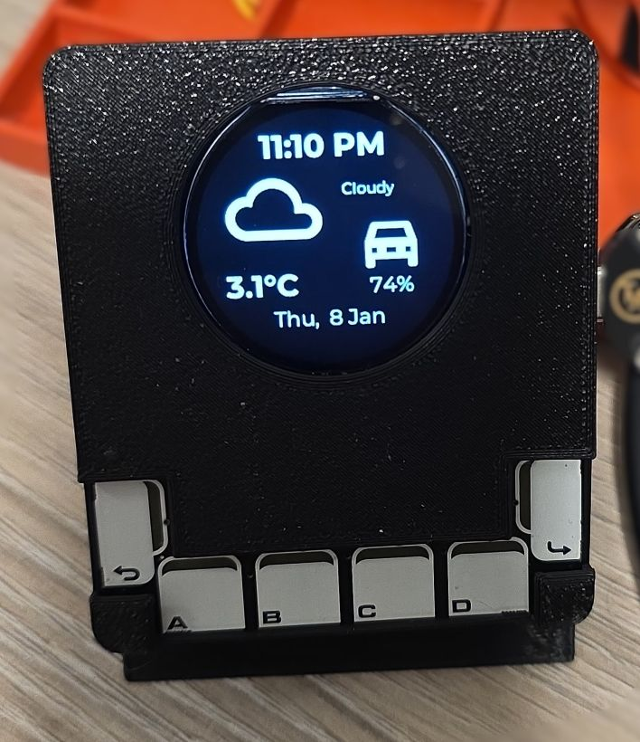

This advanced project creates a compact bedroom climate controller with a round color display and
capacitive touch interface that provides:

- 🕐 Real-time clock display with date
- 🌤️ Weather information (current temperature, forecast icon, and description)
- 🌡️ Indoor climate monitoring (temperature and humidity)
- 🔥 Thermostat control with multiple preset modes (frost, eco, comfort, boost)
- 🎯 Fine-grained temperature adjustment for boost mode
- 🚗 EV battery level monitoring
- 💡 Interactive LED feedback on touch buttons
- 📄 Multi-page interface with heating control page
- 🎨 Context-aware heating status visualization
- 🌈 Status indicator (and mood light?) with NeoPixel LED

This project is for a quick overview of important info on one page and then managing heating in the room.
When you get up you can quickly see time/date, outside temperature, forecast and EV battery level
(super important, right?).

On the other page are details of the temperature and humidity in the room and control of heating presets.
One of the presets can also be modified to set a different temperature.

The project is complete in terms of hardware. The rest are software improvements.

## Progress

- ✅ [Main Configuration](#main-configuration-file) - fully functional
- ✅ [3D Enclosure](#3d-printed-enclosure)
- [ ] Further improvements
  - ✅ Display Auto Sleep
  - [ ] Add Colors
  - ✅ Use NeoPixel for notifications
  - [ ] Use LEDs on the touch board for quick status

### Future improvement ideas

- Added dimmed start-up as a quick fix for the device rebooting at night
  - It's good to dim the display at night time for example 🌙😴 so maybe make it configurable
- Add Colors
  - This was ported from Mono OLED so everything is monochromatic - it looks pretty but why not add some
  colors to our lives 😉
- Use LEDs on the touch board for quick status
  - EV Battery level? Or something else? Just throwing out ideas
- Adding more pages?

### Reusability Note

Substitutions are put at the top of the config file, so replacing them for your own sensor entity IDs and
climate IDs will get it working for you. Some extra work needed if not all the same component used. Some of
the parts are obsolete (Touch Phat) so a different options might be required.

## What You'll Need

### Hardware

- 1x [DFRobot Beetle ESP32-C6](/devices/beetle-esp32-c6) - Compact ESP32-C6 development board
- 1x [GC9A01 based Round LCD](/devices/sh1107-spi-oled) - SPI Color Round Display breakout
- 1x [Pimoroni Touch pHAT](/devices/touch-phat) - 6 capacitive touch buttons with RGB LEDs (I2C)
- 1x [Adafruit NeoPixel](/devices/adafruit-neopixel) - RGB LED for ambient/notification
- Jumper wires for connections (for testing it)
- USB-C cable (data capable)
- Power supply (USB charger, 5V/1A minimum)
- This will require soldering if you want it properly assembled
- Optional: 3D printer for custom enclosure

#### Wiring Connections

The OLED display uses SPI bus, Touch breakout uses I2C and Neopixel uses GPIO.

| Component | ESP32-C6 GPIO | Notes |
| --------- | ------------- | ----- |
| **SPI Display (GC9A01)** |
| SCK | GPIO23 (SCK) | SPI Clock |
| MOSI | GPIO22 (MOSI) | SPI Master Out |
| CS | GPIO16 | Chip Select |
| DC | GPIO05 | Data/Command |
| RESET | GPIO04 | Display Reset Pin |
| BL | GPIO17 | Backlight - it can be used to set brightness |
| **I2C Touch pHAT (CAP1166)** |
| 3 (GPIO 2) | GPIO06 (SDA) | I2C Data - requires external pull-up resistor |
| 5 (GPIO 3) | GPIO07 (SCL) | I2C Clock - requires external pull-up resistor |
| **ESP32-C6 Built-in** |
| LED | GPIO15 | Built-in LED - not used |
| BOOT | GPIO09 | Boot button - not used |
| **NeoPixel (Future)** |
| DIN | GPIO21 | Data pin for the LED driver |

**WARNING ⚠️:** I used 3.3K external pull-up resistors to 3.3V for I2C bus - on GPIO06 and GPIO07. The Touch
Phat does not have external pull-ups and internal pull-ups on the MCU are too weak. If you don't do this
you'll be getting weird I2C errors in the logs, phantom touches, etc.

**Power Notes:**

- All components use 3.3V logic level
- Touch pHAT requires both 3.3V and 5V pins to be connected to power supply. It does not provide power supply
it requires power supply
  - 3.3V power input is for power supply for the CAP1166 controller and logic
  - 5V power input is for powering LEDs. It works with 3.3V and I connected it to 3.3V. Since this is for
  driving LEDs it will not affect overal functionality. LEDs might not be as bright. If you are using some
  other input device, make sure you check documentation for it. Connecting 5V supply to 3.3V device
  might ☠️ kill it.
- NeoPixel uses 5V supply, but it supports 3.3V logic level for communication

### Software

- [ESPHome installed](https://esphome.io/guides/getting_started_hassio/)
- Home Assistant with configured [weather integration](https://www.home-assistant.io/integrations/weather/)
  - [Met.no](https://www.home-assistant.io/integrations/met/) used, which is used by 82.4% of all users so
  this should work out of the box.
- Home Assistant entities:
  - Indoor temperature sensor
  - Indoor humidity sensor
  - Climate entity (thermostat/heater)
  - EV Car integration and sensor for battery level
- USB-to-Serial drivers (ESP32-C6 implements USB 2.0 CDC so should work out of the box)

### Required Home Assistant Entities

This project requires the following entities in Home Assistant. You'll need to update the substitutions
with your own entity IDs:

- **Climate Entity**: Thermostat/TRV with preset modes (frost, eco, comfort, boost)
  - Example: `climate.bedroom_heater` (using Versatile Thermostat integration)
  - Must support `preset_mode` attribute and `climate.set_preset_mode` action
- **Temperature Sensor**: Indoor temperature reading
  - Example: `sensor.bedroom_temperature`
- **Humidity Sensor**: Indoor humidity reading
  - Example: `sensor.bedroom_humidity`
- **Weather Integration**: Home Assistant weather entity
  - Example: `weather.forecast_home`
  - Must provide `temperature` and `temperature_unit` attributes
- **EV Battery Sensor** (optional): Electric vehicle battery level
  - Example: `sensor.car_battery_level`
- **Number Entity**: Boost preset temperature setting (if using Versatile Thermostat)
  - Example: `number.bedroom_heater_preset_boost_temp`
- **Template Select**: To control the notification LED
  - Example: `select.open_window_rain_status` - see [Rain Notification](#rain-notification)
  - I could have controlled LED from Home Assistant directly I suppose when I got through all
  the trouble configuring everything there 🙂 in the first place

### Additional Files

- Material Design Icons font file - see [font component](/components/font#material-design-icons) for more
comprehensive explanation.
- `weather_icon_map.h` header file see
[Info Panel with ESP32 2.8" Display](./info-panel-28.md#weather-icon-map-header-file) project for details.
- CAP1166 custom component is pulled from github repository so no additional files for this are needed

## Project Photos

- Info

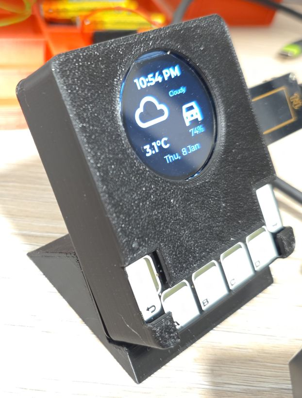
- Starting up
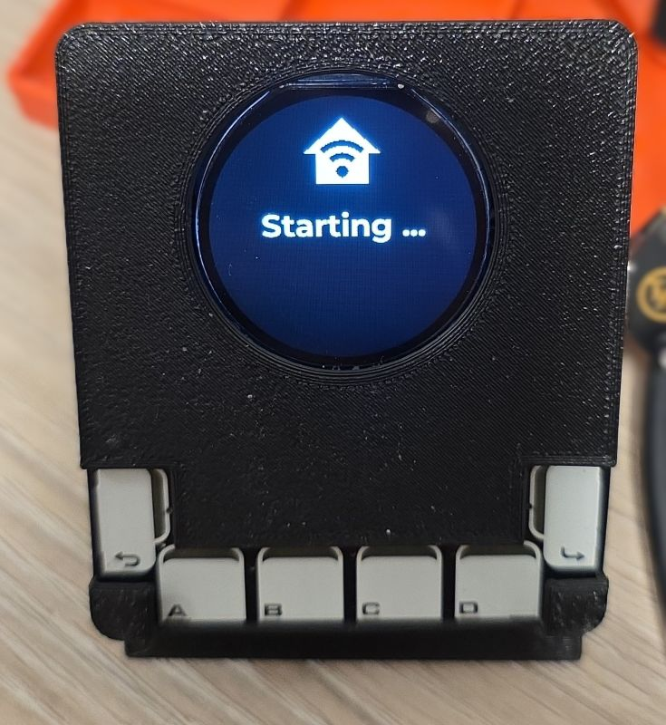
- Heating
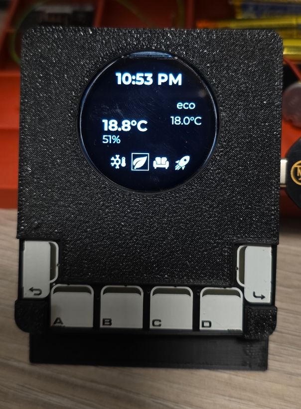
- Set Heating Preset
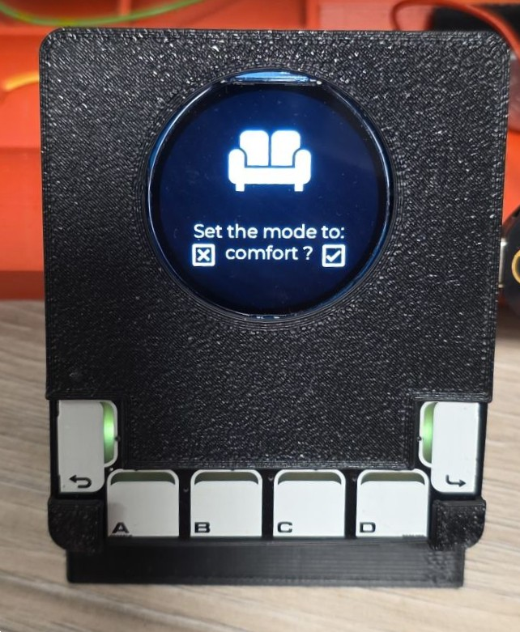
- Set Boost Temperature
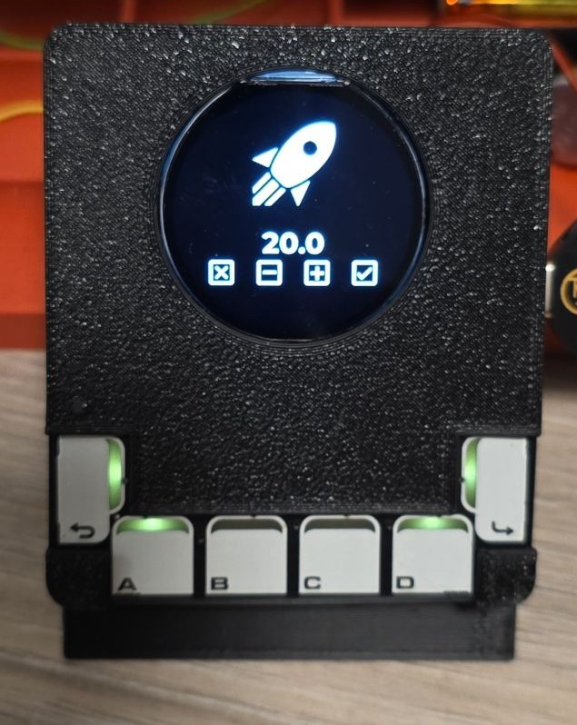
- Neopixel Blue
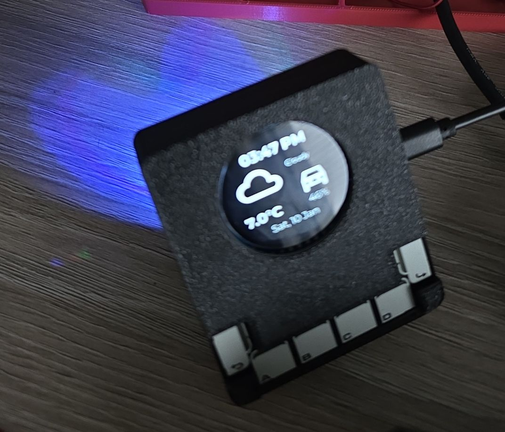

<!-- TODO: Add wiring diagram -->
_Detailed wiring diagram showing all connections will be added here._

- Soldered controller - front
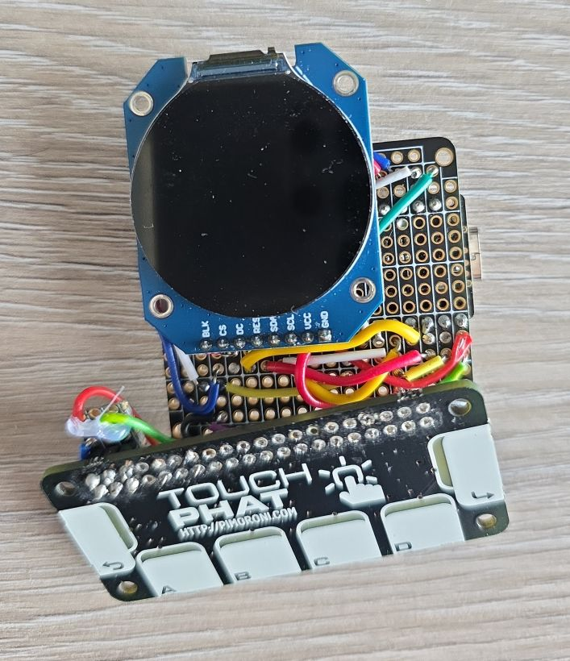

- Soldered controller - back
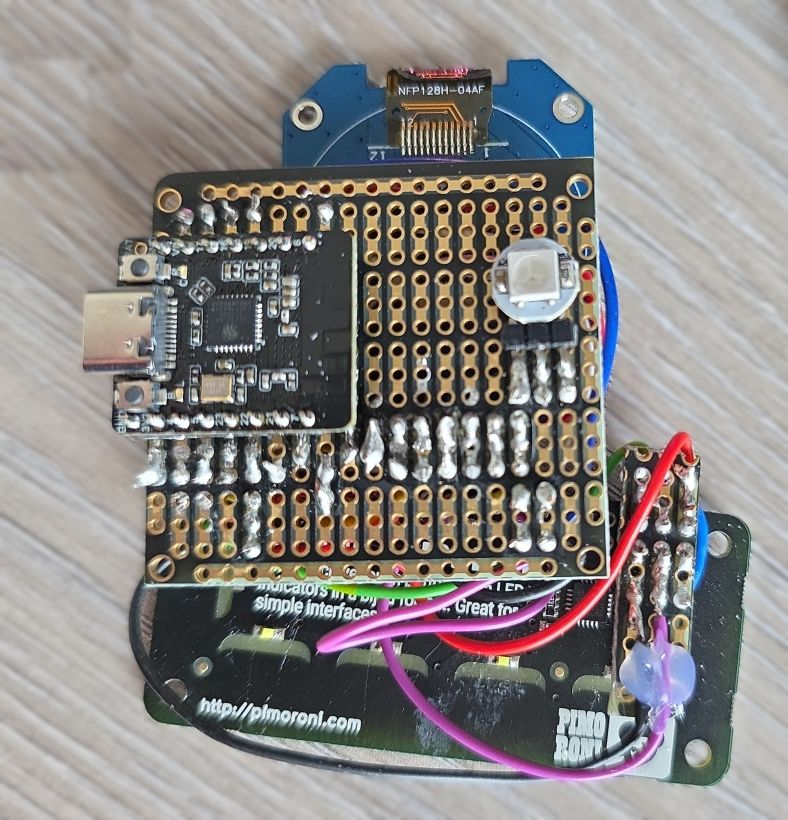

## 3D Printed Enclosure

Ready to assemble:
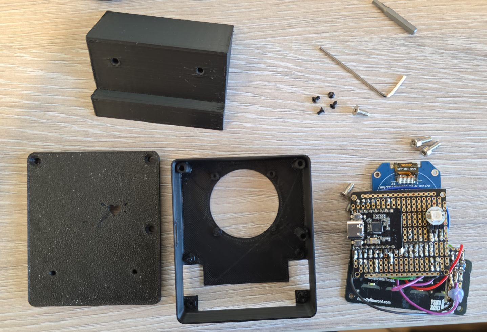

The enclosure houses:

- ESP32-C6 board
- Round LCD display (front-facing)
- Touch pHAT buttons (front-facing)
- NeoPixel LED (for ambient/notification lighting)
- USB-C access for programming and power

Ready to print STLs:
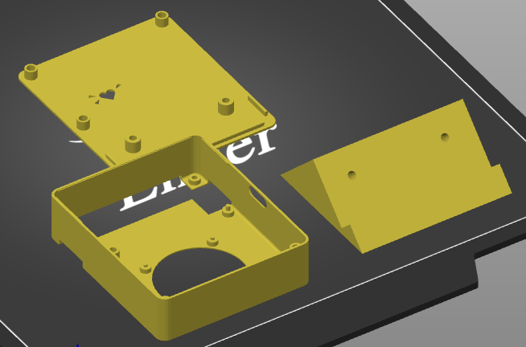

Download STL files:

- [BedroomControllerBox.stl](/files/bedroom-controller/BedroomControllerBox.stl)
- [BedroomControllerLid.stl](/files/bedroom-controller/BedroomControllerLid.stl)
- [BedroomControllerStand.stl](/files/bedroom-controller/BedroomControllerStand.stl)

## ESPHome Configuration

### Prerequisites

Before using this configuration, ensure you have:

1. **Home Assistant** with the following configured:
   - Weather integration (provides `weather.forecast_home` entity)
   - Climate entity with preset mode support
   - Indoor temperature and humidity sensors (Zigbee or other)
   - A climate entity for heating control
   - EV battery sensor integration
2. Material Design Icons font file saved in your ESPHome directory as `assets/materialdesignicons-webfont.ttf`
3. The `weather_icon_map.h` header file

### Secrets File Setup

Create a `secrets.yaml` file in your ESPHome directory with your credentials:

```yaml
wifi_ssid: "Your_WiFi_SSID"
wifi_password: "Your_WiFi_Password"

bedroom2_controller_api: "your generated api key"
bedroom2_controller_ota: "your ota password"
```

For more information on using secrets in ESPHome, refer to the [ESPHome documentation](https://esphome.io/guides/yaml/#secrets-and-the-secretsyaml-file).

### Main Configuration File

If you're using
[ESPHome Device Builder](https://www.esphome.io/guides/getting_started_hassio/#installing-esphome-device-builder)
create your _New Device_. Or if you're using
[command line](https://www.esphome.io/guides/getting_started_command_line/) create your yaml file
(e.g. `bedroom-controller.yaml`)
Then use the following file as a guide (details on how to customize it are below).

Download the full configuration: [bedroom-controller.yaml](/files/src/bedroom-controller/bedroom-controller.yaml)

<!-- astro-embed: /files/src/bedroom-controller/bedroom-controller.yaml -->

## Configuration Breakdown

### Substitutions

The configuration uses substitutions to make it easy to adapt to your Home Assistant setup.
**Update these with your own entity IDs:**

```yaml
substitutions:
  heater: bedroom_heater                # Climate entity (without climate. prefix)
  car_battery_level: ev_battery_level   # EV battery sensor (without sensor. prefix)
  indoor_temp: bedroom_temperature      # Indoor temp sensor (without sensor. prefix)
  indoor_humid: bedroom_humidity        # Indoor humidity sensor (without sensor. prefix)
  rain_alert: select.open_window_rain_status # status of rain alert (or any other alert)
```

### Boot Progress Tracking

The `my_boot_in_progress` global variable tracks the device startup stages:

- **3**: ESP32 starting up
- **2**: Boot Finished
- **1**: Wifi Connected
- **0**: Connected to Home Assistant (Fully connected and ready)

This is controlling boot display. If you look at the code I wasn't 100% sure of the ordering of events or
whether there might be some racing conditions. The boot screen is shown all the way until device connects to
Home Assistant.

### Climate Control Integration

This configuration is designed to work with the
[**Versatile Thermostat integration**](https://github.com/jmcollin78/versatile_thermostat)
custom integration for Home Assistant. Versatile Thermostat provides:

- Multiple preset modes (frost, eco, comfort, boost)
- Individual temperature settings per preset
- Advanced heating strategies
- Comprehensive automation support

**Important:** If you're using a different climate integration, you may need to adjust:

- Preset mode names in scripts
- The `indoor_temp_preset_boost` number entity reference
- Preset mode icons

### Touch Button Functions

#### Information Page (page_info)

- **FORWARD**: Navigates to the heating page
- **BACK**: Navigates to the heating page (same as forward, only 2 pages)

#### Heating Page (page_heating)

**Normal Mode:**

- **FORWARD**: Navigate to info page
- **BACK**: Navigate to info page (same as forward, only 2 pages)
- **Button A**: Select "frost" preset
- **Button B**: Select "eco" preset
- **Button C**: Select "comfort" preset
- **Button D (short press)**: Select "boost" preset
- **Button D (long press)**: Enter temperature adjustment mode for boost

**Preset Confirmation Mode:**

- **FORWARD**: Confirm preset change
- **BACK**: Cancel preset change
- **Buttons A-D**: No function

**Temperature Adjustment Mode:**

- **FORWARD**: Confirm new temperature
- **BACK**: Cancel temperature change
- **Button A**: Decrease by 0.5°C (min 15°C)
- **Button D**: Increase by 0.5°C (max 28°C)
- **Buttons B, C**: No function

### LED Feedback

The Touch pHAT LEDs provide visual feedback:

- **Normal mode**: LEDs off
- **Preset confirmation**: Forward and Back LEDs pulsing
- **Temperature adjustment**: Forward, Back, A, and D LEDs lit

LED brightness can be adjusted via the "LED Brightness" number entity (0-100%).

### Display Pages

#### Page 1: Information Display

- Current time (12-hour format with AM/PM)
- Current date (day, date, month)
- Weather icon and description
- Outside temperature
- EV battery level with car icon

#### Page 2: Heating Control

- Current time (top-right)
- Heating active indicator (top-left, only when heating)
- Indoor temperature (large, left side)
- Indoor humidity (below temperature)
- Target temperature setting (right side)
- Current preset mode name (below target)
- Preset mode icons at bottom (highlighted when active)

### Weather Integration

This project assumes you have a working weather integration in Home Assistant, typically configured as
`weather.forecast_home`. The configuration retrieves:

- Current temperature (from `temperature` attribute)
- Temperature unit (C or F)
- Weather condition (for icon mapping)

### Idle Screen Timeout

Screen will be turned off if the device is idle for more than configured timeout - `Screen Timeout - display_timeout`.
By default it is configured to 45s but it can go from 0 - 7200 (2hrs). If set to 0, the screen won't go to sleep.
The configuration is in seconds.

#### Implementation Details

The script used is: `idle_screen_reset` and it resets the timer when called. It is a very simple script:

- it is configured in `restart` mode so previus execution is cancelled when called and the new one is initiated
- it checks if `display_timeout` is turned off and just keeps the backlight on in that case
- otherwise
  - it turns on the backlight (making sure it's ON)
  - waits for the configured timeout. Lambda needs to returns value in ms - hence multiplying the configuration by 1000
  - and it turnes off the backlight
  - note that if the script is called before it finishes this, the current execution will be cancelled and
  the new will be started

**NOTE**: The `delay` operation is _smart_ and it is async so it does not block anything

The script is executed in the following cases:

- when `dispay_timeout` is set - either the timeout is changed or, on restart, when display timeout is set
from Home Assistant
- when any of the touch buttons is pressed (`on_release`)
- when the `Display Backlight` is manually (or through automation) turned on from Home Assistant

On boot - the backlight is set to 20% brightness. The brightness is set to 100% only when one of the
touch buttons is used.

### Rain Notification

NeoPixel is going to be flashing red if it is raining or the rain is coming soon
and windows are open. It will flash quickly if it's raining and windows
are open, and it will flash slower if the rain is upcoming.

I have an automation setup that runs every hour (5th minute of every hour) and checks the weather
forecast. It gets forecast data and sets 3 variables based on the hourly forecast.

- **is_raining**: The first record is current precipitation.
- **about_to_rain**:  `batch(2) | first` splits the forecast information in lists of two and takes
the first list (which is the forecast for the first 2 hours) and counts how many items have precipitation
greater than 0. Essentially it is true if it is currently raining or it will rain in the next hour.
- **rain_soon**: same as previous, it is true if it is currently raining or it will rain in next 4 hours.

```javascript
alias: Rain Soon?
description: Setting variables that are related to checking rain
triggers:
  - trigger: time_pattern
    hours: "*"
    minutes: "5"
conditions: []
actions:
  - action: weather.get_forecasts
    target:
      entity_id: weather.forecast_home
    data:
      type: hourly
    response_variable: forecast_data
  - variables:
      is_raining: >-
        {{(forecast_data['weather.forecast_home']['forecast'] |
        first).precipitation > 0 }}
      about_to_rain: >-
        {{forecast_data['weather.forecast_home']['forecast'] | batch(2) | first
        | selectattr('precipitation', '>', 0) | list | count > 0 }}
      rain_soon: >-
        {{forecast_data['weather.forecast_home']['forecast'] | batch(5) | first
        | selectattr('precipitation', '>', 0) | list | count > 0 }}
```

This automation also sets or resets 3 helper toggle buttons depending on the values of the variables.

I grouped a couple of binary sensors that indicate whether any of the roof windows are open and I created
a ["template select"](https://www.home-assistant.io/integrations/template#select)
with `select.open_window_rain_status` id and with following state:

```javascript

ALLGOOD

RAINING

RAINSOON

RAINCOMING

ALLGOOD

```

and available options:

```javascript
{{['ALLGOOD', 'RAINING', 'RAINSOON', 'RAINCOMING']}}
```

## Installation Steps

### Prepare Hardware

1. Wire all components according to the wiring table above
2. Double-check all connections before powering on
3. NOTE: Touch pHAT - I connected both 5V and 3.3V pins to the 3.3V power suppy pin on the board
4. Ensure all I2C and SPI connections are correct
5. Make sure all the other pins for the display are correct. If any of them is incorrect the display won't show
6. NeoPixel - connect VCC to 5V (3.3V will work but some of the colors won't show well)

### Prepare Files

1. Download the Material Design Icons - details in [font component](/components/font#material-design-icons).
2. Create the `weather_icon_map.h` header file ([content here](./info-panel-28.md/#weather-icon-map-header-file))
3. Create your `secrets.yaml` file with your WiFi credentials
4. Update the API encryption key ([generate a new one for security](https://esphome.io/components/api/))
5. Set secure OTA passwords (I did not configure fallback WiFi endpoint but I did configure OTA)

NOTE: no need to do anything for the external component, the [CAP1166](/components/cap1166) component code
downloaded from github automatically.

### Update Configuration

1. Modify the `substitutions` section with your Home Assistant entity IDs
2. Adjust timezone in `time` component if not in Europe/Dublin

More info on [how to manage secrets](https://esphome.io/guides/security_best_practices/#secrets-management).

### Flash ESPHome

Use [ESPHome Device Builder](https://esphome.io/guides/getting_started_hassio/#device-builder-interface),
that's simplest. After the first flash, you can use OTA updates.

### Add to Home Assistant

The device should be automatically discovered in Home Assistant:

- Go to **Settings → Devices & Services**
- Look for the discovered ESPHome device
- Click **Configure** and enter your API encryption key
- ⚠️ By default new ESPHome device is not allowed to perform any Home Assistant Actions
  - In order to:
    - change heating presets
    - change "boost" preset configuration
  - You need to go to device settings in Home Assistant and select:
    - _Allow the device to perform Home Assistant actions_

### Verify Operation

Check that:

- Display shows boot screen and then connects
- Time and weather information appear on info page
- Indoor temperature and humidity display on heating page
- Page navigation works (forward/back buttons)
- Preset icons show current heating mode

## Troubleshooting

### Stuck at Boot Screen

If you're stuck at boot screen that usually means the device cannot connect to WiFi.

Check your secrets.yaml that you have correct WiFi ssid and password. If this is correct, the best is to
connect the device to your computer, open up [ESPHome Web](https://web.esphome.io/), connect to the device
and open up logs. Reboot the device to see the logs from starting up and hopefully that will reveal any issues.

If no issues show up change logging level:

```yaml
logger:
  level: DEBUG
```

Note that the boot screen will be on until connection is established with Home Assistant, so the issue might
be that the device cannot connect to WiFi or it can connect to WiFi but not to Home Assistant afterwards.

### Entity Status Not Updated

Check substitutions making sure that you have entered correct entity ids. For temperature/humidity sensor
this should work just fine and a typo or incorrect entity id is most likely issue. Any climate entity
should work for controling heating but see below.

### Heating Control Not Working

If the correct preset and temperature setting is not updated - verify that climate entity ID is correct.

If the heater button doesn't control thermostat - did you:
[_Allow the device to perform Home Assistant actions_](#add-to-home-assistant)?

While this should work with any climate control, check that preset modes (frost, boost, eco)
are supported. If they are not, you might need to change config slightly to support your
settings. Maybe your setting doesn't have a boost preset - just replace `boost` in the
configuration with what your desired setting is. The same goes for `frost`, `eco` and `comfort`.

### Random Reboots or Crashes

**Problem:** Device restarts unexpectedly

**Solutions:**

1. Use adequate power supply (1A minimum)
1. Reduce display buffer size if running out of memory
1. Lower logger level to WARN or ERROR
1. Disable unnecessary components temporarily
1. Unplug your Electric Toothbrush charger if it uses the same USB charger ... yes ... the device was rebooting
randomly. I used USB charger with 2 ports. While electric toothbrush charger was plugged in, it just kept on
rebooting randomly. I unpluged the electric brush charger and reboots stopped - dead givaway! 🤦‍♂️

### Display Not Working

**Problem:** Screen stays blank or shows no output

**Solutions:**

1. Verify SPI wiring (CLK, MOSI, CS pins)
1. Check display is using mipi_spi and model GC9A01A ... or if you're modifying this - whatever your model is
1. Verify CS, DC and RESET pin assignments match your wiring - note that not all displays have RESET, but if yours
have it you should connect and configure it correctly
1. Try different `rotation` values (0, 90, 180, 270)
1. Check display power supply (3.3V)
1. Make sure that you have buffer configured to 25% - ESP32C6 board I have has limited memory. Unless your board
has external PSRAM go with 25%
1. Test with simpler display code first - go to the list of [devices](/devices) and filter by `display`
category. If your display is in the list it will have information how to set it up and will have simple
display configuration.

### Touch Buttons Not Responding

**Problem:** Touch pHAT doesn't register touches

**Solutions:**

1. Verify I2C wiring (SDA: GPIO19, SCL: GPIO20)
1. Check Touch pHAT has 5V power
1. Verify I2C address is 0x2C (check with I2C scanner)
1. Adjust `touch_threshold` value (generally: 0x01 is most sensitive, 0x80 is least sensitive.
My configuration is 0x40 - Medium. Try 0x20 first and see how it goes)
1. Look for I2C errors in ESPHome logs
1. Make sure you have external pull-up resistors!

### LEDs Not Lighting

**Problem:** Touch pHAT LEDs don't respond

**Solutions:**

1. Verify I2C communication is working (touch should work first)
1. Check LED brightness setting (increase to 100% for testing)
1. Test individual lights from Home Assistant

### Temperature Adjustment Not Working

**Problem:** Long-press on Button D doesn't enter adjustment mode

**Solutions:**

1. Verify you're on the heating page (page 2)
1. Are you pressing it not too short and not too long? Press should be between 350ms and 2000ms long 👀
1. Check `number.${heater}_preset_boost_temp` number entity exists. You might not have this in Home Assistant
if you're not using Versatile Thermostat - you might need to replace this with what you want to change.
1. Ensure you're not already in selection mode
1. Increase long-press duration threshold if needed
1. Check lambda logic in `touch_d_long_click` script

## Future Enhancements

This project documentation will be updated with:

- **NeoPixel Integration** - RGB LED for ambient lighting and notifications is there and can be used from Home
Assistant but it does nothing else at the moment. An option is to configure it to light up with automation.

## Other Images

- Home Assistant Control
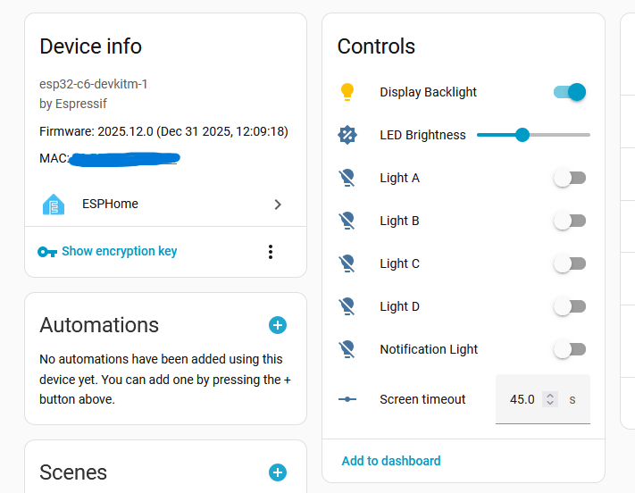

You can actually turn on and off LEDs behind buttons A-D.

- NeoPixel
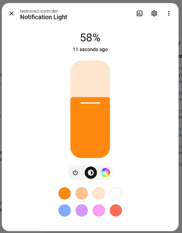

And you can play with the NeoPixel.

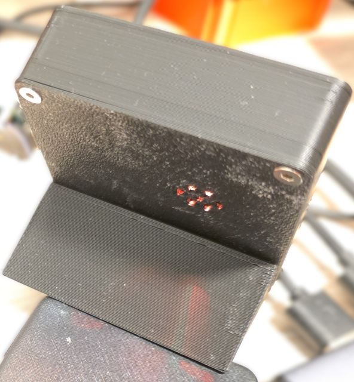
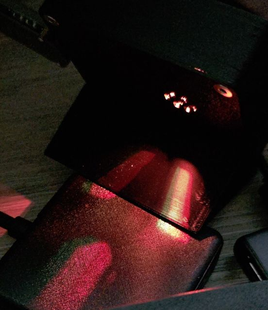
