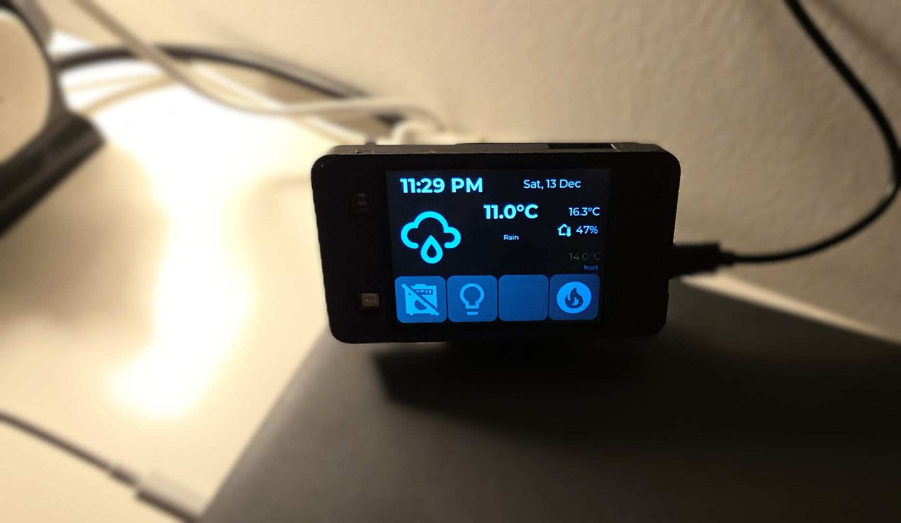
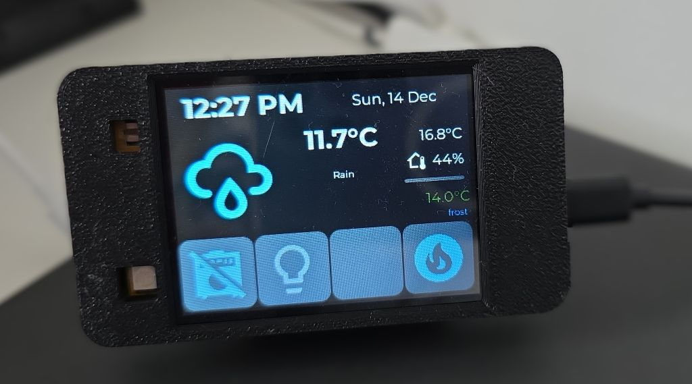
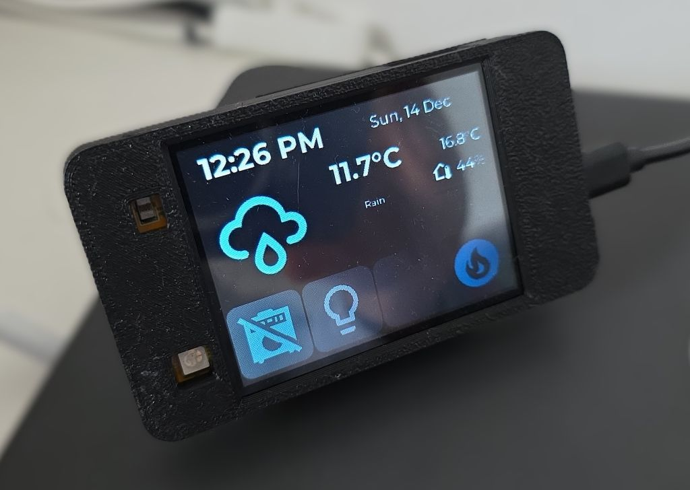
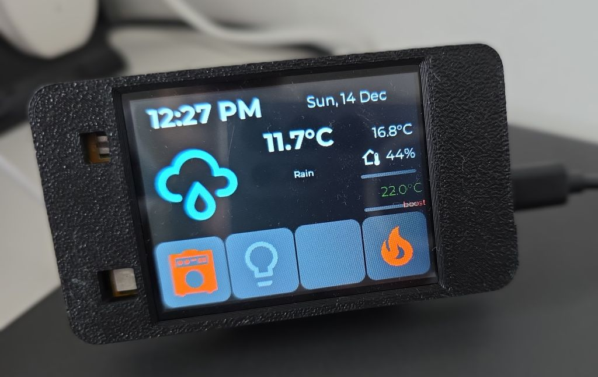
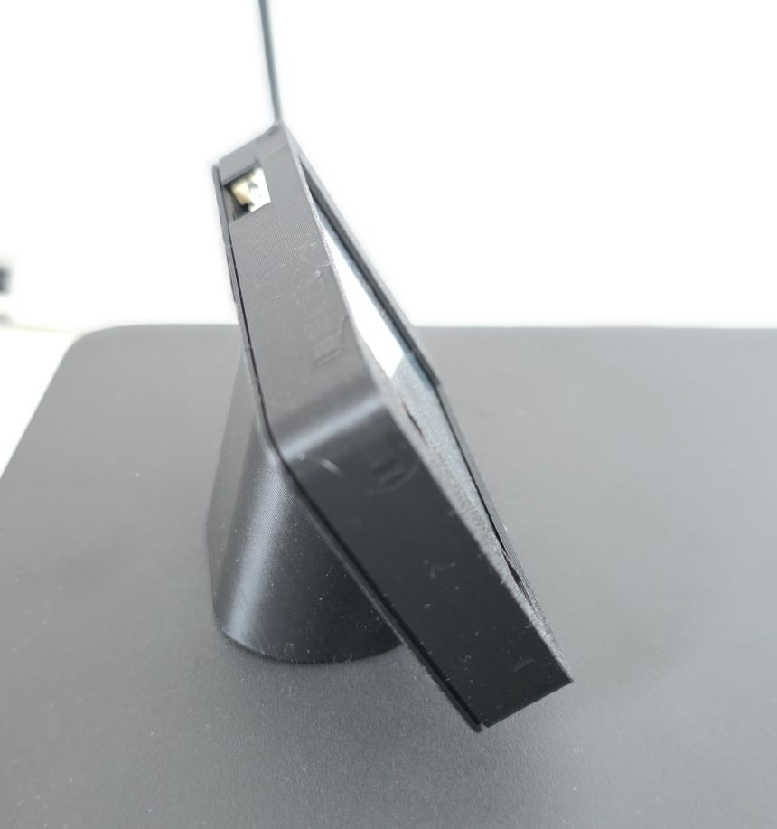
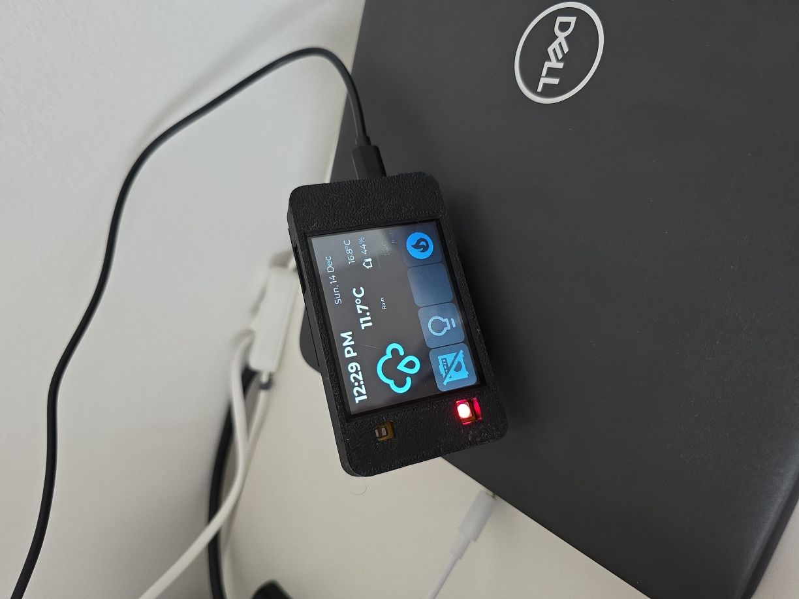
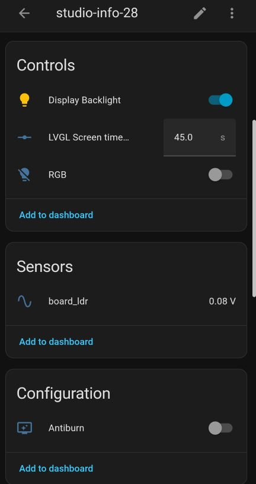

## Project Overview



Smart home control panel with a touchscreen interface that provides:

- 🕐 Real-time clock display with date
- 🌤️ Weather information (current conditions, temperature, forecast)
- 🌡️ Indoor climate monitoring (temperature and humidity)
- 🔥 Thermostat control with preset modes (frost, eco, boost)
- 💡 Light and appliance switch controls
- 🎨 Custom LVGL-based UI with touch interaction
- 💤 Auto-sleep with touch-to-wake functionality
- 🛡️ Anti-burn-in protection for display longevity
- 🌈 RGB LED for status

I did this project for my boy. We have a shed where he can play his guitar. For most of the time the heater
is off. It just turns on so it keeps a reasonable temperature for the gear during cold months. The panel gives
him information on outside temperature, weather forecast and inside temperature.

He can remotely turn on heating if he wants the temperature to be more pleasant for playing, and he can
remotely turn on lights, amp and the rest of the gear (hence the amp switch in the project). Actually, the
main feature is that he can turn all of them off because he forgets to do it occasionally 😁.

It is fully functional, lots of features, only one device used and it has a 3D printed enclosure for it.

While it has lots of coding, I consider it `intermediate` because you don't need to figure out anything
hardware related. There's no wiring, only plug it in and copy code and with a bit of tweaking you should
have it going in no time.

### Future improvement ideas

- RGB LED that is "breathing" red while the heating is on, maybe green when the amp is on, just to remind him
to switch them off 😉
- Alarm - sound alarm when the windows are open and it is forecasted to rain 🤔

### Reusability Note

The project is not as reusable as I would like it, but it offers a lot if you need any of the features
described above. You can adapt it to your specific needs by modifying the substitutions and entity IDs.
However, customizing the LVGL UI layout or adding/removing features will require a bit of understanding of
LVGL and ESPHome.

I hope the config file is readable enough and the additional descriptions here are useful. I'll keep
improving it as I go along.

## What You'll Need

### Hardware

- 1x [JC2432W328C ESP32 2.8" Display](/devices/jc2432w328c) - This project uses nearly all integrated features of the board.
- 1x USB-C cable (data capable)
- 1x Power supply (USB charger, 5V/1A minimum)
- Optional: 3D printer for custom enclosure

### Software

- ESPHome installed
- Home Assistant with configured [weather integration](https://www.home-assistant.io/integrations/weather/)
  - [Met.no](https://www.home-assistant.io/integrations/met/) used, which is used by 82.4% of all users
  so this should work out of the box
- Home Assistant entities:
  - Indoor temperature sensor
  - Indoor humidity sensor
  - Climate entity (thermostat/heater)
  - Switch entities (lights, appliances)
- USB-to-Serial drivers (CH340C chip is used by the board, it was plug-and-play for me on Windows 11)

### Additional Files

- Material Design Icons font file - see [font component](/components/font#material-design-icons) for more
comprehensive explanation.
- `weather_icon_map.h` header file (provided below)

## Project Photos

Some photos of the device in action:









## Hardware Setup

The JC2432W328C is an integrated ESP32 development board with a 2.8" IPS touchscreen display. For detailed
specifications and pinout information, see the [JC2432W328C device page](/devices/jc2432w328c).

No additional wiring is required as the display and touchscreen are pre-wired on the board. Simply connect
via USB-C for programming and power.

## 3D Printed Enclosure

I used couple of models to print mine. I could not find exact device so I used:

- Case from this one: [CYD ESP32-2432S028 Case](https://www.printables.com/model/1337113-cyd-esp32-2432s028-case)
- Just the stand from this one: [Enclosure for Sunton ESP32-2432S028R Cheap Yellow Display](https://www.printables.com/model/685845-enclosure-for-sunton-esp32-2432s028r-cheap-yellow-)

I had to add some negative volume in my Prusa Slicer to get the holes in the right place. Once I figure out how to export this as STL I'll post a link, meanwhile, here's [Prusa Slicer Project](/files/cheap-yellow-display-stand.3mf).

## ESPHome Configuration

### Prerequisites

Before using this configuration, ensure you have:

- A working Home Assistant installation with the following configured:
  - Weather integration (e.g., `weather.forecast_home`)
  - Indoor temperature and humidity sensors
  - A climate entity for heating control
  - Switch and light entities to control
- Material Design Icons font file saved in your ESPHome directory as `assets/materialdesignicons-webfont.ttf`
- The `weather_icon_map.h` header file (see below)

### Secrets File Setup

Create a `secrets.yaml` file in your ESPHome directory with your credentials:

```yaml
wifi_ssid: "Your_WiFi_SSID"
wifi_password: "Your_WiFi_Password"
```

For more information on using secrets in ESPHome, refer to the [ESPHome documentation](https://esphome.io/guides/yaml/#secrets-and-the-secretsyaml-file).

### Weather Icon Map Header File

This is just a helper code used in multiple projects. Alternative is using [Mapping](https://esphome.io/components/mapping/)

Create a file named `weather_icon_map.h` in your ESPHome directory:

```cpp
// weather_icon_map.h
#include <map>

// Map Home Assistant weather conditions to Material Design Icons
std::map<std::string, std::string> weather_icon_map
  {
    {"clear-night", "\U000F0594"},
    {"cloudy", "\U000F0590"},
    {"exceptional", "\U000F0F2F"},
    {"fog", "\U000F0591"},
    {"hail", "\U000F0592"},
    {"lightning", "\U000F0593"},
    {"lightning-rainy", "\U000F067E"},
    {"partlycloudy", "\U000F0595"},
    {"pouring", "\U000F0596"},
    {"rainy", "\U000F0597"},
    {"snowy", "\U000F0598"},
    {"snowy-rainy", "\U000F067F"},
    {"sunny", "\U000F0599"},
    {"windy", "\U000F059D"},
    {"windy-variant", "\U000F059E"},
    {"sunny-off", "\U000F14E4"},
  };

// Map Home Assistant weather conditions to description
std::map<std::string, std::string> weather_desc_map
  {
    {"clear-night", "Clear Night"},
    {"cloudy", "Cloudy"},
    {"exceptional", "Exceptional"},
    {"fog", "Fog"},
    {"hail", "Hail"},
    {"lightning", "Lightning"},
    {"lightning-rainy", "Rain and Lightning"},
    {"partlycloudy", "Partly Cloudy"},
    {"pouring", "Heavy Rain"},
    {"rainy", "Rain"},
    {"snowy", "Snow"},
    {"snowy-rainy", "Snow and Rain"},
    {"sunny", "Nice!"},
    {"windy", "Windy"},
    {"windy-variant", "Windy, cloudy"},
    {"sunny-off", ""},
  };
```

### Main Configuration File

If you're using
[ESPHome Device Builder](https://www.esphome.io/guides/getting_started_hassio/#installing-esphome-device-builder)
create your _New Device_. Or if you're using
[command line](https://www.esphome.io/guides/getting_started_command_line/) create your yaml file
(e.g. `panel-info-28.yaml`).
Then use the following file as a guide (details on how to customize it are below):

```yaml
esphome:
  name: panel-info-28
  friendly_name: panel-info-28
  includes:
    - weather_icon_map.h
  on_boot:
    - priority: 1
      then:
      - delay: 5s
      - lvgl.label.update:
          id: lbl_boot
          text: "connecting ..."

esp32:
  board: esp32dev
  framework:
    type: esp-idf

# Enable logging
logger:
  level: WARN

# Enable Home Assistant API
# https://esphome.io/guides/getting_started_hassio/
# to generate key
# https://esphome.io/components/api/
# Generated this key just now, not used anywhere. Build checks that it's an actual key
api:
  encryption:
    key: "syclMF/ZlhWdWeHMTm1qyWvjrPI2x7kwLnKldec5/Nk="

# https://esphome.io/components/ota/
ota:
  - platform: esphome
    password: "your strong password"

# https://esphome.io/components/wifi/
wifi:
  ssid: !secret wifi_ssid
  password: !secret wifi_password

  # Enable fallback hotspot (captive portal) in case wifi connection fails
  # https://esphome.io/components/wifi/#access-point-mode
  ap:
    ssid: "Panel-Info-28 Fallback Hotspot"
    password: "your temp pass"
  
  # https://esphome.io/components/wifi/#on_connect--on_disconnect-trigger
  on_connect:
    - delay: 5s
    - lvgl.widget.hide: boot_screen

# https://esphome.io/components/captive_portal/
captive_portal:
 
# https://esphome.io/components/substitutions/
substitutions:
  heater: climate_heater
  indoor_temp: sensor_indoor_temperature
  indoor_humid: sensor_indoor_humidity
  amp_switch: switch.appliance_switch
  light_switch: light.room_light

# https://esphome.io/components/time/
time:
  # https://esphome.io/components/time/homeassistant/
  - platform: homeassistant
    id: esptime
    # https://esphome.io/components/time/#on_time_sync-trigger
    on_time_sync:
      - script.execute: time_update
    # https://esphome.io/components/time/#on_time-trigger
    on_time:
      - minutes: '*'
        seconds: 0
        then:
          - script.execute: time_update
      - hours: 2,3,4,5
        minutes: 5
        seconds: 0
        then:
          - switch.turn_on: switch_antiburn
      - hours: 2,3,4,5
        minutes: 35
        seconds: 0
        then:
          - switch.turn_off: switch_antiburn

# https://esphome.io/components/script/
script:
  - id: time_update
    then:
      - lvgl.label.update:
          # https://esphome.io/components/time/#use-in-lambdas
          id: lbl_time
          text:
            # https://esphome.io/components/time/#strftime
            time_format: "%I:%M %p"
            time: !lambda return id(esptime).now();
      - lvgl.label.update:
          id: lbl_date
          text:
            time_format: "%a, %e %b"
            time: !lambda return id(esptime).now();
  - id: update_weather
    then:
      - lvgl.label.update:
          id: lbl_weather_forecast_condition_icon
          text: !lambda return weather_icon_map[id(forecast_desc).state.c_str()].c_str();
      - lvgl.label.update:
          id: lbl_weather_forecast_des
          text: !lambda return weather_desc_map[id(forecast_desc).state.c_str()].c_str();
  - id: update_outside_temp
    then:
      - lvgl.label.update:
          id: lbl_temp
          text:
            format: "%.1f%s"
            args: [id(outside_temperature).state, id(outside_temperature_unit).state.c_str()]
  - id: update_indoor_temp
    then:
      - lvgl.label.update:
          id: lbl_indoor_temp
          text:
            format: "%.1f%s"
            args: [id(indoor_temperature).state, id(outside_temperature_unit).state.c_str()]
  
  - id: update_indoor_setting
    then:
      - lvgl.label.update:
          id: lbl_current_temp_setting
          text:
            format: "%.1f%s"
            args: [id(indoor_temp_setting).state, id(outside_temperature_unit).state.c_str()]
      - lvgl.label.update:
          id: icon_heater
          text: !lambda if(id(indoor_hvac_action).state == "heating") {return "\U000F0238";} else {return "\U000F1807";}
          text_color: !lambda if(id(indoor_hvac_action).state == "heating") {return lv_color_hex(0xFF4500);} else {return lv_color_hex(0x778899);}
      - lvgl.label.update:
          id: lbl_current_temp_preset
          text: !lambda return id(indoor_temp_preset).state;
          text_color: !lambda if(id(indoor_temp_preset).state == "frost") {return lv_color_hex(0x4682B4);} else if(id(indoor_temp_preset).state == "boost") {return lv_color_hex(0xFF4500);} else if(id(indoor_temp_preset).state == "eco") {return lv_color_hex(0x7CFC00);} else {return lv_color_hex(0x778899);}
  - id: update_amp_switch
    then:
      - lvgl.label.update:
          id: icon_amp_switch
          text: !lambda if(id(amp_switch).state) {return "\U000F0030";} else {return "\U000F11B5";}
          text_color: !lambda if(id(amp_switch).state) {return lv_color_hex(0xFF4500);} else {return lv_color_hex(0x778899);}
  - id: update_light_switch
    then:
      - lvgl.label.update:
          id: icon_light_switch
          text: !lambda if(id(light_switch).state) {return "\U000F0335";} else {return "\U000F0336";}
          text_color: !lambda if(id(light_switch).state) {return lv_color_hex(0xFF4500);} else {return lv_color_hex(0x778899);}
  - id: set_indoor_preset
    parameters:
      preset: string
    then:
      - homeassistant.action:
          action: climate.set_preset_mode
          data:
            entity_id: climate.${heater}
          data_template:
            preset_mode: !lambda return preset;
          
# https://esphome.io/components/number/template/
number:
  - platform: template
    name: LVGL Screen timeout
    optimistic: true
    id: display_timeout
    unit_of_measurement: "s"
    initial_value: 45
    restore_value: true
    min_value: 10
    max_value: 180
    step: 5
    mode: box

# https://esphome.io/components/sensor/
sensor:
  # https://esphome.io/components/sensor/homeassistant/
  - platform: homeassistant
    id: indoor_temperature
    entity_id: sensor.${indoor_temp}
    internal: true
    on_value: 
      then:
        script.execute: update_indoor_temp
  
  - platform: homeassistant
    id: indoor_humidity
    entity_id: sensor.${indoor_humid}
    internal: true
    on_value:
      then:
        - lvgl.label.update:
            id: lbl_indoor_humidity
            text:
              format: "%.0f%%"
              args: [x]

  - platform: homeassistant
    id: outside_temperature
    attribute: temperature
    entity_id: weather.forecast_home
    internal: true
    on_value: 
      then:
        script.execute: update_outside_temp
  
  # Versatile Thermostat integration
  # https://github.com/jmcollin78/versatile_thermostat
  - platform: homeassistant
    id: indoor_temp_setting
    attribute: temperature
    entity_id: climate.${heater}
    internal: true
    on_value: 
      then:
        script.execute: update_indoor_setting

# https://esphome.io/components/text_sensor/
text_sensor:
  # https://esphome.io/components/text_sensor/homeassistant/
  - platform: homeassistant
    id: outside_temperature_unit
    entity_id: weather.forecast_home
    attribute: temperature_unit
    internal: true
    on_value: 
      then:
        - script.execute: update_outside_temp
        - script.execute: update_indoor_temp
        - script.execute: update_indoor_setting
        
  - platform: homeassistant
    id: forecast_desc
    entity_id: weather.forecast_home
    internal: true
    on_value: 
      then:
        script.execute: update_weather
  
  - platform: homeassistant
    id: indoor_hvac_action
    attribute: hvac_action
    entity_id: climate.${heater}
    internal: true
    on_value: 
      then:
        script.execute: update_indoor_setting
  
  - platform: homeassistant
    id: indoor_temp_preset
    attribute: preset_mode
    entity_id: climate.${heater}
    internal: true
    on_value: 
      then:
        script.execute: update_indoor_setting

# https://esphome.io/components/output/
output:
  # https://esphome.io/components/output/ledc/
  - platform: ledc
    pin: GPIO04
    id: rgb_led_red
    frequency: 1000Hz
    inverted: True
  - platform: ledc
    pin: GPIO16
    id: rgb_led_green
    inverted: True
  - platform: ledc
    pin: GPIO17
    id: rgb_led_blue
    inverted: True
  - platform: ledc
    pin: GPIO27
    id: backlight_pwm

# https://esphome.io/components/switch/
switch:
  # https://esphome.io/components/switch/homeassistant/
  - platform: homeassistant
    id: amp_switch
    entity_id: ${amp_switch}
    internal: True
    on_state: 
      then:
        script.execute: update_amp_switch
  - platform: homeassistant
    id: light_switch
    entity_id: ${light_switch}
    internal: True
    on_state: 
      then:
        script.execute: update_light_switch
  # https://esphome.io/components/switch/template/
  # https://esphome.io/cookbook/lvgl/#prevent-burn-in-of-lcd
  - platform: template
    name: Antiburn
    id: switch_antiburn
    icon: mdi:television-shimmer
    optimistic: true
    entity_category: "config"
    turn_on_action:
      - logger.log: "Starting Antiburn"
      - if:
          condition: lvgl.is_paused
          then:
            - lvgl.resume:
            - lvgl.widget.redraw:
      - lvgl.pause:
          show_snow: true
    turn_off_action:
      - logger.log: "Stopping Antiburn"
      - if:
          condition: lvgl.is_paused
          then:
            - lvgl.resume:
            - lvgl.widget.redraw:

# https://esphome.io/components/light/
light:
  # https://esphome.io/components/light/monochromatic/
  - platform: monochromatic
    output: backlight_pwm
    name: "Display Backlight"
    id: backlight
    restore_mode: ALWAYS_ON
  # https://esphome.io/components/light/rgb/
  - platform: rgb
    id: internal_rgb
    name: "RGB"
    red: rgb_led_red
    green: rgb_led_green
    blue: rgb_led_blue
    restore_mode: ALWAYS_OFF

# https://esphome.io/components/spi/
spi:
  - id: spi_card
    clk_pin: GPIO18
    mosi_pin: GPIO23
    miso_pin: GPIO19
  - id: spi_display
    clk_pin: GPIO14
    mosi_pin: GPIO13
    miso_pin: GPIO12

# https://esphome.io/components/display/
display:
  # https://esphome.io/components/display/mipi_spi/
  - platform: mipi_spi
    model: ST7789V
    spi_id: spi_display
    cs_pin: GPIO15
    dc_pin: GPIO02
    #color_depth: 8
    data_rate: 40MHz
    rotation: 90
    auto_clear_enabled: false
    update_interval: never

# https://esphome.io/components/i2c/
i2c:
  id: i2c_bus
  sda: GPIO33
  scl: GPIO32

# https://esphome.io/components/touchscreen/
touchscreen:
  # https://esphome.io/components/touchscreen/cst816/
  platform: cst816
  id: my_touchscreen
  # do not setup interrupt pin!!!
  #interrupt_pin:
  reset_pin: GPIO25
  transform:
    swap_xy: True
    mirror_y: True
    mirror_x: False
#  on_touch:
#    - lambda: |-
#          ESP_LOGI("cal", "x=%d, y=%d, x_raw=%d, y_raw=%0d",
#              touch.x,
#              touch.y,
#              touch.x_raw,
#              touch.y_raw
#              );
  # https://esphome.io/cookbook/lvgl/#turn-off-screen-when-idle
  on_release:
    then:
      - if:
          condition: lvgl.is_paused
          then:
            - logger.log: "LVGL resuming"
            - lvgl.resume:
            - lvgl.widget.redraw:
            - light.turn_on: backlight

# https://esphome.io/components/display/#color
color:
  - id: ha_blue
    hex: 51C0F2
  - id: main_bg
    hex: 0A0A0A
  - id: widget_bg
    hex: 1B1B1B
  - id: text_main
    hex: F0F0F0
  - id: button_bg
    hex: 4F4F4F
  - id: widget_press_bg
    hex: D3D3D3

# https://esphome.io/components/image/
image:
  - id: boot_logo
    type: RGB565
    file: https://esphome.io/favicon.ico
    resize: 200x200
    transparency: alpha_channel
    byte_order: big_endian

# https://esphome.io/components/font/
font:
  - id: title_med
    file:
      type: gfonts
      family: Roboto
    size: 16
    bpp: 4
  - id: value_med
    file:
      type: gfonts
      family: Montserrat
    size: 16
    bpp: 4
  - id: value_small
    file:
      type: gfonts
      family: Montserrat
    size: 10
    bpp: 4
  - id: value_large
    file:
      type: gfonts
      family: Montserrat
      weight: bold
    size: 28
    bpp: 4
  - id: mdi_small
    file: assets/materialdesignicons-webfont.ttf
    size: 24
    bpp: 4
    glyphs: [
      "\U000F0F55", # mdi-home-thermometer-outline
      "\U000F0335", # mdi-lightbulb
      "\U000F0336", # mdi-lightbulb-outline
      "\U000F0026", # mdi-alert
      "\U000F12A4", # mdi-battery-charging-low
      "\U000F12A5", # mdi-battery-charging-medium
      "\U000F12A6", # mdi-battery-charging-high
      "\U000F12A1", # mdi-battery-low
      "\U000F12A2", # mdi-battery-medium
      "\U000F12A3", # mdi-battery-high
      "\U000F0091", # mdi-battery-unknown
      "\U000F0E1B", # mdi-car-back
      "\U000F1904", # mid-home-lightning-bolt-outline
    ]
  - id: mdi_med
    file: assets/materialdesignicons-webfont.ttf
    size: 64
    glyphs: [
      "\U000F0594", # clear-night
      "\U000F0590", # cloudy
      "\U000F0F2F", # exceptional
      "\U000F0591", # fog
      "\U000F0592", # hail
      "\U000F0593", # lightning
      "\U000F067E", # lightning-rainy
      "\U000F0595", # partlycloudy
      "\U000F0596", # pouring
      "\U000F0597", # rainy
      "\U000F0598", # snowy
      "\U000F067F", # snowy-rainy
      "\U000F0599", # sunny
      "\U000F059D", # windy
      "\U000F059E", # windy-variant
      "\U000F14E4", # sunny-off
      "\U000F0F55", # mdi-thermometer
      "\U000F0335", # mdi-lightbulb
      "\U000F0336", # mdi-lightbulb-outline
      "\U000F0026", # mdi-alert
      "\U000F0238", # mdi-fire
      "\U000F1807", # mdi-fire-circle
      "\U000F0030", # mdi-amplifier
      "\U000F11B5", # mdi-amplifier-off
    ]
  - id: mdi_large
    file: assets/materialdesignicons-webfont.ttf
    size: 96
    bpp: 4
    glyphs: [
      "\U000F0594", # clear-night
      "\U000F0590", # cloudy
      "\U000F0F2F", # exceptional
      "\U000F0591", # fog
      "\U000F0592", # hail
      "\U000F0593", # lightning
      "\U000F067E", # lightning-rainy
      "\U000F0595", # partlycloudy
      "\U000F0596", # pouring
      "\U000F0597", # rainy
      "\U000F0598", # snowy
      "\U000F067F", # snowy-rainy
      "\U000F0599", # sunny
      "\U000F059D", # windy
      "\U000F059E", # windy-variant
      "\U000F14E4", # sunny-off
    ]

# https://esphome.io/components/lvgl/
lvgl:
  buffer_size: 25%
  theme:
    obj:
      overflow_visible: false
      pad_all: 0
      border_color: white
      border_width: 0
      bg_opa: 0
      radius: 12
      scrollbar_mode: "OFF"
      bg_color: main_bg
    label:
      text_align: center
      text_color: text_main
      align: center
  style_definitions:
    - id: inner_panel
      border_width: 0
      grid_cell_x_align: STRETCH
      grid_cell_y_align: STRETCH
  on_idle:
    timeout: !lambda "return (id(display_timeout).state * 1000);"
    then:
      - logger.log: "LVGL is idle"
      - light.turn_off: backlight
      - lvgl.pause:
  # https://esphome.io/cookbook/lvgl/#esphome-boot-screen
  top_layer:
    widgets:
      - obj:
          id: boot_screen
          x: 0
          y: 0
          width: 100%
          height: 100%
          bg_color: 0xffffff
          bg_opa: COVER
          radius: 0
          pad_all: 0
          border_width: 0
          widgets:
            - image:
                align: CENTER
                src: boot_logo
                y: -40
            - spinner:
                align: CENTER
                y: 95
                height: 50
                width: 50
                spin_time: 1s
                arc_length: 60deg
                arc_width: 8
                indicator:
                  arc_color: 0x18bcf2
                  arc_width: 8
            - label:
                align: BOTTOM_MID
                id: lbl_boot
                pad_bottom: 6
                text: "starting ..."
  pages:
    - id: dashboard_page
      bg_color: widget_bg
      widgets:
        - obj:
            x: 0
            y: 0
            width: 320
            height: 240
            radius: 8
            pad_all: 0
            layout:
              type: grid
              grid_row_align: start
              grid_rows: [FR(1), FR(1), FR(1), FR(1), FR(1), FR(1)]
              grid_columns: [FR(1), FR(1), FR(1), FR(1), FR(1), FR(1), FR(1), FR(1)]
              pad_row: 0
              pad_column: 0
            widgets:
              - obj:
                  styles: inner_panel
                  grid_cell_row_pos: 0
                  grid_cell_column_pos: 0
                  grid_cell_column_span: 4
                  widgets:
                    - label:
                        id: lbl_time
                        text: "11:27 AM"
                        text_font: value_large
                        text_color: text_main
              - obj:
                  styles: inner_panel
                  grid_cell_row_pos: 0
                  grid_cell_column_pos: 4
                  grid_cell_column_span: 4
                  widgets:
                    - label:
                        id: lbl_date
                        text: "Mon, 20 Oct"
                        text_font: value_med
                        text_color: text_main
              - obj:
                  styles: inner_panel
                  grid_cell_row_pos: 1
                  grid_cell_column_pos: 0
                  grid_cell_row_span: 3
                  grid_cell_column_span: 3
                  widgets:
                    - label:
                        id: lbl_weather_forecast_condition_icon
                        text: "\U000F0591"
                        text_font: mdi_large
                        text_color: ha_blue
              - obj:
                  styles: inner_panel
                  grid_cell_row_pos: 1
                  grid_cell_column_pos: 3
                  grid_cell_column_span: 3
                  widgets:
                    - label:
                        id: lbl_temp
                        text: "14.3\u00B0C"
                        text_font: value_large
                        text_color: text_main
              - obj:
                  styles: inner_panel
                  grid_cell_row_pos: 2
                  grid_cell_column_pos: 3
                  grid_cell_column_span: 3
                  widgets:
                    - label:
                        id: lbl_weather_forecast_des
                        text: "Partially Cloudy"
                        text_font: value_small
                        text_color: text_main
              - obj:
                  styles: inner_panel
                  grid_cell_row_pos: 1
                  grid_cell_column_pos: 6
                  grid_cell_row_span: 2
                  grid_cell_column_span: 2
                  widgets:
                    - label:
                        id: lbl_indoor_temp
                        align: TOP_RIGHT
                        pad_all: 0
                        pad_top: 12
                        pad_bottom: 0
                        pad_left: 0
                        pad_right: 8
                        text: "18.7\u00B0C"
                        text_font: value_med
                        text_color: text_main
                    - label:
                        id: lbl_indoor_humidity
                        align_to:
                          id: lbl_indoor_temp
                          align: OUT_BOTTOM_RIGHT
                        pad_all: 0
                        pad_top: 8
                        pad_bottom: 0
                        pad_left: 0
                        pad_right: 8
                        text: "48%"
                        text_font: value_med
                        text_color: text_main
                    - label:
                        id: icon_indoor
                        align_to:
                          id: lbl_indoor_humidity
                          align: OUT_LEFT_MID
                        pad_all: 0
                        pad_top: 8
                        pad_bottom: 0
                        pad_left: 0
                        pad_right: 6
                        text: "\U000F0F55"
                        text_font: mdi_small
                        text_color: text_main
              - obj:
                  styles: inner_panel
                  id: obj_amp_switch
                  grid_cell_row_pos: 4
                  grid_cell_column_pos: 0
                  grid_cell_row_span: 2
                  grid_cell_column_span: 2
                  bg_color: button_bg
                  border_width: 1
                  border_color: widget_bg
                  bg_opa: COVER
                  radius: 12
                  widgets:
                    - label:
                        id: icon_amp_switch
                        text: "\U000F11B5"
                        text_font: mdi_med
                        text_color: grey
                    - obj:
                        width: 100%
                        height: 100%
                        bg_opa: 0
                        on_click:
                          then:
                            - switch.toggle: amp_switch
                        on_press:
                          then:
                            - lvgl.widget.update:
                                id: obj_amp_switch
                                bg_color: widget_press_bg
                        on_release:
                          then:
                            - lvgl.widget.update:
                                id: obj_amp_switch
                                bg_color: button_bg

              - obj:
                  styles: inner_panel
                  id: obj_light_switch
                  grid_cell_row_pos: 4
                  grid_cell_column_pos: 2
                  grid_cell_row_span: 2
                  grid_cell_column_span: 2
                  bg_color: button_bg
                  border_width: 1
                  border_color: widget_bg
                  radius: 12
                  bg_opa: COVER
                  widgets:
                    - label:
                        id: icon_light_switch
                        text: "\U000F0336"
                        text_font: mdi_med
                        text_color: grey
                    - obj:
                        width: 100%
                        height: 100%
                        bg_opa: 0
                        on_click:
                          then:
                            - switch.toggle: light_switch
                        on_press:
                          then:
                            - lvgl.widget.update:
                                id: obj_light_switch
                                bg_color: widget_press_bg
                        on_release:
                          then:
                            - lvgl.widget.update:
                                id: obj_light_switch
                                bg_color: button_bg
              - obj:
                  styles: inner_panel
                  grid_cell_row_pos: 4
                  grid_cell_column_pos: 4
                  grid_cell_row_span: 2
                  grid_cell_column_span: 2
                  bg_color: button_bg
                  border_width: 1
                  border_color: widget_bg
                  radius: 12
                  bg_opa: COVER
                  widgets: []
              - obj:
                  styles: inner_panel
                  id: obj_heater_switch
                  grid_cell_row_pos: 4
                  grid_cell_column_pos: 6
                  grid_cell_row_span: 2
                  grid_cell_column_span: 2
                  bg_color: button_bg
                  border_width: 1
                  border_color: widget_bg
                  bg_opa: COVER
                  radius: 12
                  widgets:
                    - label:
                        id: icon_heater
                        text: "\U000F1807"
                        text_font: mdi_med
                        text_color: red
                    - obj:
                        width: 100%
                        height: 100%
                        bg_opa: 0
                        on_click:
                          then:
                            script.execute:
                              id: set_indoor_preset
                              preset: !lambda if(id(indoor_temp_preset).state == "boost") {return "frost";} else {return "boost";}
                        on_press:
                          then:
                            - lvgl.widget.update:
                                id: obj_heater_switch
                                bg_color: widget_press_bg
                        on_release:
                          then:
                            - lvgl.widget.update:
                                id: obj_heater_switch
                                bg_color: button_bg
              - obj:
                  styles: inner_panel
                  grid_cell_row_pos: 3
                  grid_cell_column_pos: 6
                  grid_cell_column_span: 2
                  bg_color: widget_bg
                  radius: 0
                  widgets:
                    - label:
                        id: lbl_current_temp_setting
                        align: TOP_RIGHT
                        pad_all: 0
                        pad_top: 2
                        pad_bottom: 0
                        pad_left: 0
                        pad_right: 2
                        text: "14.0\u00B0C"
                        text_font: value_med
                        text_color: green
                    - label:
                        id: lbl_current_temp_preset
                        align_to:
                          id: lbl_current_temp_setting
                          align: OUT_BOTTOM_RIGHT
                        pad_all: 0
                        pad_top: 2
                        pad_bottom: 0
                        pad_left: 0
                        pad_right: 2
                        text: "Frost"
                        text_font: value_small
                        text_color: green
              - obj:
                  styles: inner_panel
                  grid_cell_row_pos: 3
                  grid_cell_column_pos: 3
                  grid_cell_column_span: 3
                  widgets: []
```

## Configuration Breakdown

### Substitutions

The configuration uses substitutions to make it easy to adapt to your Home Assistant setup:

```yaml
substitutions:
  heater: climate_heater               # Your climate entity ID (without climate. prefix)
  indoor_temp: sensor_indoor_temperature    # Indoor temperature sensor (without sensor. prefix)
  indoor_humid: sensor_indoor_humidity      # Indoor humidity sensor (without sensor. prefix)
  amp_switch: switch.appliance_switch       # Full entity ID for switch control
  light_switch: light.room_light            # Full entity ID for light control
```

**Note:** The `amp_switch` and `light_switch` require the full entity ID including the domain prefix
(e.g., `switch.` or `light.`) because they can be various entity types (switch, light, etc.) in Home Assistant.

### Weather Integration

This project assumes you have a working weather integration in Home Assistant, typically configured as `weather.forecast_home`. The outside temperature is obtained from the `temperature` attribute of this entity.

### Climate Control Integration

This configuration was designed to work with the
[Versatile Thermostat](https://github.com/jmcollin78/versatile_thermostat) custom integration for Home
Assistant. Versatile Thermostat is a powerful climate integration that provides advanced thermostat features
including multiple preset modes (frost, eco, boost), various heating strategies, and comprehensive automation support.

If you're using a different climate integration, you may need to adjust:

- The preset mode names in the `set_indoor_preset` script
- The color coding logic in `update_indoor_setting` script
- The available preset modes accessible via the heater button

### Display Features

#### Auto-Sleep and Wake

- The display automatically dims and pauses after a configurable timeout (default 45 seconds)
- Tap anywhere on the screen to wake it up
- Timeout can be adjusted via the "LVGL Screen timeout" number entity (10-180 seconds)
- From [LVGL Cookbook](https://esphome.io/cookbook/lvgl/#turn-off-screen-when-idle)

#### Anti-Burn-In Protection

- Automatically activates during early morning hours (2-5 AM)
- Runs for 30 minutes each hour
- Shows a "snow" effect to prevent pixel burn-in
- Can be manually controlled via the "Antiburn" switch entity
- From [LVGL Cookbook](https://esphome.io/cookbook/lvgl/#prevent-burn-in-of-lcd)

#### Boot Screen

- Shows ESPHome logo with spinner during startup
- Displays connection status
- Automatically hides when WiFi connects
- - From [LVGL Cookbook](https://esphome.io/cookbook/lvgl/#esphome-boot-screen)

### UI Layout

The interface uses an 8-column × 6-row grid layout:

```
+----+----+----+----+----+----+----+----+
|        Time       |      Date         |  Row 0
+----+----+----+----+----+----+----+----+
|              |   Out Temp   | Indoor  |
+              +----+----+----+   Temp  |
|   Weather    | Weather Desc |   Humid |
+    Icon      +----+----+----+----+----+
|              |                        |
+----+----+----+----+----+----+----+----+
|   Amp   |  Light  |         | Heat Tmp|
+  Switch +  Switch +         + & Preset+
|         |         |         | Switch  |
+----+----+----+----+----+----+----+----+
  0    1    2    3    4    5    6    7  (Columns)
```

I split the screen first to make it simpler to design everything. There is some empty space
so it can be improved or reorganized.

### Scripts Explained

#### Time Update

Updates the time and date labels every minute and on time sync (when updated from Home Assistant).

#### Weather Updates

- `update_weather`: Updates weather icon and description using the weather icon map
- `update_outside_temp`: Updates outside temperature display

#### Indoor Climate Updates

- `update_indoor_temp`: Updates indoor temperature reading
- `update_indoor_setting`: Updates thermostat target temperature, preset mode, and heating status icon

#### Switch Updates

- `update_amp_switch`: Updates appliance switch icon and color
- `update_light_switch`: Updates light switch icon and color

#### Preset Control

- `set_indoor_preset`: Toggles between "boost" and "frost" modes when heater button is pressed

## Installation Steps

### Prepare Your Files

1. Download the Material Design Icons - details in [font component](/components/font#material-design-icons).
2. Create the `weather_icon_map.h` header file ([content here](#weather-icon-map-header-file))
3. Create your `secrets.yaml` file with your WiFi credentials

### Update Configuration

1. Modify the `substitutions` section with your Home Assistant entity IDs
2. Update the API encryption key ([generate a new one for security](https://esphome.io/components/api/))
3. Set OTA password and fallback hotspot password

If you wish you can add the rest of the "secrets" to the secrets file and use them like this for example:

```yaml
api:
  encryption:
    key: !secret info_panel_28_api_key

ota:
  - platform: esphome
    password: !secret info_panel_28_ota_pwd

wifi:
  ssid: !secret wifi_ssid
  password: !secret wifi_password

  ap:
    ssid: "Panel-Info-28 Fallback Hotspot"
    password: !secret info_panel_28_fallback_pwd
```

And specify them all in the secrets.yaml:

```yaml
wifi_ssid: "Your_WiFi_SSID"
wifi_password: "Your_WiFi_Password"

info_panel_28_api_key: "uKh1234567890abcdefghijklmnopqrstuvwxyz="
info_panel_28_ota_pwd: "strong-unique-password-device1"
info_panel_28_fallback_pwd: "unique-fallback-password-device1"


another_device_api_key: "aBc9876543210xyzqrstuvwxyzabcdefghijkl="
another_device_ota_pwd: "strong-unique-password-device2"
another_device_fallback_pwd: "unique-fallback-password-device2"

```

More info on [how to manage secrets](https://esphome.io/guides/security_best_practices/#secrets-management).

### Flash ESPHome

Use [ESPHome Device Builder](https://esphome.io/guides/getting_started_hassio/#device-builder-interface),
that's simplest. After the first flash, you can use OTA updates.

### Add to Home Assistant

The device should be automatically discovered in Home Assistant:

- Go to **Settings → Devices & Services**
- Look for the discovered ESPHome device
- Click **Configure** and enter your API encryption key
- ⚠️ By default new ESPHome device is not allowed to perform any Home Assistant Actions
  - In order to:
    - be able to turn on/off devices
    - change heating presets
  - You need to go to device settings in Home Assistant and select:
    - _Allow the device to perform Home Assistant actions_

### Verify Operation

Check that:

- Time and date display correctly
- Weather information updates
- Indoor temperature and humidity show values
- Switch buttons respond to touch
- Icons update when you control devices from Home Assistant

## Troubleshooting

There is only a few things that might go wrong as long as you don't change anything in the yaml file 😁. I'll
list out some possible issues. Hardware should be correctly configured if you're
using the same device.

### Stuck at Boot Screen

If you're stuck at boot screen that usually means the device cannot connect to WiFi.

Check your secrets.yaml that you have correct WiFi ssid and password. If this is correct, the best is to
connect the device to your computer, open up [ESPHome Web](https://web.esphome.io/), connect to the device
and open up logs. Reboot the device to see the logs from starting up and hopefully that will reveal any issues.

If no issues show up change logging level:

```yaml
logger:
  level: DEBUG
```

### Past the Boot Screen but Nothing is Updated

Most likely issue connecting to Home Assistant. Ensure you have added your device to Home Assistant. If you
have and still nothing happens, check the logs.

If time/date is updated to the correct value - Home Assistant connection is established and the issue might
be individual entities.

If time/date is updated, outside temperature and weather information should also get updated since nearly
everyone has weather forecast integration.

### Entity Status Not Updated

Check substitutions making sure that you have entered correct entity ids. For temperature/humidity sensor,
lights and switches this should work just fine and a typo or incorrect entity id is most likely issue. Any
climate entity should work for controling heating but see below.

### Cannot Switch On/Off Lights/Appliance

Did you: [_Allow the device to perform Home Assistant actions_](#add-to-home-assistant)?

### Heating Control Not Working

If the correct preset and temperature setting is not updated - verify that climate entity ID is correct.

If the heater button doesn't control thermostat see [above](#cannot-switch-onoff-lightsappliance).

While this should work with any climate control, check that preset modes (frost, boost, eco) are supported.
If they are not, you might need to change config slightly to support your settings. Maybe your setting
doesn't have a boost preset - just replace `boost` in yaml with what your desired setting is. The same goes
for `frost`.

### Random Reboots or Crashes

**Problem:** Device restarts unexpectedly

**Solutions:**

1. Use adequate power supply (1A minimum)
1. Reduce LVGL buffer size if running out of memory
1. Lower logger level to WARN or ERROR
1. Disable unnecessary components temporarily

### Touchscreen Not Working

Are you using a resistive touchscreen? JC2432W328**C** is the device with capacitive touchscreen, but
JC2432W328**R** has resistive touchscreen and it will have a different control chip and it needs to be
calibrated differently.

### Touchscreen Calibration Off

It would be unusual if touch coordinates don't match screen position ... for a capacitive touch screen, for
resistive, all bets are off. This would mean that the chip is correct, but for whatever reason your device is
working slightly differently than mine. Maybe you're holding it up-side-down? 🙂

At any case things to try:

1. Adjust `transform` settings (swap_xy, mirror_x, mirror_y)
1. Use the commented-out `on_touch` lambda to log coordinates
1. Test each corner of screen to determine correct transform
1. Verify display `rotation` setting matches physical orientation

## Customization Ideas

### Add More Buttons

Adding new button is relatively straight forward, however there are couple of things to consider.

#### UI Part

The bottom row has an empty button (columns 4-5, rows 4-5), so that is easy to add, just paste this to the
end of the config yaml file (minding the indentation):

```yaml
- obj:
  styles: inner_panel
  id: obj_my_switch
  grid_cell_row_pos: 4
  grid_cell_column_pos: 4
  grid_cell_row_span: 2
  grid_cell_column_span: 2
  bg_color: button_bg
  border_width: 1
  border_color: widget_bg
  bg_opa: COVER
  radius: 12
  widgets:
    - label:
        id: icon_my_switch
        #mdi-alert just as an example you can use light bulb or something
        text: "\U000F0026"
        text_font: mdi_med
        text_color: grey
    - obj:
        width: 100%
        height: 100%
        bg_opa: 0
        on_click:
          then:
            - switch.toggle: my_switch
        on_press:
          then:
            - lvgl.widget.update:
                id: obj_my_switch
                bg_color: widget_press_bg
        on_release:
          then:
            - lvgl.widget.update:
                id: obj_my_switch
                bg_color: button_bg
```

The above will create a button that when pressed will "flip" `my_switch`, you just need to setup your `my_switch` 😁.

#### Setting up My Switch

You need to configure your switch (can be a light or a switch, anything you can toggle, or it will require
some more work):

```yaml
#switch:
  - platform: homeassistant
    id: my_switch
    entity_id: your_my_switch_entity_id
    internal: True
    on_state: 
      then:
        script.execute: update_my_switch
```

**NOTE:** I commented out `#switch:`, this is just to tell you where to put the rest of the code.

When the state of the switch changes our device gets notification from Home Assistant. This "triggers"
`on_state` event. When this happens we want to execute `update_my_switch` script so we can update UI with the
new state.

#### Update the Switch State on UI

```yaml
#script:
  - id: update_my_switch
    then:
      - lvgl.label.update:
          id: icon_my_switch
          text_color: !lambda if(id(my_switch).state) {return lv_color_hex(0xFF4500);} else {return lv_color_hex(0x778899);}
```

Keep in mind that our device is not "flipping" the switch, it only tells Home Assistant to flip it. Once Home
Assistant has done that it will notify our device back with the updated state and the code above will change
color to red-ish if the state is ON, or grey-ish if the state is OFF.

There you have it, a new button!

### Change Preset Mode Cycle

Modify the `set_indoor_preset` script to cycle through different modes:

```yaml
- id: set_indoor_preset
  parameters:
    preset: string
  then:
    - homeassistant.action:
        action: climate.set_preset_mode
        data:
          entity_id: climate.${heater}
        data_template:
          preset_mode: !lambda |-
            // Cycle through: eco -> comfort -> boost -> frost -> eco
            if(id(indoor_temp_preset).state == "eco") return "comfort";
            else if(id(indoor_temp_preset).state == "comfort") return "boost";
            else if(id(indoor_temp_preset).state == "boost") return "frost";
            else return "eco";
```

### Adjust Color Scheme

Modify the color definitions to match your preferences:

```yaml
color:
  - id: ha_blue
    hex: 51C0F2        # Accent color for weather icons
  - id: main_bg
    hex: 0A0A0A        # Background color for the main screen (very dark)
  - id: widget_bg
    hex: 1B1B1B        # Background color for widgets (dark)
  - id: text_main
    hex: F0F0F0        # Default text color (light)
  - id: button_bg
    hex: 4F4F4F        # Background color for buttons (medium gray)
  - id: widget_press_bg
    hex: D3D3D3        # Highlight color for pressed buttons (light gray)
```

### Add Additional Sensors

Display more information from Home Assistant:

```yaml
sensor:
  - platform: homeassistant
    id: energy_usage
    entity_id: sensor.energy_home_grid_import_today
    on_value:
      then:
        - lvgl.label.update:
            id: lbl_energy
            text:
              format: "%.1f kW"
              args: [x]
```

### Multiple Pages

Add more LVGL pages for different views:

```yaml
lvgl:
  pages:
    - id: dashboard_page
      # ... existing dashboard ...
    
    - id: settings_page
      widgets:
        - label:
            text: "Settings"
            # ... settings widgets ...
```

Then add swipe gestures or buttons to navigate between pages.
