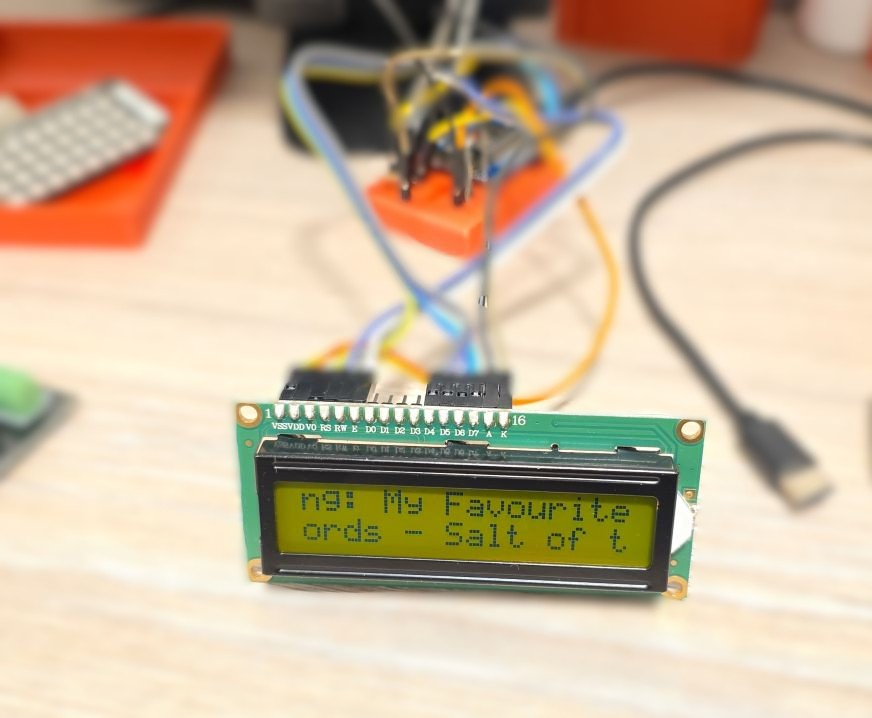
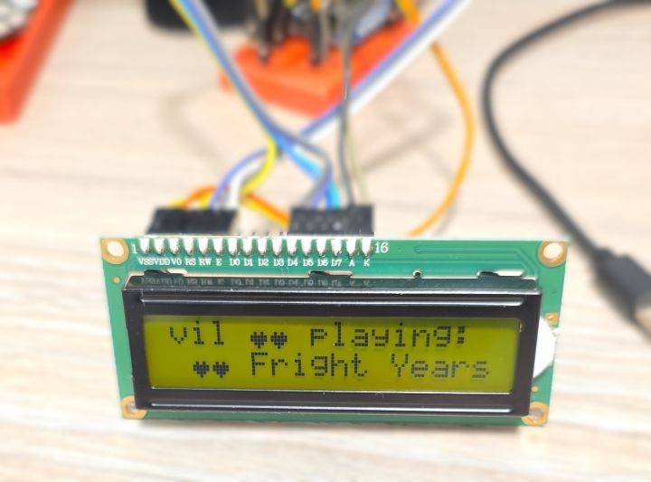

## Project Overview

This project aims to create a simple smart device that displays the currently playing Spotify song on an
[HD44780 based text LCD](/devices/hd44780-character-lcd). The device will use a
[D1 Mini](/devices/esp8266-d1-mini) board for WiFi connectivity and communication with Spotify integration in
Home Assistant. The LCD will show the song title and artist name in real-time.



### Features

- 🎵 Display Spotify's currently playing song title and artist name
- 📡 WiFi-enabled for real-time updates
- 🖥️ Simple text-based interface using an HD44780 LCD
- 🔌 Powered via USB

## Progress

- ✅ [Main Configuration](#main-configuration-file) - fully functional
- [ ] Improve scrolling
- [ ] Improve idle screen

### Reusability Note

Just connect to your Home Assistant and if you have Spotify integration it should work straight away.
You will need to update id of your entity.

## What You'll Need

### Hardware

- 1x [ESP8266 D1 Mini](/devices/esp8266-d1-mini)
- 1x [HD44780 Character LCD](/devices/hd44780-character-lcd) (e.g., 16x2 or 20x4)
- 1x USB cable (data capable)
- 1x Power supply (USB charger, 5V/1A minimum)
- 3D Printed Enclosure

### Software

- [ESPHome installed](https://esphome.io/guides/getting_started_hassio/)
- Home Assistant with configured [Spotify integration](https://www.home-assistant.io/integrations/spotify/)
  - Spotify Developer Account for API access is required but the instructions above are pretty exhautive

### Required Home Assistant Entities

This project requires the following entities in Home Assistant. You'll need to update the substitutions
with your own entity IDs:

- **Media Player**: I'm using Spotify but others might work. Example: `media_player.your_spotify`

### Secrets File Setup

Create a `secrets.yaml` file in your ESPHome directory with your credentials:

```yaml
wifi_ssid: "Your_WiFi_SSID"
wifi_password: "Your_WiFi_Password"

my_spotify_lcd_ota: "your ota password"
my_spotify_lcd_api: "your generated api key"
```

For more information on using secrets in ESPHome, refer to the [ESPHome documentation](https://esphome.io/guides/yaml/#secrets-and-the-secretsyaml-file).

## Main Configuration File

Check out [HD44780 Character LCD](/devices/hd44780-character-lcd) for wiring, in examples overthere,
I am also using D1 mini.

```yaml
esphome:
  name: my-spotify-lcd

esp8266:
  board: d1_mini

# Enable logging
logger:

# Enable Home Assistant API
api:
  encryption:
    key: !secret my_spotify_lcd_api

ota:
  - platform: esphome
    password: !secret my_spotify_lcd_ota

wifi:
  ssid: !secret wifi_ssid
  password: !secret wifi_password


substitutions:
  pin_enable: D1
  pin_rs: D2
  pin_bl: D3
  pin_data0: D8
  pin_data1: D7
  pin_data2: D6
  pin_data3: D5
  media_player: media_player.your_spotify

script:
  - id: update_media_status
    then:
      - globals.set:
          id: my_boot_in_progress
          #finally connected to Home Assistant
          value: '0'

globals:
  - id: my_boot_in_progress
    type: int
    restore_value: no
    initial_value: '1'

text_sensor:
  - platform: homeassistant
    id: media_state
    entity_id: ${media_player}
    internal: true
    on_value:
      then:
        - script.execute: update_media_status
  - platform: homeassistant
    id: media_title
    entity_id: ${media_player}
    attribute: media_title
    internal: true
    on_value:
      then:
        - script.execute: update_media_status
  - platform: homeassistant
    id: media_artist
    entity_id: ${media_player}
    attribute: media_artist
    internal: true
  - platform: homeassistant
    id: media_album
    entity_id: ${media_player}
    attribute: media_album_name
    internal: true
  # could be useful for graphics LCD
  #- platform: homeassistant
  #  id: media_picture
  #  entity_id: ${media_player}
  #  attribute: entity_picture
  #  internal: true

# Example configuration entry
display:
  - platform: lcd_gpio
    dimensions: 16x2
    data_pins:
      - ${pin_data0}
      - ${pin_data1}
      - ${pin_data2}
      - ${pin_data3}
    enable_pin: ${pin_enable}
    rs_pin: ${pin_rs}
    user_characters:
      - position: 0
        data:
          - 0b00000
          - 0b00000
          - 0b00000
          - 0b01010
          - 0b11111
          - 0b11111
          - 0b01110
          - 0b00100
      - position: 1
        data:
          - 0b00000
          - 0b11011
          - 0b11011
          - 0b00100
          - 0b00100
          - 0b10001
          - 0b01110
          - 0b00000
    lambda: |-
      static int current_position_first = -1;
      static int current_position_second = -1;

      if (id(my_boot_in_progress) > 0){
        it.print(0, 0, "Connecting ...");
        it.print(0, 1, "      \x08\x09\x09\x08      ");
        return;
      }
      const int cols = 16; //8 - 40
      const int rows  = 2; //2 - 4

      auto first_row = id(media_state).state + ": " + id(media_title).state + " \x08\x08 ";
      auto second_row = id(media_artist).state + " - " + id(media_album).state + " \x08\x08 ";
      if(first_row.length() < cols){
        first_row.append(cols - first_row.length(), ' ');
      }
      
      if(second_row.length() < cols){
        second_row.append(cols - second_row.length(), ' ');
      }

      current_position_first ++;
      current_position_second ++;

      if(current_position_first >= first_row.length()){
        current_position_first = 0;
      }

      if(current_position_second >= second_row.length()){
        current_position_second = 0;
      }

      std::rotate(first_row.begin(), first_row.begin() + current_position_first, first_row.end());
      std::rotate(second_row.begin(), second_row.begin() + current_position_second, second_row.end());

      it.printf(0, 0, "%s", first_row.substr(0, cols).c_str());
      it.printf(0, 1, "%s", second_row.substr(0, cols).c_str());

output:
  - platform: esp8266_pwm
    pin: ${pin_bl}
    frequency: 1000 Hz
    id: pwm_output

light:
  - platform: monochromatic
    output: pwm_output
    name: "Backlight"
```

## Configuration Breakdown

### Substitutions

The configuration uses substitutions to make it easy to adapt to your Home Assistant setup.
**Update these with your own entity IDs:**

```yaml
substitutions:
  pin_enable: D1
  pin_rs: D2
  pin_bl: D3
  pin_data0: D8
  pin_data1: D7
  pin_data2: D6
  pin_data3: D5
  media_player: media_player.your_spotify # your media player entity id
```

All pins above are from D1 mini, if you're using different GPIOs (and you can use any GPIO) just update
them with the ones you are using. If you are using a different board, you'll need to update this section
as well with your board details:

```yaml
esp8266:
  board: d1_mini
```

### Boot Status

The display is showing a boot screen until it connects to Home Assistant (until it gets information about player status).

### User Defined Characters

```yaml
    user_characters:
      - position: 0
        data:
          - 0b00000
          - 0b00000
          ...
```

A heart and a smiley face. They are displayed by using `\x08` and `\0x09`.

### Displaying Song Information

The display is then showing a combination of play status, song name, song artist and song album:

0. _status_: _song name_ ❤️❤️
1. _artist_: _album name_ ❤️❤️

And they are scrolling at the speed of the refresh rate of the display (1s by default). The algorithm is super
simple (and probably inefficient):

- concatenate strings for each row with little hearts at the end
- if the rows are shorter than 16 characters, pad them to 16
- rotate based on the counters `current_position_*`
- show just 16 characters

I need to figure out how to make the scrolling smoother.

### Display Dimensions

My screen is 16x2 so if you have different dimensions make sure to update configuration and lambda variables.
I could not get values for rows and columns from the display object so had to hard code them.

```yaml
display:
  - platform: lcd_gpio
    dimensions: 16x2

    ...
      const int cols = 16; //8 - 40
      const int rows  = 2; //2 - 4
```

### Backlight

Backlight is configured as monochromatic light and will be available in Home Assistant to control brightness.

## Limitations and Issues

Initially, if idle, there will be no information about current song. The display just shows `idle:`.
It should handle better the scenario when there is no information.

Slightly slow refresh. Investigate if there is a way to use all of the available memory on the display to
make it smoother.

## Other Photos


